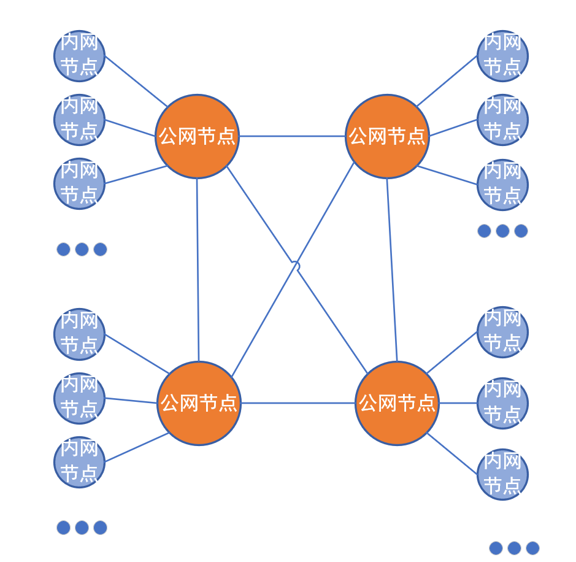
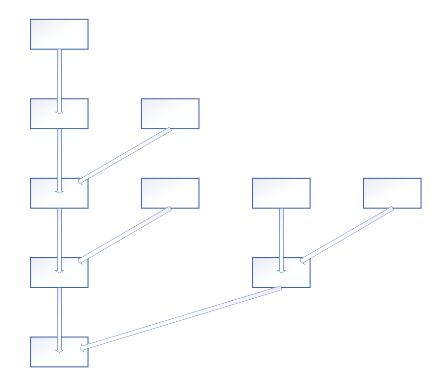

# UENC技术说明 

## 混合式的网络结构

UENC底层网络采用混合式的网络拓扑结构，借助混合式网络结构的优势，可以实现不同节点之间的快速的节点交互和数据传输。使之能较快的对网络上的节点进行的查找、发送消息、广播数据等节点交互操作。
UENC的混合式网络结构由两种节点类型组成
* 公网节点：架设在外网有独立公网ip的节点。
* 内网节点：架设在内网环境的节点。

其网络拓扑图的结构如下：

其中公网节点之间会进行点对点的相互连接，而内网节点会在一个可信的公网节点列表之中随机的选择一个公网节点进行连接。这样可以控制公网节点的连接数量，从而在内网节点众多的情况下减轻节点服务器的压力，同时通过公网节点之间的转发和广播从而保证网络连接进行快速的消息的发送。使用混合式网络的优点还体现在即使没有独立公网ip的情况下依然可以轻松的连入整个网络结构中。

在公网节点类型中，节点会维护网络中的所有节点的列表，并且节点列表在公网节点之间进行相互的同步。而内网节点则会向自己所连接的公网节点请求所有的节点列表。这样对于网络中的每个节点，都可以轻松的获取网络上其他节点的信息，并与之进行相应的网络交互。

在进行网络广播时，借助混合式的网络拓扑结构，可以首先在公网节点之间进行广播，而后各个公网节点再向连接到自己节点上的内网节点进行广播，从而可以使网络消息较快地传达到整个网络中的所有节点。

## 树状的区块结构

区块链是由一个一个区块构成的有序链表，每一个区块都记录了一系列交易，并且，每个区块都指向前一个已经存在的区块，从而形成一个按时间次序排列的有序的区块链条。每个区块都有一个唯一的经过特定哈希算法计算的哈希标识，被称为区块哈希。同时，区块通过记录上一个区块的哈希来指向上一个区块，通过这种方法，便可以从最后一个区块遍历到创世区块，以获取整个区块链上的所有的交易数据。

不同于其他的区块链项目的链式的区块结构，UENC可以在同一个区块高度可以存在多个区块，并且这些在同一高度并存的区块都指向同已经存在的上一个高度的区块。

比如同一时刻在不同的节点上创建了多个不同区块，并且这些区块的前置哈希同时指向同一个前置的区块，那么在由单链构成的区块链项目中则会产生区块的分叉，这些同时产生的区块最终只能存在一个，而其他产生的区块则会被所有其他节点抛弃掉。但是在UENC的区块的结构下则可以同时进行处理。在这种同一个时间内同时创建多个区块的情况下，全网的节点会对这些区块进行合法性的验证，确保这些区块以及这些区块中所包含的所有交易是否全部合法，如果不合法，则会被其他验证的节点抛弃掉，如果经过其他节点的所有合法性验证后都是合法的，并且这些区块中的所有交易都不存在相互冲突的情况，即不存在同一笔UTXO被不同的交易花费掉，则所有的块都可以横向并入这条链中。所以在这种区块结构下同一个高度可以容纳多个区块，在一定程度上可以增加了整个节点的交易总数量以及同一时刻并发交易的数量。

上述的区块结构如下：

## 查找可靠节点
在网络节点当中
Ⅰ.A节点向随机节点发送数据请求（SendSyncGetnodeInfoReq）协议：SyncGetnodeInfoReq 
Ⅱ.接收到 SyncGetnodeInfoReq 请求的节点，以A节点的高度为起始，向前计算分组hash（get_check_hash_forward）， 向后计算分组hash（get_check_hash_backward）发送回A节点（SyncGetnodeInfoAck）

​Ⅲ.A节点接受到 SyncGetnodeInfoAck 之后，开始找出可靠节点（GetSyncInfo），可靠节点的选择依据为：若60%及以上的节点的数据一致，则以60%的节点为可靠节点。通过这种方式就可以确定可靠节点。确定完可靠节点之后发送同步请求
​Ⅰ.A节点开始请求同步数据（DataSynch），发送数据同步请求消息（SendSyncBlockInfoReq）

​Ⅱ.可靠节点接受到A节点的数据同步请求之后开始处理请求（HandleSyncBlockInfoReq），通过对比A节点发送过来的分组hash，找出分叉点（若有分叉），并从分叉高度开始，组织块数据发送给A节点（协议：SyncBlockInfoAck）

​Ⅲ.A节点收到数据之后开始处理（HandleSyncBlockInfoAck），若有分叉点，则记录分叉点，并发送漏块请求（协议：SyncLoseBlockReq），然后将收到的块加入blockpool中用于加块。

## 非关系型数据库存储
UENC的存储方式是利用非关系型的数据库存储的，Rocksdb是在leveldb的基础上进一步优化改进的，是一种key-value的存储方式。非关系型数据库需要自身来梳理逻辑关系。RocksDB是使用C++编写的嵌入式kv存储引擎，其键值均允许使用二进制流。由Facebook基于levelDB开发， 提供向后兼容的levelDB API。
RocksDB针对Flash存储进行优化，延迟极小。RocksDB使用LSM存储引擎。
在数据库当中可以通过块哈希获取到块的高度(GetBlockHeightByBlockHash)、
通过块高度获取到块哈希(SetBlockHashByBlockHeight)、
通过块哈希获取到块头(GetBlockHeaderByBlockHash)、通过地址可以获取到utxo(GetUtxoHashsByAddress)、通过地址可以获取到所有交易(GetAllTransactionByAddreess)、通过地址可以获取到本次交易(GetTransactionByAddress)、通过不同的Key值可以把整个区块串联起来。同时保持常用的增删改查操作，Rocksdb是key-value的结构类型，有效提升数据访问速度，基于编码优化技术的能提高数据存储空间的效率，有效的利用有限的空间尽可能存储更多的数据。
## 去除异常账号
UENC使用椭圆曲线数字签名算法（ECDSA），即使用椭圆曲线密码（ECC）对数字签名算法（DSA）的模拟,UENC的交易过程节点会对交易进行签名，签名节点会得到一笔签名奖励，当每笔交易都在某个节点签名的时候该节点获取的额外奖励越来越高。为了防止某一节点签名奖励异常的高，利用数学当中的四分位算法屏蔽掉异常高的节点进行签名，可以去除掉某个节点获取超高奖励。

