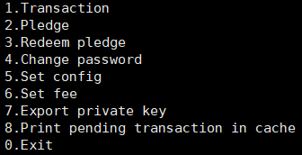

本文档适用于版本v1.6.3

## 本文简介：
本文将为您介绍，如何在centos7操作系统上运行此uenc程序，从而加入到uenc网络中。

## 硬件要求：
* cpu ：推荐使用Intel Celeron CPU系列及其以上，核心数4核及其以上
* 内存：推荐4G及其以上 
* 磁盘：推荐50G及其以上

## 软件要求：
 * 操作系统：CentOS 7及其以上 

## 获取程序
程序的获取有两种方式：网页方式或者命令行方式。程序安装包有两种版本：主网版本和测试网版本，可以根据需求选择版本。
### 1.1 网页方式  
从github[网页链接](https://github.com/uenctech/uenc-demo/tree/master/uenc)上直接选择你想要的版本，然后参见[命令行方式](#command)的unzip和chmod操作。

### 1.2 命令行方式


在linux终端输入命令如下：
* 下载主网程序（uenc_1.6.3_primarynet.zip），然后解压得到uenc_1.6.3_primarynet二进制可执行文件，然后修改程序的执行权限。
  ```
  wget https://github.com/uenctech/uenc-demo/raw/master/uenc/uenc_1.6.3_primarynet.zip
  unzip uenc_1.6.3_primarynet.zip
  chmod +x uenc_1.6.3_primarynet
  ```
* 下载测试网程序(uenc_1.6.3_testnet.zip)，然后解压得到uenc_1.6.3_testnet二进制可执行文件，然后修改程序的执行权限。
  ```
  wget https://github.com/uenctech/uenc-demo/raw/master/uenc/uenc_1.6.3_testnet.zip
  unzip uenc_1.6.3_testnet.zip 
  chmod +x uenc_1.6.3_testnet
  ```
    
## 配置环境
在运行程序之前，您需要通过修改一些文件来配置程序运行所需要的环境。

1、将程序放到一个目录下面，需要确保该目录具有读、写和执行权限及其以上。

2、这里以测试网为例，运行“获取程序”步骤后得到的二进制文件，等待数秒（例如10秒）后，按0退出当前程序。
```
./uenc_1.6.3_testnet                       
```
3、查看当前目录下自动生成的目录和文件：


注1：这里虽然也是运行，但是只是简单的运行，目的不在于运行，而在于通过程序运行自动生成默认配置。

注2：自动生成的目录和文件说明如下：

| 文件或目录 | 类型 |     描述     | 
| :--------: |:-----:|:--------------:| 
| cert |文件夹|存放生成的公私密钥对，后缀为".public.key"的文件是公钥文件，后缀为".private.key"为私钥文件 | 
|   data.db   |文件夹|存放数据库文件 | 
|   logs  | 文件夹|存放日志文件 | 
|   devpwd.json   | json文件|设备密码文件，本机访问密码哈希值，当移动端连接时使用该密码进行连接| 
|   config.json   | json文件|配置文件 | 


4、配置config.json

若您的centos7系统的宿主计算机的IP地址是公网IP地址，则此计算机是公网节点；若是内网IP地址，则是内网节点。

* 内网节点

  内网节点无需配置，可按前面得到的默认配置直接运行。
 
* 公网节点

  修改config.json，将is_public_node的值由false修改为true，将var字段下的local_ip字段设置为自身节点的外网IP地址。
     
  ```
  vim config.json
  ```

  

  

注：或者您也可以运行通过程序来设置，参见[菜单的设置配置文件](#Set_config)来设置。
           
## 运行程序：
运行程序最简单只需要"./uenc_1.6.3_testnet"，在这种情况下没有显示菜单，因而无法人机交互。

此外可以配合使用守护进程运行，防止因shell中断而导致意外退出。获得守护进程程序如下：

```
wget https://github.com/uenctech/uenc-demo/raw/master/uenc/uenc_daemon
```

将守护进程程序复制到uenc程序同级目录下，使用如下方法用守护进程运行程序：

```
./uenc_daemon uenc_1.6.3_testnet ./uenc_1.6.3_testnet
```

如需要uenc程序作为client端能够发起交易和改密码等等，可加上命令参数来运行程序。可供选择的参数如下：

|参数|作用|
|:-------:|:---------:|
|--help  |获取帮助菜单|
|-m      |menu的简称，是否显示菜单，没有该字段不显示菜单 |
|-s      |signature的简称，设置矿费，输入值范围是1000-100000，实际值采用输入值*10^(-6)。|
|-p      |package的简称，设置打包费，输入值范围是0-100000000| 

注1：这些命令参数可以是单个参数，例如：
```
./uenc_1.6.3_testnet -s 2000
```
也可以是任意排列组合，例如：
```
./uenc_1.6.3_testnet -m -s 2000 -p 150
``` 
注2：或者您也可以运行通过程序来设置矿费和打包费，参见[菜单的设置费用](#Set_fee)来设置。

输入运行命令回车，然后会出现读取到的本地账户（如黄色字所示）：


然后会出现基本信息：


然后会出现菜单：



注：说明菜单各功能。

|序号|菜单条目|功能|
|------|-----|------|
|1|Transaction|发起交易|
|2|Pledge|质押|
|3|Redeem pledge|解质押|
|4|Change password|更改密码|
|5|Set config|设置配置|
|6|Set fee|设置矿费和打包费|
|7|Export private key|导出私钥|
|8|Print pending transaction in cache|查看缓存里的挂起交易|
|0|Exit|退出程序|

## 菜单
### 1、Transaction 
按1进入交易界面。注意发起交易前需要设置矿费且矿费值在0.001与0.1之间，参见[运行程序的参数](#parameters)或者[菜单的设置费用](#Set_fee)。

输入自己的账号地址，参见[运行程序的基本信息](#basic_info)，Base58的值即为账户地址。您可以用鼠标滚轴向上移动，找到绿色字体，将base58的值右键复制粘贴，注意不要用[ctrl+c/v]复制黏贴，因为ctrl+c会退出程序。
```
input FromAddr: 12GwpCQi7bWr8cbmU2r1aFia1rUQJDVXdo
```
输入对方账号地址：
```
input ToAddr: 1vkS46QffeM4sDMBBjuJBiVkMQKY7Z8Tu   
```
输入交易金额，这里的范围是在您账户余额范围内的任意数，输入值等于实际值，即为币数：
```
input amount: 999999 
```
输入需要签名的数量，签名数的范围是6-15：
```
input needVerifyPreHashCount: 6 
```
输入手续费，注意手续费范围也是在0.001与0.1之间：
```
input minerFees: 0.012
```
若成功，则有提示信息如下；若失败，没有提示信息。
```
Remove pending transaction in Cache 1d1a3d191787c6b24ad154a0bbef7f07444d1331d3bbd502aa9b871ec9a34591 from 115SwrxtYUucetvtgr1M1rKgDyzDLiyre5   
```
                     
### 2、Pledge  
按2进入质押界面，注意此时质押的账号是你自己的本机账号：
```
Default account： 1FFKXsov2c3Ud9V5moWdPJ35tKZT5SRoAj    
```
输入要质押金额，范围是任意正数，您可以分多次数输入，因为质押金额是多次累加的，但只有累计质押金额为500时才有效：
```
Please enter the amount to pledge：500
```
输入矿费：
```
Please enter GasFee:0.014
```   
输入密码，此处质押需要您的密码用来验证，12345678是默认密码。若您希望修改密码，参见[菜单的修改密码](#Change_password)。
```
Please enter password:12345678
```
质押完毕。
  
### 3、Redeem pledge 
按3进入解质押界面。

输入解质押的账号：
```
Please enter addr：
12GwpCQi7bWr8cbmU2r1aFia1rUQJDVXdo
```
然后提示已有质押交易：
```
-- Current pledge amount: -- 
500
```
输入要解质押的交易：
```
Please enter utxo:
```
输入要解质押的金额：
```
Please enter GasFee：
```
输入密码，此处解质押需要您的密码用来验证，12345678是默认密码。若您希望修改密码，参见[菜单的修改密码](#Change_password)。
```
Please enter GasFee：12345678
```

输入
解质押完毕(需确认和完善)。

### 4、Change password

按4进入修改密码界面。

输入旧密码：
```
Please input the old password: 12345678
```
输入新密码：
```
Please input the new password: abcd1234
```
若成功，则有提示信息：
```
Password change was successful.
```

### 5、Set config


按5进入设置配置文件界面来修改config.json。

是否设置config.json文件，输入y/n：
```
Do you want to set config(y/n/yes/no)?y
```
是不是公网节点，输入y/n：
```
Is it public node(y/n/yes/no)?y
```
输入公网ip地址：
```
input the local ip:172.1.0.3
```

### 6、Set fee

按6进入设置费用界面，出现二级菜单，如下：


* Set signature fee

  提示当前矿费：
  ```
  Current signature fee: 1000
  < Hint: any positive integer from 1000 to 100000 >
  ```
  输入矿费：
  ```
  Set signature fee: 100000
  ```
  若成功，则有提示信息：
  ```
  Signature fee is successful to set: 100000.
  ```

* Set package fee

  提示当前打包费：
  ```
  Current package fee: 0
  < Hint: any positive integer from 0 to 100000000 >
  ```
  输入打包费：
  ```
  Set package fee: 12
  ```
  若成功，则有提示信息：
  ```
  Package fee is successful to set: 12.
  ```
### Export private key
按7进入到私钥菜单，按账户显示助记符、私钥和二维码（采用Courier New字体可完整显示二维码）：
```
Base58 addr: 1FFKXsov2c3Ud9V5moWdPJ35tKZT5SRoAj
Mnemonic: nasty flight figure slow flag divert hand toward amazing method render reason lonely crawl point dose list office until pen boy casino primary robot
Private key: 932b1d586615827f9a373007d186d859883a6569d20c827333b8d131aa46eaad
QRCode:

        ██████████████  ████      ██  ██████  ████        ██  ██    ██████████████
        ██          ██    ██████  ████      ████    ██████      ██  ██          ██
        ██  ██████  ██      ██████        ██      ████  ██    ████  ██  ██████  ██
        ██  ██████  ██  ██████    ████████      ██  ██    ██  ████  ██  ██████  ██
        ██  ██████  ██  ██      ████      ██    ██  ████  ██  ████  ██  ██████  ██
        ██          ██  ██    ██████████████  ████        ██    ██  ██          ██
        ██████████████  ██  ██  ██  ██  ██  ██  ██  ██  ██  ██  ██  ██████████████
                        ██    ██  ██  ██          ██    ██                        
        ██      ██  ████████  ████  ██  ██      ██          ██    ██████████    ██
        ██████    ██    ██  ██████████      ████    ██  ██    ██████  ████  ████  
        ██  ██████████        ██  ██  ██      ██  ████████    ██        ████████  
        ██    ██  ██  ██    ██      ████████████████  ██    ██████████    ████  ██
        ██  ██████  ██    ██            ████      ██            ██  ██    ████  ██
        ██████                ██████████    ██  ████████████████  ██  ████    ██  
        ██  ██      ████  ██  ████    ██████    ██    ██  ████████████    ██  ██  
        ██      ████            ██    ██  ████      ████        ████    ██  ██  ██
            ██████  ██    ████    ██        ██      ██  ██        ██████    ██  ██
          ████████      ██  ██  ██  ██  ██    ██████      ████████      ██    ██  
        ██████  ██████  ██  ████        ████    ██████        ██      ██████  ██  
          ██████████    ████  ████  ██    ████    ████  ██  ██████████    ████    
        ██      ██  ██████    ████    ██  ██████  ██  ██    ██  ██  ██    ████    
            ██  ██    ████        ██  ██████    ██  ████████  ██  ██  ████        
        ██    ████████  ██    ██████  ██    ██  ████████    ██████    ██  ██      
        ██  ████  ██  ██  ████      ██████      ████  ██    ████████  ██  ██████  
                    ██      ██    ████████    ████      ██    ████  ██    ████  ██
        ████████      ██    ██    ████      ████    ██  ████████  ██  ██████  ██  
            ██████  ██  ██    ██  ██████    ████      ██  ██  ██  ██  ████    ██  
            ██    ██  ████  ████████████████  ████████████  ██  ██        ██████  
        ████  ████  ██    ████          ██████    ████      ██  ██████████████  ██
                        ██  ██  ████  ██        ████  ██████  ████      ██    ██  
        ██████████████  ██  ████  ██████████          ████      ██  ██  ██  ████  
        ██          ██    ████    ██      ████      ██      ██████      ██  ██████
        ██  ██████  ██  ██  ██████          ██      ██  ██      ██████████  ██  ██
        ██  ██████  ██    ██  ██████    ██    ████    ██  ██████    ██          ██
        ██  ██████  ██    ██      ██    ██████  ████  ████████  ██  ██            
        ██          ██    ██    ██████    ████    ██████    ██    ██      ██████  
        ██████████████  ██  ██        ██████████  ██        ██    ████  ██████████
```

### Print pending transaction in cache
按8进入查看缓存里的挂起交易，交易后立即进入此功能，可以判段交易是否发起成功。若为非0数值，则交易发起成功并正在进行交易；否则，要么交易未成功发起，要么交易成功发起了并交易完成了。
```
Pending transcation in Cache: 0
```

### Exit

输入0回车退出系统。
           


##  手机连接：
      
#### 1.需要先下载app
   * 打开[官网](https://www.uenc.io/#/index) 扫最下方的二维码Fostoken安装app。  
#### 2.创建数字身份  
 * 安装成功后打开app。  
 * 此时要你创建你的数字身份，输入身份名密码和确认密码点击创建。   
#### 3.备份助记词  
 *  点击上一步的创建后进入提示你备份助记词的页面。  
 * 点击下一步（或者稍后备份）进行备份助记词。  
 * 然后点击下一步此时要你按刚才的助记词的顺序点击出现的助记词。  
#### 4.连接矿机  
 * 备份成功后，进入首页当前显示是主账号（高亮显示）。  
 * 进入首页还未连接矿机，点击矿机切换到矿机账号，点击+  进入矿机搜索列表。
 *   在矿机列表中选择一台矿机进行连接（备注：手机端必须连接wi-fi，且手机端wi-fi与连接的矿机在同一局域网内）
选择一台矿机，点击连接矿机，弹出输入密码框，矿机默认密码是12345678，输入密码。  
* 点击完成  
#### 5.设置燃料费  
* 矿机连接成功后点击立即设置进入设置燃料费界面，可以设置修改当前矿机燃料费。   
* 点击保存，返回矿机列表界面。  
#### 6.主账号发起转账  
* 回到首页点击转账按钮，进入转账页面。  
* 输入转账地址。  
* 选择单节点签名费。  
* 选择共识数。  
* 选择交易的公网。  
* 输入完成点击转账按钮。
* 进入确认转账界面 ，点击确认转账。  
* 提示交易发起成功，主账号转账发起成功。  
#### 7.矿机账号发起转账   
* 进入首页点击矿机切换到矿机账号。  
* 在矿机账号点击转账按钮，进入转账页面。  
* 输入转账地址。  
* 选择单节点签名费。  
* 选择共识数。  
* 输入完点击转账按钮按提示输入矿机密码。  
* 进入确认转账页面。  
* 点击确认转账按钮，交易发起成功。  
#### 8.主账号退出
* 点击钱包管理按钮，进入钱包管理界面。  
* 在钱包管理页面点击钱包地址右边的箭头进入设置页面。  
* 点击退出当前账号按钮 ，弹出输入密码，输入正确的密码退出账号，返回到注册页面。  
#### 9.恢复账号  
* 两种方式：1助记词恢复；2私钥恢复。  
* 在首页点击钱包管理按钮，进入钱包管理界面点击右下角的创建按钮。  
* 进入创建数字身份页面，点击最下面的恢复身份按钮进入恢复身份页面。   
* 选择助记词或私钥恢复身份。  
## 交易不成功可能原因 ：
#### 1.判断节点是否连接到服务器
   能否ping通公网服务。

 11187、11188、11190端口是否开放。
#### 2.看余额是否够即手续费+交易费是否小于余额

#### 3.是否设置矿费  
   
#### 4.本节点的块高度和全网节点的块高度是否一致  

  第2，3，4问题的解决：
  运行程序  
  ```
   ./uenc_1.6.3_testnet -m   
 ```  
运行起来后会出现如下信息：  
```
Version: 1_1.5_t
Base58: 15md8eripkG9n4hGMNacEar7AqTfudvWBZ
Balance: 0
Mac md5: 887da3c400cd1fcaf2d5431abcbc647d
Signature Fee: 1100
Package Fee: 0
Block top: 1919
Top block hash: d955017db4475742caeb9b9d143c7d9b79126b9c4e5cee1b55f735b00f42fdbd
```  
Balance是你的余额。你的交易费+矿费X（共识数-1）是你的本次交易总费用。看余额是否大于总费用。  
signature是矿费，看是否设置矿费，设置矿费：  
```
./uenc_1.6.3_testnet -s 2000
```  
Block tops是块高度通过浏览器查看高度是否一致。


 

