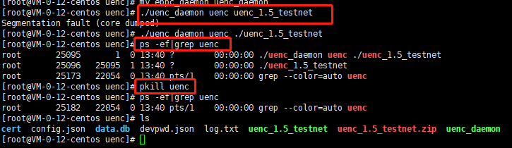

 ##  参数介绍：  
 安装文件运行时后面是可以带参数的，参数介绍如下。

|参数|作用|
|:-------:|:---------:|
|--help  | 获取帮助菜单 |
| -m       | 显示菜单   |
| -s    | signature的简称，设置矿费，输入值范围是1000-100000，实际值采用输入值*10^(-6)。  |
| -p  | package的简称，设置打包费，输入值范围是0-100000000 |  


 ## 菜单介绍：

测试节点命令：

```
 ./uenc_xxx_testnet -m 
```

公网节点命令：

```
 ./uenc_xxx_primarynet -m 
```

程序启动之后，可以看到如下菜单：

```
	1.Transaction  
	2.Pledge  
	3.Redeem pledge  
    4.Change password  
    5.Set config  
    6.Set fee
    7.Export private key  
    8.Print pending transaction in cache  
	0.exit  
	Please input your choice: 

```

|序号|菜单条目|功能|
|------|-----|------|
|1|Transaction|发起交易|
|2|Pledge|质押|
|3|Redeem pledge|解质押|
|4|Change password|更改密码|
|5|Set config|设置配置|
|6|Set fee|设置gas费和打包费|
|7|Export private key|导出私钥|
|8|Print pending transaction in cache|查看缓存里的挂起交易|
|0|Exit|退出程序|

如下图所示：

  
  
:::tip
 以下都以测试节点为例，公网节点程序为`uenc_xxx_primarynet`，xxx为版本号，目前最新版本号为：1.6.4
:::

## 生成账户
在执行`./uenc_xxx_testnet` 出现如下基本信息

  

其中的`Base58: xxxxxxxx`是本节点生成的钱包地址，是存放在程序执行目录下的cert文件夹下的一对公私密钥。

请妥善保管此钱包地址，节点运行所得的收益都在这个钱包地址里面。

## 设置费用

这里介绍设置gas费和打包费两种，分别有以下两种方式设置：

### 1. 主程序设置

列如设置gas费：

测试节点：
```
    ./uenc_1.6.4_testnet -s  2000
```

也可以是任意排列组合，例如：

```
./uenc_1.6.4_testnet -m -s 2000 -p 150
``` 

### 2. 菜单设置

 您也可以通过菜单来设置gas费和打包费。
 
 -m出现上图菜单后，按**6**进入设置费用界面，出现二级菜单，如下：
 
 
 * 1.Set signature fee
 
   提示当前gas费：
   
  ```
   Current signature fee: 1000
   < Hint: any positive integer from 1000 to 100000 >
  ```
   输入gas费：
   
  ```
   Set signature fee: 100000
  ```
   若成功，则有提示信息：
   
  ```
   Signature fee is successful to set: 100000.
  ```
 
 * 2.Set package fee 
 
   提示当前打包费： 
  ```
   Current package fee: 0
   < Hint: any positive integer from 0 to 100000000 >
  ```
   输入打包费：
   
  ```
   Set package fee: 12
   ```
 
   若成功，则有提示信息：
   
  ```
   Package fee is successful to set: 12.
   ```

:::danger
  注意：实际值 = value * 0.000001。实际值最小值：0.000001。
:::

## 进行转账
进行转账之前要确定以下几点：
    1. 节点是否设置签名费，设置的费用是否正确
    2. 节点区块高度是否同步完成(相差10个高度之内可以转账)
    3. 节点是否质押
    4. 是否有预留足够的打包费

1.Transaction 表示发起交易，注意发起交易前需要设置gas费且gas费值在`0.001与0.1`之间. 

 输入**1**回车会让你输入自己的账号地址：
 ```
      input FromAddr :
      12GwpCQi7bWr8cbmU2r1aFia1rUQJDVXdo
 ```
 输入自己账号地址后回车此时会让你输入对方账号地址
 ```
     input ToAddr：
     1vkS46QffeM4sDMBBjuJBiVkMQKY7Z8Tu   
 ```
 输入对方账号地址后回车系统会提示让你输入交易金额
 ```
    input amount :
    999999 
 ```
 输入交易金额后回车系统会提示让你输入需要签名的数量，签名数量**最小值6最大值15**。
 ```
    input needVerifyPreHashCount :  
    6 
 ```
 输入签名数后回车系统提示你输入手续费注意手续费范围也是在**0.001与0.1**之间。
 ```
    input minerFees : 
          0.012
         
 ```
输入后**回车**交易发起完毕。  

交易发送完成，签名数据会进行广播。广播到全网有节点对交易进行签名，签名完成.
当达到该交易已在全网60%以上的节点中上链，则视为交易成功
最后会把成功数据回广播到自己的节点。

节点确认交易是否成功
1. 观察签名成功的hash是否有广播返回(交易量大不适合等待)

```
    Remove pending transaction in Cache 1d1a3d191787c6b24ad154a0bbef7f07444d1331d3bbd502aa9b871ec9a34591 from 115SwrxtYUucetvtgr1M1rKgDyzDLiyre5   
 ```

2. 查看账户金额是否有减少(最直观)

   

## 质押

:::tip
测试网络质押之前，需向[水龙头](http://www.uenc.net.cn:9000/#/login)账号申请定量金额，进行质押、解质押操作。
:::

2.Pledge 表示质押。

UENC节点质押分为两种类型，普通节点质押和公网类型质押，普通节点的账户质押金额到达500后（可累积），该节点可作为签名节点对转账交易进行签名，获得相应的签名费用和交易奖励。公网节点的账户质押金额达到5000后（可累积），该节点作为公网节点时，可作为交易的第一个签名节点，获得签名费但不获得交易奖励。


在初始菜单输入**2**回车进入质押界面，注意此时质押的账号是你自己的本机账号，系统此时提示输入质押金额：

输入要质押金额，范围是任意正数，您可以分多次数输入，因为质押金额是多次累积的：

```
   Please enter the amount to pledge：
        500     
```

输入后回车后系统提示是进行验证节点类型质押还是公网类型质押，0为普通节点质押，1为公网质押
```
Please enter pledge type: (0: node, 1: public)
0

```
输入类型后回车系统提示你输入gas费
```
    Please enter GasFee: 
    0.014
```   
输入后回车系统提示你输入密码,，**12345678**是默认密码。若您希望修改密码，参见[修改密码](#修改密码)。
```
     Please enter password:
     15866992
```
输入密码后回车质押完毕。

质押成功如图所示：
    
    
:::tip
无论是普通节点质押还是公网质押，均需要30天后才可对其进行解质押操作。
:::
    
## 解质押
  3.Redeem pledge表示解质押。  
  
输入**3**回车会提示你输入解质押的账号
```
     Selected redeem pledge.
addr：
     12GwpCQi7bWr8cbmU2r1aFia1rUQJDVXdo
```
输入后回车系统列出当前账号的所有utxo
```
     -- At present, there are pledges--
utxo: e77074aa69a97ea6f018bc4ef5d4fa643e823c46ab6c59958c0e5d288befbe8d
```
输入你要解质押的utxo(复制后粘贴)

```
Please enter utxo:
```
输入要解质押的金额：
```
Please enter GasFee：
```
输入密码，此处解质押需要您的密码用来验证，**12345678**是默认密码。若您希望修改密码，参见[修改密码](#修改密码)。
```
Please enter GasFee：12345678
```
回车解质押完毕。

## 修改密码
4.Change password
按**4**进入修改密码界面,刚启动时的默认密码为：**12345678**。

输入旧密码：

```
Please input the old password: 12345678
```
输入新密码：

```
Please input the new password: abcd1234
```
若成功，则有提示信息：

```
Password change was successful.
```

## 设置配置文件
5、Set config

按**5**进入设置配置文件界面来修改`config.json`。

是否设置config.json文件，输入y/n：

```
Do you want to set config(y/n/yes/no)?y
```
是不是公网节点，输入y/n：

```
Is it public node(y/n/yes/no)?y
```

输入公网ip地址：

```
input the local ip:172.1.0.3
```

## 导出私钥
7.Export private key
按**7**进入到私钥菜单，按账户显示助记符、私钥和二维码（采用Courier New字体可完整显示二维码）：

```
Base58 addr: 1FFKXsov2c3Ud9V5moWdPJ35tKZT5SRoAj
Mnemonic: nasty flight figure slow flag divert hand toward amazing method render reason lonely crawl point dose list office until pen boy casino primary robot
Private key: 932b1d586615827f9a373007d186d859883a6569d20c827333b8d131aa46eaad
QRCode:

        ██████████████  ████      ██  ██████  ████        ██  ██    ██████████████
        ██          ██    ██████  ████      ████    ██████      ██  ██          ██
        ██  ██████  ██      ██████        ██      ████  ██    ████  ██  ██████  ██
        ██  ██████  ██  ██████    ████████      ██  ██    ██  ████  ██  ██████  ██
        ██  ██████  ██  ██      ████      ██    ██  ████  ██  ████  ██  ██████  ██
        ██          ██  ██    ██████████████  ████        ██    ██  ██          ██
        ██████████████  ██  ██  ██  ██  ██  ██  ██  ██  ██  ██  ██  ██████████████
                        ██    ██  ██  ██          ██    ██                        
        ██      ██  ████████  ████  ██  ██      ██          ██    ██████████    ██
        ██████    ██    ██  ██████████      ████    ██  ██    ██████  ████  ████  
        ██  ██████████        ██  ██  ██      ██  ████████    ██        ████████  
        ██    ██  ██  ██    ██      ████████████████  ██    ██████████    ████  ██
        ██  ██████  ██    ██            ████      ██            ██  ██    ████  ██
        ██████                ██████████    ██  ████████████████  ██  ████    ██  
        ██  ██      ████  ██  ████    ██████    ██    ██  ████████████    ██  ██  
        ██      ████            ██    ██  ████      ████        ████    ██  ██  ██
            ██████  ██    ████    ██        ██      ██  ██        ██████    ██  ██
          ████████      ██  ██  ██  ██  ██    ██████      ████████      ██    ██  
        ██████  ██████  ██  ████        ████    ██████        ██      ██████  ██  
          ██████████    ████  ████  ██    ████    ████  ██  ██████████    ████    
        ██      ██  ██████    ████    ██  ██████  ██  ██    ██  ██  ██    ████    
            ██  ██    ████        ██  ██████    ██  ████████  ██  ██  ████        
        ██    ████████  ██    ██████  ██    ██  ████████    ██████    ██  ██      
        ██  ████  ██  ██  ████      ██████      ████  ██    ████████  ██  ██████  
                    ██      ██    ████████    ████      ██    ████  ██    ████  ██
        ████████      ██    ██    ████      ████    ██  ████████  ██  ██████  ██  
            ██████  ██  ██    ██  ██████    ████      ██  ██  ██  ██  ████    ██  
            ██    ██  ████  ████████████████  ████████████  ██  ██        ██████  
        ████  ████  ██    ████          ██████    ████      ██  ██████████████  ██
                        ██  ██  ████  ██        ████  ██████  ████      ██    ██  
        ██████████████  ██  ████  ██████████          ████      ██  ██  ██  ████  
        ██          ██    ████    ██      ████      ██      ██████      ██  ██████
        ██  ██████  ██  ██  ██████          ██      ██  ██      ██████████  ██  ██
        ██  ██████  ██    ██  ██████    ██    ████    ██  ██████    ██          ██
        ██  ██████  ██    ██      ██    ██████  ████  ████████  ██  ██            
        ██          ██    ██    ██████    ████    ██████    ██    ██      ██████  
        ██████████████  ██  ██        ██████████  ██        ██    ████  ██████████
```

## 查看挂起交易
8.Print pending transaction in cache
按**8**进入查看缓存里的挂起交易

交易后立即进入此功能，可以判段交易是否发起成功。若为非0数值，则交易发起成功并正在进行交易；否则，要么交易未成功发起，要么交易成功发起了并交易完成了。

```
Pending transcation in Cache: 0
```
           
## 节点稳定运行

节点要想在后台实现节点运行签名奖励首先

1. 必须要进行质押，如果不质押在发起交易的时候签名节点会被剔除；
2. 设置节点签名费
3. 然后启动守护进程，下载地址：`https://github.com/uenctech/uenc-demo/tree/master/uenc`，或者

```
wget https://github.com/uenctech/uenc-demo/raw/master/uenc/uenc_daemon
```

目录里的`uenc_daemon`,下载放到解压的 `uenc_1.X.1_testnet` 同级目录下。

启动命令：
```
./uenc_daemon <别名> ./uenc_xxx_testnet
```
启动守护进程之后就不能进行config的配置也不能再次启动程序，除非杀死守护进程，在重新启动程序。

查看进程是否运行：
```
ps -ef|grep uenc
```
看到有如下图所示的程序，说明启动成功
如果进行节点配置或者转账解质押等操作，杀掉进程
```
pkill uenc
```
用`ps -ef|grep uenc` 命令查看是否关闭程序。
    

## 升级 && 卸载
### 升级
在新版本程序出现后，如果是自己部署的节点。就需要进行手动升级。
1. 手动升级之前要先关闭节点程序；
2. 要备份同步的区块数据。**data.db**数据(避免二次同步)进行备份，**cert**账号的公私钥备份。

下文命令备份文件存到 `/usr/local/backup`文件目录下
```
mkdir /usr/local/backup
cp -r data.db /usr/local/backup
cp -r cert /usr/local/backup
cp devpwd.json /usr/local/backup
cp config.json /usr/local/backup
ls /usr/local/backup
```

   

备份好文件之后，删除uenc目录下的文件，重新下载 uenc_xxx_testnet

```
rm uenc_xxx_testnet
rm config.json devpwd.json log.txt
```

把之前备份的文件重新拷到同级目录下面

```
cp -r /usr/local/backup/data.db  uenc
cp -r /usr/local/backup/cert  uenc
cp /usr/local/backup/devpwd.json  uenc
cp /usr/local/backup/config.json  uenc
ls uenc
```
### 卸载
1. 关闭所有uenc相关进程
```
pkill uenc
```
2. 删除uenc相关文件

```
rm -rf uenc
```
