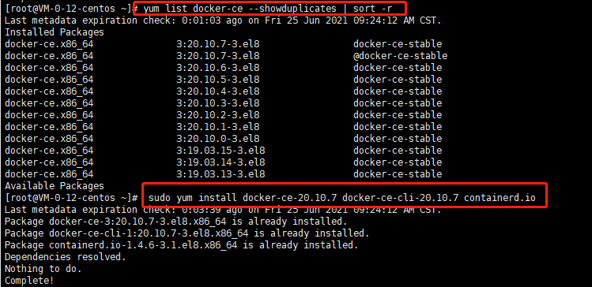
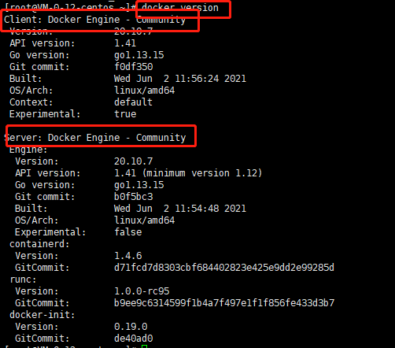
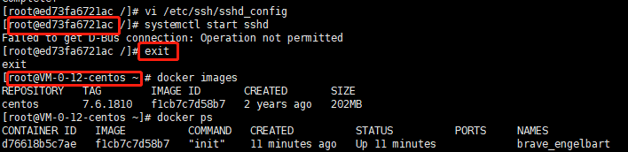
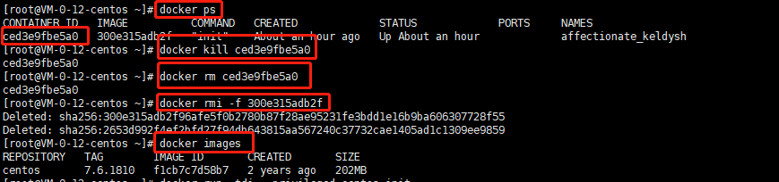
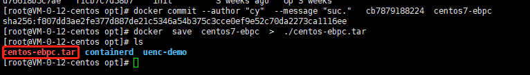
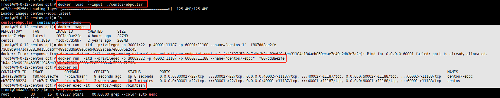
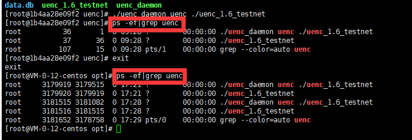

## 一台服务，多个节点
如果想一台服务器上实现多个节点部署，可以用docker技术进行部署。

根据主网的TPS进行评估，满足各容器节点稳定运行，如果你所部署的容器节点无法保持主网高度，检查资源瓶颈进行合理调整。

首先查看系统内核版本`uname -r`,根据系统内核选择正确的系统镜像。


控制台输入`docker`查看是否有安装docker,有安装进行旧版本卸载：

## 卸载

```
yum remove docker \
                  docker-client \
                  docker-client-latest \
                  docker-common \
                  docker-latest \
                  docker-latest-logrotate \
                  docker-logrotate \
                  docker-engine


```

在进行查看docker是否卸载完成。

## 安装docker
  ```
    curl -fsSL https://get.docker.com | bash -s docker --mirror aliyun
   
  ```
安装所需要的软件包，yum-utils 提供了 yum-config-manager ，并且 device mapper 存储驱动程序需要 device-mapper-persistent-data 和 lvm2
   
 ```
    yum install -y yum-utils \
      device-mapper-persistent-data \
      lvm2
  ```

## 设置仓库

 ```
    yum-config-manager \
       --add-repo \
       https://download.docker.com/linux/centos/docker-ce.repo
  ```
也可以选用国内的仓库：
阿里云(推荐)
 ```
    yum-config-manager \
        --add-repo \
        http://mirrors.aliyun.com/docker-ce/linux/centos/docker-ce.repo
  ```
## 安装Engine-Community

如下命令安装最新版本的 Docker Engine-Community 和 containerd
 ```
    yum install docker-ce docker-ce-cli containerd.io
  ```
或者指定特定的版本进行安装

1、列出并排序您存储库中可用的版本。此示例按版本号（从高到低）对结果进行排序。

 ```
    yum list docker-ce --showduplicates | sort -r
 ```

出现列表

 

2、通过其完整的软件包名称安装特定版本，
该软件包名称是软件包名称（docker-ce）加上版本字符串（第二列），从第一个冒号（:）一直到第一个连字符，并用连字符（-）分隔。
例如：`docker-ce-18.09.1`。

 ```
    yum install docker-ce-<VERSION_STRING> docker-ce-cli-<VERSION_STRING> containerd.io
 ```

## 启动 Docker

 ```
    systemctl start docker
 ```

通过运行 hello-world 映像来验证是否正确安装了 Docker Engine-Community 。

 ```
    docker run hello-world
 ```
使用`docker version`测试是否安装成功.

 
 
## 安装镜像

根据系统内核版本安装centos镜像
 ```
    docker pull centos:7.6.1810
 ```
查看镜像
 ```
    docker images
 ```

删除镜像

 ```
    docker rmi -f  镜像名
 ```

## 配置镜像

进入centos镜像

 ```
    docker run -it centos:7.6.1810
 ```

运行容器

此命令不限制内存资源，如需限制需增加参数

 ```
    docker run  -itd --privileged -p 30001:22 -p 40001:11187 -p 50001:11188  -p 60001:11190  --name="centos"  镜像ID
 ```

### 限制硬件资源

运行docker容器时，默认对硬件资源的占用没有限制，所以我们需要对其进行限制，否则docker容器可能会耗尽宿主机的硬件资源，导致宕机。

 ```
    docker run  -itd --privileged -p 30001:22 -p 40001:11187 -p 50001:11188 -p 60001:11190  -m 3.5G --memory-swap 4G --name="uenc_1"  镜像ID
 ```
创建容器并分配该容器占用内存限制最大为4g（可根据主机硬件情况进行分配）

复制本机节点程序文件到容器

 ```
    docker cp  /home/ebpc_run/  centos:/home/
 ```

进入容器
 ```
    docker exec -it   centos  /bin/bash
 ```

退出容器
 ```
    exit
 ```

如果想对已存在的容器进行硬件资源限制修改

 ```
    docker container update uenc_1(容器名称) --memory="3.5g" --memory-swap="4g"
 ```
 
修改容器的内存占用限制为4g。
  
查看修改是否生效         
  
 ```
    docker stats uenc_1  --no-stream
 ```

 查看是否在容器里，只观察角色目录。如果再容器里，角色显示的是容器的ID，退出后在自己服务器目录下。
 
 
 
## 容器的启停

查看容器进程

 ```
    docker ps
 ```

关闭容器

 ```
    docker kill 名称
 ```

查看容器状态, 找到要启动容器的ID

 ```
    docker ps -as
 ```

启动容器
 ```
    docker start 容器id
 ```

如果没有完全关闭
 ```
    docker  ps  -a
    docker  rm  名称  
 ```

 
 
## 导出&&导入镜像

配置部署好一个容器，就可以导出成为镜像，第二次部署就直接导入镜像，不需要进行重新配置。
实现一键部署多个节点

把某个容器保存为镜像

 ```
    docker commit --author "cyh"  --message "suc."   5c9631bb06d8（容器id）  centos7-ebpc（命名的镜像名称）
 ```

导出镜像

 ```
    docker  save  centos7-ebpc-x  >  ./centos-ebpc-x.tar
                 (要导出的镜像名)   （导出目标命名）
 ```
 
 
导入镜像

 ```
    docker  load  --input  ./centos-ebpc-x.tar
 ```
 
 
导入镜像之后，进入镜像启动uenc程序。并退出。这时候查看uenc程序，出现2个。如果部署多个程序，以此类推进行部署。

 
 
运行多个服务器，因为同一台服务器的IP是一定的，在Fastoken中通过输入端口号的方式搜索查找自己部署的服务，
也可以通过导出私钥([使用节点](../使用节点.md) 模块的 [导出&&保存私钥](../使用节点.md))，并导入到Fastoken里进行节点奖励信息查询及转账操作。
