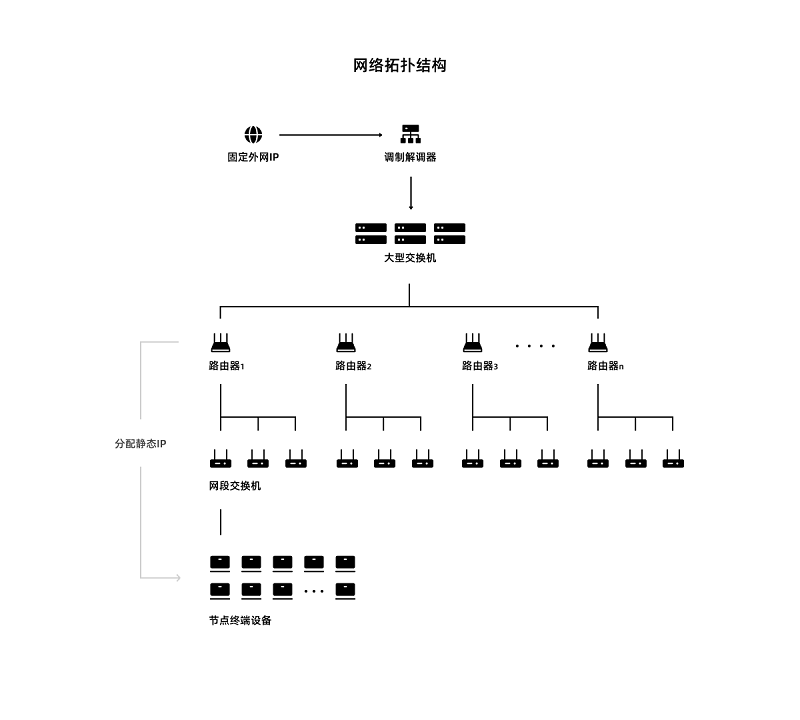
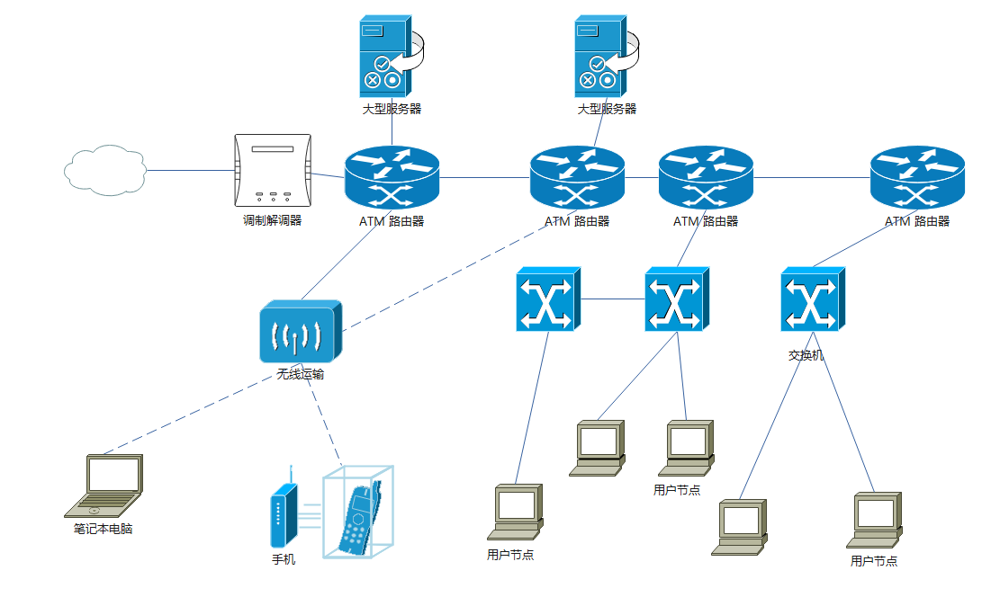
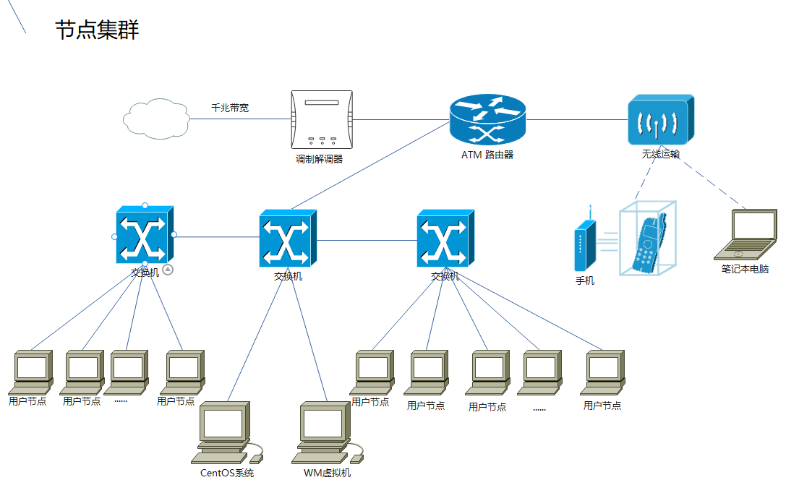

本章意在指导用户搭建自己的UENC节点集群，成为一个专业的，规模化的运营节点。

### 网络搭建
在普通的家庭网络中一般只有一台路由器，n个家庭设备。但是随着设备的增加，网络会出现卡顿，流量减少等情况。所以要想规模化的UENC节点稳定运行，就需要规范化网络规模和框架。 

如下图所示，通过调制解调器连接网络，用交换机和路由器进行网络节点的搭建。通过对路由器和路由设置实现静态IP配置，通过VLAN划分使个网段的节点保存相对安全的环境，各网段不受干扰又能相互连通。

 
 
## 场景一：企业级网络搭建
此场景示例应用于专业中型网络中，其中包含专业的大型实体服务器，路由器进行VLAN划分，需路由设置。

### 注意事项

企业级的用户一般节点规模达到了50个甚至更大的数量级，对节点运维有一定的硬件要求：

1. 目前阶段CPU算力的要求是比较低的，可以单个客户端的运行占用算力降至单核心或单线程，如果出现不稳定的情况，需要增加核心数和线程数量。

2. 采用docker部署的时候需要限制docker容器消耗的硬件资源，这样会让你服务器跑满90%的硬件资源。但是随着主网的吞吐量变化和数据增加要调整资源分配。

3. UENC对I/O性能有一定要求，微型计算机推荐使用SATA协议下的机械硬盘或固态硬盘。如果有更好的条件可以使用NVME协议的固态硬盘。

4. 对于大型节点集群的网络，我们建议你需要准备固定的外网IP，以保证节点的长期存活。UENC网络层是混合式网络结构，如果外部IP不稳定会发生间断性的断开和重新请求。

5. 建议在同一网段放置不高于100个节点终端设备，以确保节点长期处于稳定状态。

6. 带宽我们建议采用上下行对等商业带宽，带宽的大小取决于两个重要指标：1、节点终端设备的数量。2、主网链上的数据体量。这是需要经过测算后才可以实施的。

如需详细了解企业级用户节点注意事项可参考：https://www.uenc.io/#/pc/Blog/Details?id=173

### 硬件设备：
2台大型实体服务器，4台路由器，一个调制解调器。N个交换机，m个节点设备

•	实体服务器参数：10cpu，16G，硬盘 1T

•	路由器的参数：TP-Link路由器 WAN和LAN接入都支持千兆网口，无线速率：1200M

•	交换机的参数：

   1. 普联TL-SF1024D。上下行端口速率均支持百兆，24端口
    
   2. 普联TL-SG1008D。 上下行端口速率支持千兆，8端口

交换机可以有多种选择，端口速率最低支持百兆，一个路由器下同个LAN可分配254个IP地址，但是为了节点的稳定运行，我们只推荐一个路由器下小于100台节点设备。
如需额外增加设备，需要确定网络带宽分配不小于10M

•	节点设备参数：4cpu，4G，硬盘：500G 

### 拓扑图：
 
  

说明：

   a. 为了网络带宽的稳定，需要每个服务器接专线。普通家庭带宽不满足大型服务器的需求

   b. 服务器里通过安装虚拟化机器可安装n个虚拟节点，服务器配置和主网的TPS确定虚拟安装的个数。
    例如：一般10核16G的实体服务器可以虚拟10台节点。
    这个数值不是唯一不变的，是根据主网的TPS来最终确定的，如果TPS越高，所需求的硬件性能就会越高，要根据主网TPS进行弹性缩减。

### 配置注意：

（1）节点服务器的IP地址配置

有两种方法：

   1. 固定IP 在节点的IP设置里配置 IP Address：192.168.1.100 子网掩码(Subnet Mask):255.255.255.0 默认网关：192.168.1.1
   2. 动态IP：选择DHCP自动获取。各个路由节点下根据VLAN划分，设置IP地址段也不一样

（2）交换机的配置

如果交换机与交换机，交换机与路由器相连要强制转换为trunk。配置命令为：switchport mode trunk，交换机和节点则不需要。 交换机根据自己网络的具体搭建划分vlan。

交换机和交换机连接需要用到交叉线。服务器和路由器相连也是用交叉线，路由器和路由器支持串口线连接，其他连接都是直通线连接。

（3）路由器的配置

路由器和路由器相连的接口首先要配置地址和子网掩码`ip address 192.168.1.2 255.255.255.0`
路由器和服务器之间要配置DHCP，服务器虚拟出的节点动态获取IP地址。

路由器和交换机下节点路由配置则是之间设置rip。直接设置允许转发的网段

### 部署UENC节点

在每台节点设备根据[安装教程](https://www.uenc.io/devDocs/UENC%E8%8A%82%E7%82%B9/%E8%8A%82%E7%82%B9%E9%83%A8%E7%BD%B2/CentOS%E9%83%A8%E7%BD%B2)进行安装UENC节点服务。并稳定运行UENC程序。

此网络也可以再实体服务器上配置公网节点服务，公网节点搭建需要设置签名费和打包费，修改config.json文件参数： 将is_public_node的值由false修改为true，将var字段下的local_ip字段设置为自身节点的外网IP地址。这样就是一个中型的公私网混合搭建的UENC节点集群。

### 测试：
节点安装完UENC程序，并稳定运行之后，可以通过[使用节点](https://www.uenc.io/devDocs/UENC%E8%8A%82%E7%82%B9/%E4%BD%BF%E7%94%A8%E8%8A%82%E7%82%B9)章节查看和设置节点。

## 场景二：家庭网络搭建

此场景应用于家庭网络中，通过简单的设备：一个路由器，若干个交换机， 100以内的节点设备。简单的网络部署步骤：无需LAN划分，无需路由设置。

### 注意事项

在家庭中使用节点设备，为了确保节点的稳定运行，需要定时对其维护，也要需要了解一些注意事项：

1. 硬盘的读取性能有一定的要求，需要有一定能力的I/O读写能力。较弱读写能力的会产生一定的影响。

2. 我们建议使用固态硬盘，因为相比机械会更有优势，但不代表机械不可用，企业级SATA机械的I/O是可以满足目前的数据要求。

3. 节点采用了Docker的部署方案，那么固态是必须的，因为你的IO已经成倍的增长了。

4. 家庭用户（1-5个节点）在5-10MB/s的带宽下是足够支撑。

如需详细了解家庭用户节点注意事项可参考：https://www.uenc.io/#/pc/Blog/Details?id=172

### 硬件设备：
一个Modem（调制解调器），一台路由器，n台交换机，m台节点设备。

•	节点设备参数：4cpu，4G，硬盘：500G

•	路由器的参数：普联TL-WDR5620千兆版。 WAN和LAN接入都支持千兆网口，无线速率：1200M

•	交换机的参数：1.普联TL-SF1024D。上下行端口速率均支持百兆，24端口

2. 普联TL-SG1008D。 上下行端口速率支持千兆，8端口

交换机可以有多种选择，端口速率最低支持百兆，一个路由器下同个LAN可分配254个IP地址，但是为了节点的稳定运行，我们只推荐一个路由器下小于100台节点设备。

如需额外增加设备，需要确定网络带宽分配不小于10M
### 拓扑图：

  
 
### 配置说明：

节点的配置：

1. 动态路由配置，直接DHCP随机分配地址，好处是不需要额外配置每台节点设备IP。

    进行WAN(连接Modem的端口)和LAN(连接交换机或者节点设备的端口)设置需注意以下两点：

   1. 路由器的IP和网关设置，要和节点配置的IP地址区分开。
   2. 开启DHCP服务。

2. 静态路由设置，为每台设备设置固定的IP地址。好处是，当电源设备关机重启的时候，设备的IP地址还是保持不变。方便统一管理设备。

   如果不知道节点服务的MAC地址可以先设置DHCP。根据在线设备数量进行MAC地址记录。此方法虽然繁复，但是一次整理一直受益。

交换机的设置：

   交换机和路由器连接要强制转换为trunk，选择的交换机支持端口自动转换功能，无需设置。没有LAN划分也无需额外设置。直接端口按拓扑图连接。

### 测试：

节点安装完UENC程序，并稳定运行之后，可以通过[使用节点](https://www.uenc.io/devDocs/UENC%E8%8A%82%E7%82%B9/%E4%BD%BF%E7%94%A8%E8%8A%82%E7%82%B9)章节查看和设置节点。

