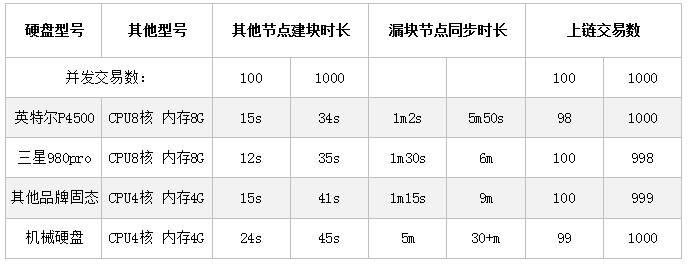

本章介绍在Linux操作系统上增加一个UENC的运行节点，增加节点的安装方法及相关配置，节点启动后即可加入UENC网络。

## 硬件要求：
UENC特殊的架构设计使节点硬件要求在主网TPS需求不断提升的过程中产生节点性能的潜在竞争，随着加入节点硬件性能的提升，UENC主网的TPS也会不断提升，能够满足UENC当前时间内的TPS需求才能参与UENC的激励。
### 当前公网节点要求：
* cpu ：推荐使用Intel CPU系列及其以上，核心数8核及其以上
* 内存：至少8G  DDR3或DDR4
* 磁盘标准：普通SSD或NVME协议下中高端固态硬盘 
* 磁盘空间：推荐500G及其以上
* 带宽：至少10M上下行速率对等商业型带宽

:::tip tips:
注意事项：UENC主链同一高度下的并发区块数量越多，硬件性能的压力越大，上述硬件标准参考于当前主网的TPS需求，如果你所建立的节点无法保持与主网高度的实时一致性，请根据相关数据进行扩展，我们建议你采用扩展性较强的服务器进行节点搭建，更便于你在特定TPS下不断进行迭代。
:::

### 当前验证节点要求：
* cpu ：推荐使用Intel CPU系列及其以上，核心数4核及其以上
* 内存：至少4G DDR3或DDR4
* 磁盘标准：普通SSD或NVME协议的中高端固态硬盘
* 磁盘空间：推荐大于256G及以上
* 带宽：至少10M上下行速率对等，可满足主网要求的商业型带宽

:::tip tips:
注意事项：UENC主链同一高度下的并发区块数量越多，硬件性能的压力越大，上述硬件标准参考于当前主网的TPS需求，如果你所建立的节点无法保持与主网高度的实时一致性，请根据相关数据进行扩展，我们建议你采用扩展性较强的服务器进行节点搭建，更便于你在特定TPS下不断进行迭代。
:::

我们经过长时间的测试发现在TPS直线上升的过程中，CPU的算力消耗是可控的，内存容量在4-8G是可以满足要求的，随着同一区块高度下的并发体量上升对I/O和带宽的要求会较高，这里提供了一组仅供参考的数据，以下数据的测试环境是内网速度在1000M的情况下，I/O性能不同时所产生的时间效率，不考虑其他因素的干扰，希望数据对你有所帮助。
 
 

**补充说明：我们在进行100笔交易测试，并且每笔交易不超过50个UTXO的情况下，测试出平均单笔签名时长不超过0.1s。**

## 操作系统：
 * CentOS 7版本(CentOS是免费的、开源的、可以重新分发的开源操作系统 ，CentOS（Community Enterprise Operating System，中文意思是社区企业操作系统）是Linux发行版之一)
 * Ubuntu 20.04(一个以桌面应用为主的Linux操作系统) 是Linux发行版之一
