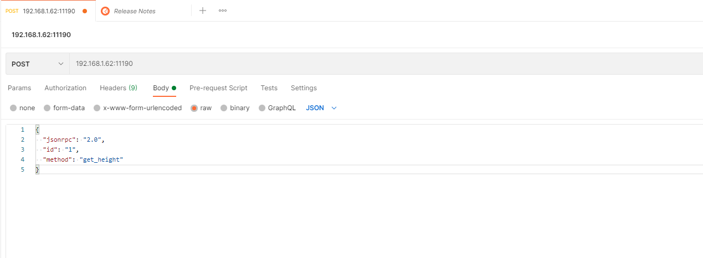
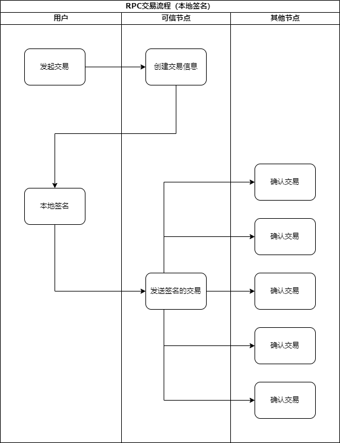
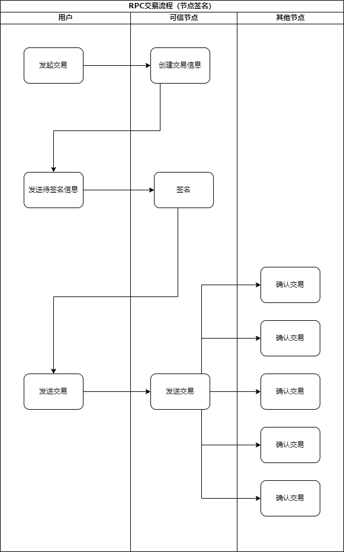

:::tip 说明：
此文档适用于v2.0.0版本。
:::

## 请求示例

jsonrpc标准为2.0，文档中的数据皆为测试数据，请求方式为 POST
默认端口为11190，可以在配置文件config.json中"http_port"属性中指定端口值

可使用HTTP工具Postman或者Curl进行访问测试

### Postman示例  


Postman：新建"Request"--> 选择"POST" --> 输入URL地址，需包含端口号11190（如：192.168.1.51:11190/）-->选择Body,选择Raw选项，输入json请求内容，
如:`{ "jsonrpc": "2.0", "method": "get_height", "id": "1" }`

填写完毕后，点击 **"Send"** 按钮，服务端响应请求并发回响应内容。

### Curl示例
```
Curl: curl -i -X POST -H "Content-Type: application/json; indent=4" -d '{ "jsonrpc": "2.0", "method": "get_height", "id": "1" }' 192.168.1.51:11190
```

输入上面内容，即可访问get_height接口


## JSON RPC API 引用

### get_height
 获取区块高度接口
 
 请求参数 
```json
{
  "jsonrpc": "2.0",
  "id": "1",
  "method": "get_height"
}
```

成功返回：  
```json
{
  "jsonrpc": "2.0",
  "id": "1",
  "result": {
    "height": "100"
  }
}  
```  
失败返回：  
```json
{
    "error": {
        "code": -32601,
        "message": "Method not found"
    },
    "id": "",
    "jsonrpc": "2.0"
}
```

 字段说明

|       字段|类型 |字段说明|
|:---:|:---:|:---:|  
|请求: |
|jsonrpc  |字符串类型 | 2.0标准 (相同字段以下不再重复)|
|id       |字符串类型 | 编号，客户端发送什么，服务端回复相同的编号 (相同字段以下不再重复)   |
|method       |字符串类型| 调用的方法名 (相同字段以下不再重复)   |
|响应:       |  
|result       |json对象|  调用成功返回的结果信息 (相同字段以下不再重复)|  
|height       |字符串类型| 区块高度|  
|error      | json对象|  调用出错返回的结果信息 (相同字段以下不再重复)|  
|code       |整型|  	 错误码 (相同字段以下不再重复)|  
|message       |字符串类型| 错误描述 (相同字段以下不再重复)|  

curl示例:
```bash
curl -i -X POST -H "Content-Type: application/json; indent=4" -d '
{
    "jsonrpc": "2.0", 
    "method": "get_height", 
    "id": "1" 
}
' 192.168.1.51:11190
```  

python示例:

获取高度:  
```python
def get_height():
    data = {
        "jsonrpc": "2.0",
        "id": "1",
        "method": "get_height"
    }
    headers = {
        "Content-Type": "application/json"
    }
    res = requests.post(
        url=domain,
        data=json.dumps(data),
        headers=headers)
    print(res.text)
```

### get_txids_by_height
通过高度获取所有交易hash接口

请求:  
```json
{
  "jsonrpc": "2.0",
  "id": "1",
  "method": "get_txids_by_height",
  "params": {
    "height": "1"
  }
}
```

成功返回：   
```json
{
    "id": "1",
    "jsonrpc": "2.0",
    "result": [
        "772298b54a30e8b9e51b677a497369e19c3bc8ad500bf418b968638fd5d2960f",
        "6916d3a37128df383326249abfd57fec11fe693ca1b802bb0e0a9293a688c520",
        "7744719b0014bf6f733b9a0624a78273e0cf90818dd5fb02b623a0229990cebb"
    ]
}
```
失败返回：  
```json
{
    "error": {
        "code": -32602,
        "message": "Invalid params"
    },
    "id": "1",
    "jsonrpc": "2.0"
}
```  
请求的高度格式输入错误：  
```json
{
    "error": {
        "code": -1,
        "message": "height is invalid"
    },
    "id": "1",
    "jsonrpc": "2.0"
}
```  
请求的高度超过最高块的高度：  
```json
{
    "error": {
        "code": -4,
        "message": "height more than block top "
    },
    "id": "1",
    "jsonrpc": "2.0"
}
```

字段说明:

|       字段|类型 |字段说明|
|:---:|:---:|:---:|  
|请求: |
|params  | json对象 | 方法所需要的参数(相同字段以下不再重复)|
|height      |字符串类型 | 区块高度   |
|响应:       |  
|result       |json数组|  当前区块高度所有交易hash组成的json数组|  


示例:  
```bash
curl -i -X POST -H "Content-Type: application/json; indent=4" -d '
{
    "jsonrpc": "2.0", 
    "method": "get_txids_by_height", 
    "params": {"height": "1"} 
}
' 192.168.1.51:11190
```

python示例:

通过高度获取所有交易hash  

```python
def get_txids_by_height():
    height = input("请输入要查询的高度:")
    data = {
        "jsonrpc": "2.0",
        "id": "1",
        "method": "get_txids_by_height",
        "params": {
            "height": height
        }
    }
    headers = {
        "Content-Type": "application/json"
    }
    res = requests.post(
        url=domain,
        data=json.dumps(data),
        headers=headers)
    print(res.text)
```    

### get_balance
根据地址获取余额接口

 请求参数

```json
{
  "jsonrpc": "2.0",
  "id": "1",
  "method": "get_balance",
  "params": {
    "address": "1BuFpDmH2bJhqxQoyv8cC8YL3mU2TnUDES"
  }
}
```

成功返回：

```json
{
    "id": "1",
    "jsonrpc": "2.0",
    "result": {
        "balance": "888.666668"
    }
}
```

失败返回：

```json
{
    "error": {
        "code": -32602,
        "message": "Invalid params"
    },
    "id": "1",
    "jsonrpc": "2.0"
}  
```  

查询地址格式输入错误：

```json
{
    "error": {
        "code": -1,
        "message": "address is invalid "
    },
    "id": "1",
    "jsonrpc": "2.0"
}
```

字段说明

| 字段|类型 |字段说明|
|:---:|:---:|:---:|  
|请求: |
|address      |字符串类型 | 钱包地址   |
|响应:       |  
|balance       |字符串类型|  钱包余额|  

示例:  

```bash
curl -i -X POST -H "Content-Type: application/json; indent=4" -d '
{
    "jsonrpc": "2.0",
    "id": "1", 
    "method": "get_balance", 
    "params": { "address":"1BuFpDmH2bJhqxQoyv8cC8YL3mU2TnUDES" } 
}
' 192.168.1.51:11190
```  

python示例


根据地址获取余额（get_balance）  
接口：
  
 ```python
def get_balance():
    address = input("请输入要查询的地址:")
    data = {
        "jsonrpc": "2.0",
        "id": "1",
        "method": "get_balance",
        "params": {
        "address": address
        }
    }
    headers = {
        "Content-Type": "application/json"
    }
    res = requests.post(
        url=domain,
        data=json.dumps(data),
        headers=headers)
    print(res.text)  
   ```

### get_tx_by_txid
根据交易hash获取交易详情接口

请求:  
```json
{
  "jsonrpc": "2.0",
  "id": "1",
  "method": "get_tx_by_txid",
  "params": {
    "hash": "3bb0c305a59c45a35eb48fef3ac5a9f42104a083288b867572fa07b9a7961baa"
  }
}
```
成功返回：  
```json
{
    "id": "1",
    "jsonrpc": "2.0",
    "result": {
        "hash": "3bb0c305a59c45a35eb48fef3ac5a9f42104a083288b867572fa07b9a7961baa",
        "time": 1603854991179495,
        "type": "tx"
        "height": ""
        "vin": [
            {
                "address": "1BuFpDmH2bJhqxQoyv8cC8YL3mU2TnUDES",
                "output_index": 0,
                "output_value": "1000.000000",
                "prev_hash": "4df2ac157683a5553503731aa74495c556f46faf11c595b95ee5980f8b5013b0"
            }
        ],
        "vout": [
            {
                "address": "1FoQKZdUNeBXV2nTba6e354m5JrQ4rHYgA",
                "value": "10.000000"
            },
            {
                "address": "1BuFpDmH2bJhqxQoyv8cC8YL3mU2TnUDES",
                "value": "989.000000"
            }
        ]
    }
}
```
没有查找到该笔交易返回：  
```json
{
    "error": {
        "code": -32000,
        "message": "not find"
    },
    "id": "1",
    "jsonrpc": "2.0"
}
```  
参数错误返回：  
```json
{
    "error": {
        "code": -32602,
        "message": "Invalid params"
    },
    "id": "1",
    "jsonrpc": "2.0"
}
```  

哈希长度不等于64：  
```json
{
    "error": {
        "code": -1,
        "message": "hash is invalid"
    },
    "id": "1",
    "jsonrpc": "2.0"
}

```
抛出异常
```json
{
    "error": {
        "code": -32700,
        "message": "Internal error"
    },
    "id": "",
    "jsonrpc": "2.0"
}

```

字段说明

| 字段|类型 |字段说明|
|:---:|:---:|:---:|  
|请求: |
|hash      |字符串类型 | 交易hash   |
|响应:       |  
|hash       |字符串类型|  交易hash|  
|time       |无符号64位整型|  时间戳|  
|type       |字符串类型|  交易的类型,有三种类型,只需要处理正常交易类型: "tx"正常交易;"pledge"质押交易;"redeem"解质押交易|  
|height       |字符串类型|  当前交易所在区块高度|  
|vin       |json数组|  交易输入|  
|address       |字符串类型|  交易转出地址|  
|prev_hash       |字符串类型|  utxo所在的交易hash|  
|output_index       |整型|  索引|  
|output_value       |字符串类型|  utxo金额|  
|vout       |json数组|  交易转入地址和金额组成的json对象|  
|address       |字符串类型|  交易转入地址|  
|value       |字符串类型|  交易金额|  

实际花费的fee计算：vin里的output_value 减去 vout 里的所有value


示例:  
```bash
curl -i -X POST -H "Content-Type: application/json; indent=4" -d '
{
    "jsonrpc": "2.0", 
    "id": "1", 
    "method": "get_tx_by_txid", 
    "params": { "hash": "3bb0c305a59c45a35eb48fef3ac5a9f42104a083288b867572fa07b9a7961baa" } 
}
' 192.168.1.51:11190
```

python示例

根据交易hash获取交易详情  

```python 
def get_tx_by_txid():
    hash = input("请输入要查询的交易hash:")
    data = {
        "jsonrpc": "2.0",
        "id": "1",
        "method": "get_tx_by_txid",
        "params": {
            "hash": hash
        }
    }  
    headers = {
        "Content-Type": "application/json"
    }
    res = requests.post(
        url=domain,
        data=json.dumps(data),
        headers=headers)
    print(res.text)  
   ```

## 发起交易的步骤
  1. 创建交易信息
  
  通过向可靠节点发送RPC请求，来创建交易信息。用户收到交易信息后，可对交易信息进行二次确认（可选）。
  2. 用私钥对交易信息进行签名
  
  有两种方式可进行签名
  * 调用本地签名动态库（so库）对交易信息进行签名。详情见[调用静态库](../开放接口/调用静态库)
  * 如果可靠节点为自己所控制节点并可信，向可靠节点发送RPC请求，用私钥对交易信息进行签名。
  
  推荐调用本地签名动态库进行签名。
  3. 发送签名后交易信息
  
  将签名后的交易信息发送到可靠节点，可靠节点将信息转发到主网全部节点进行确认。
  
  当发送交易完成后，如果交易得到全网60%的节点的确认和认可后，可视为该交易成功上链，用户可使用相关RPC接口进行确认查询。
  
  当该交易已经上链后才可使用该账户进行下一笔交易，否则将无法继续用该账户发起交易。
## 流程图
1. 节点签名
 
 
   
2. 本地签名

   
   
### create_tx_message
创建交易体接口
请求   
```json
  {
    "jsonrpc": "2.0",
    "id": "1",
    "method": "create_tx_message",
    "params": {
        "from_addr": ["1BuFpDmH2bJhqxQoyv8cC8YL3mU2TnUDES"],
        "to_addr": [{"addr": "1FoQKZdUNeBXV2nTba6e354m5JrQ4rHYgA", "value": "2.2"}],
        "fee": "0.1"
    }
}
```

成功返回：  
```json
{
    "id": "1",
    "jsonrpc": "2.0",
    "result": {
        "tx_data": "EM2nvbfKuOwCIiIxQnVGcERtSDJiSmhxeFFveXY4Y0M4WUwzbVUyVG5VREVTMig4ZjU1M2U5ODA4MzM4MjZhMDIxYWQ5MTU4MDA5N2E5OGVkY2EzM2M3QkQKQgpAMDEwZDJmYTBkNzkwNDEzNDlmM2QwZWFmY2FjMzg5ZTQ4NTM1MzgyYzE1M2VmYzNiYWZlZjFjMTcyNjU5ZjU2YUopCI6rzAoSIjFGb1FLWmRVTmVCWFYyblRiYTZlMzU0bTVKclE0ckhZZ0FKKgjY4M+cAxIiMUJ1RnBEbUgyYkpocXhRb3l2OGNDOFlMM21VMlRuVURFU1JDeyJHYXNGZWUiOjU1NTU1NSwiTmVlZFZlcmlmeVByZUhhc2hDb3VudCI6MywiVHJhbnNhY3Rpb25UeXBlIjoidHgifQ==",
        "tx_encode_hash": "3c9a103d8542750dd048eecf2151b052ed26051f201246089bfc01e508ed7000"
    }
}  
```

创建交易失败返回：  
```json
{
    "error": {
        "code": -32000,
        "message": "create fail,error number:-2"
    },
    "id": "1",
    "jsonrpc": "2.0"
}  
```  

参数错误返回：  
```json
{
    "error": {
        "code": -32602,
        "message": "Invalid params"
    },
    "id": "1",
    "jsonrpc": "2.0"
}  
```  

请求的时候value格式输入错误：("value":1.2345678 或者"value"："abc"等)  

```json
{
    "error": {
        "code": -32602,
        "message": "The value is wrong or More than 6 decimal places"
    },
    "id": "1",
    "jsonrpc": "2.0"
}  
```

字段说明

| 字段|类型 |字段说明|
|:---:|:---:|:---:|  
|请求: |
|from_addr |字符串类型 | 交易hash   |
|to_addr |json数组 | 交易转入地址结构,addr:交易转入地址 value:交易金额    |
|addr |字符串类型 | 交易转入地址   |
|value |字符串类型 | 交易金额   |
|fee |字符串类型 | 该交易所使用的单笔签名费   |
|响应:       |  
|tx_data |字符串类型|  交易体(base64编码)|  
|tx_encode_hash |字符串类型|  交易体hash(待签名信息)|  

 
 fee所标识为该交易的单笔签名费，RPC交易默认采用6个共识数节点认证，因此该交易的总费用为:
  
  ```
  总签名费用 = （共识数 - 1）* 单笔签名费
  ```
  
  在交易中，如果可靠节点设置了打包费，则额外需要付打包费用，即总费用公式如下：
  ```
  总费用 = （共识数 - 1）* 单笔签名费 + 打包费 + 交易金额
  ```
  
  假设该可靠节点打包费用为0.3，则上述例子中的总费用如下：
  
  ```
  (6 - 1) * 0.1 + 0.3 + 2.2 = 3
  ```

:::tip  注：

   某节点打包费用可用 get_basic_info 接口查询`package_fee`字段。
  
:::
 
示例
  
```bash
curl -i -X POST -H "Content-Type: application/json; indent=4" -d '
{
    "jsonrpc": "2.0", 
    "id": "1", 
    "method": "create_tx_message", 
    "params": { 
        "from_addr": ["1BuFpDmH2bJhqxQoyv8cC8YL3mU2TnUDES"], 
        "to_addr": [{"addr": "1FoQKZdUNeBXV2nTba6e354m5JrQ4rHYgA", "value": "22.222222"}], 
        "fee": "0.555555"
    } 
}
' 192.168.1.51:11190
```

python示例

通过调用create_tx_message rpc接口，创建交易体数据  
接口： 
 
  ```python
def create_tx_message():
      data = {
        "jsonrpc": "2.0",
        "id": "1",
        "method": "create_tx_message",
        "params": {
            "from_addr": ["1FJpJQkhunjirwjKm85f1P6LcCGnF4Tfet"],
            "to_addr": [{"addr": "1McVeDa3cM6A9939wKqLmnuxp863fZXXiC", "value": "4.1"}],
            "fee": "0.1"
        }
    }
    headers = {
        "Content-Type": "application/json"
    }
    res = requests.post(
        url=domain,
        data=json.dumps(data),
        headers=headers)
    result = json.loads(res.text)
    tx_data = result["result"]["tx_data"]
    tx_encode_hash = result["result"]["tx_encode_hash"]   
    dict_list = {'tx_data': tx_data,
                 'tx_encode_hash': tx_encode_hash}
    return_value = json.dumps(dict_list)
    return return_value  
 ```

### generate_sign
    
  对create_tx_message接口的`tx_encode_hash`字段进行签名。
  
:::danger
   此接口不建议使用，如使用必须确保当前节点的可靠性。
:::
  
  请求格式：
  ```json
  {
  "jsonrpc": "2.0",
  "id": "1",
  "method": "generate_sign",
  	"params": {
		"data": "3c9a103d8542750dd048eecf2151b052ed26051f201246089bfc01e508ed7000",
		"private_key": "xAEF+gTQZ6PmtH3hlmygJpAVxBpKHBa3Zw8iMxRjlbQ="
	 }
  }
  ```

  调用成功时返回
  
  ```json
  {
    "id": "1",
    "jsonrpc": "2.0",
    "result": {
        "message": "Ggy2ouJDIZw9/ShvZUwXyVgsAXSFLsxvRCh42elAf+Klit6DJH/jUY6Z3Km/W7VhPKinrsHcaEcwYqIUIwopWQ=="
    }
}  
  ```

失败返回：  
  
 ```json
 {
    "error": {
        "code": -32602,
        "message": "Invalid params"
    },
    "id": "1",
    "jsonrpc": "2.0"
  }
```

字段说明

|  参数   | 类型 | 说明  |
|  ----  | ----  |----  |
|请求:       | 
| data  | 字符串类型| 待签名信息, create_tx_message方法调用后返回的tx_encode_hash |
| private_key  | 字符串类型| base64编码后的私钥  |
|响应:       |  
|message |字符串类型 | base64编码后的已签名信息 |  

示例
```bash
curl -i -X POST -H "Content-Type: application/json; indent=4" -d '
{
    "jsonrpc": "2.0", 
    "method": "generate_sign", 
    "id": "1", 
    "params": { 
        "data": "b3b8f15852efddbdfe8aa759a2f026488350b6f56a4cae7494ea3cbba0f8a5c5", 
        "private_key": "xAEF+gTQZ6PmtH3hlmygJpAVxBpKHBa3Zw8iMxRjlbQ=" 
    } 
}
' 192.168.1.51:11190
```

python示例

 调用generate_sign rpc接口进行签名  
 @param tx_encode_hash 创建交易体(create_tx_message)返回的tx_encode_hash  
 @param private_key 生成钱包地址、公钥和私钥(generate_wallet)返回的private_key  
 
```python 
def generate_sign(tx_encode_hash, private_key):
    data = {
        "jsonrpc": "2.0",
        "id": "1",
        "method": "generate_sign",
  	    "params": {
		    "data": tx_encode_hash,
		    "private_key": private_key
	    }
    }
    headers = {
        "Content-Type": "application/json"
    }
    res = requests.post(
        url=domain,
        data=json.dumps(data),
        headers=headers)
    result = json.loads(res.text)
    //获取签名之后返回的message*
    message = result["result"]["message"]
    //将message封装成json格式
    dict_list = {"message": message}
    return_value = json.dumps(dict_list)
    return return_value
```

### send_tx
发送交易接口

请求  

```json
{
	"jsonrpc": "2.0",
	"id": "1",
	"method": "send_tx",
	"params": {
		"tx_data": "ELvdqOvRuOwCIiIxQnVGcERtSDJiSmhxeFFveXY4Y0M4WUwzbVUyVG5VREVTMig4ZjU1M2U5ODA4MzM4MjZhMDIxYWQ5MTU4MDA5N2E5OGVkY2EzM2M3QkQKQgpAMjRkMjUxMzMxZGFkYjEyMGMyYmYxMDlhZDI2ODllOWNkMDcwYTAyZWJkZWQxNDA1ZTM5MGFlMmVhMDI0YjEzMEopCI6rzAoSIjFGb1FLWmRVTmVCWFYyblRiYTZlMzU0bTVKclE0ckhZZ0FKKgiwua+GAxIiMUJ1RnBEbUgyYkpocXhRb3l2OGNDOFlMM21VMlRuVURFU1JDeyJHYXNGZWUiOjU1NTU1NSwiTmVlZFZlcmlmeVByZUhhc2hDb3VudCI6MywiVHJhbnNhY3Rpb25UeXBlIjoidHgifQ==",
		"tx_signature": "N1ii0dikr0NJRvi7GXkjXOayD+mVcMfXF+49iOmOneYqYj2HHYzNm3Txj/otW/K7Dh3uBJ2Gb4nlTJW2AY3Dog==",
		"public_key": "ICBszM0aHCpWmDdEC3GMBL6DFN7XdWzijF33uvmWKMa1WbvWBk33+G9E4pSztJWlwDkvEt4dW4oGY8/sY2FJBtPG",
		"tx_encode_hash": "b3b8f15852efddbdfe8aa759a2f026488350b6f56a4cae7494ea3cbba0f8a5c5"
	}
}
```  

成功返回值:
```json
{
    "id": "1",
    "jsonrpc": "2.0",
    "result": {
        "tx_hash": "e241d6af1b8f8ff58508f14177005b4263d26e32a2e0d0f6b8e98d966cbaa864",
        "height":100
    }
}  
```

验证签名失败返回：
```json
{
    "error": {
        "code": -32000,
        "message": "create fail,error number:-8"
    },
    "id": "1",
    "jsonrpc": "2.0"
}  
```  

参数错误返回：  
```json
{
    "error": {
        "code": -32602,
        "message": "Invalid params"
    },
    "id": "1",
    "jsonrpc": "2.0"
}
```

字段说明

| 字段|类型 |字段说明|
|:---:|:---:|:---:|  
|请求: |
|tx_data |字符串类型 | 交易体(base64编码),创建交易体方法调用后返回的tx_data   |
|tx_signature |字符串类型 | 对交易体hash(tx_encode_hash)进行签名得到的签名信息,调用动态库   |
|public_key |字符串类型 | 公钥(base64编码)    |
|tx_encode_hash |字符串类型 | 交易体hash(待签名信息),创建交易体方法调用后返回的tx_encode_hash  |
|fee |字符串类型 | 交易燃料费   |
|响应:       |  
|tx_hash |字符串类型|  交易hash(可通过此hash查询完整交易信息)|
|height |数值类型	|	交易发生时的高度|

 tx_signature值需要调用文档中的静态库里的GenSign_()方法进行签名

示例
```bash
curl -i -X POST -H "Content-Type: application/json; indent=4" -d '
{
    "jsonrpc": "2.0",
    "id": "1", 
    "method": "send_tx", 
    "params": { 
        "tx_data":"ELvdqOvRuOwCIiIxQnVGcERtSDJiSmhxeFFveXY4Y0M4WUwzbVUyVG5VREVTMig4ZjU1M2U5ODA4MzM4MjZhMDIxYWQ5MTU4MDA5N2E5OGVkY2EzM2M3QkQKQgpAMjRkMjUxMzMxZGFkYjEyMGMyYmYxMDlhZDI2ODllOWNkMDcwYTAyZWJkZWQxNDA1ZTM5MGFlMmVhMDI0YjEzMEopCI6rzAoSIjFGb1FLWmRVTmVCWFYyblRiYTZlMzU0bTVKclE0ckhZZ0FKKgiwua+GAxIiMUJ1RnBEbUgyYkpocXhRb3l2OGNDOFlMM21VMlRuVURFU1JDeyJHYXNGZWUiOjU1NTU1NSwiTmVlZFZlcmlmeVByZUhhc2hDb3VudCI6MywiVHJhbnNhY3Rpb25UeXBlIjoidHgifQ==", 
        "tx_signature": "N1ii0dikr0NJRvi7GXkjXOayD+mVcMfXF+49iOmOneYqYj2HHYzNm3Txj/otW/K7Dh3uBJ2Gb4nlTJW2AY3Dog==", 
        "public_key": "ICBszM0aHCpWmDdEC3GMBL6DFN7XdWzijF33uvmWKMa1WbvWBk33+G9E4pSztJWlwDkvEt4dW4oGY8/sY2FJBtPG", 
        "tx_encode_hash": "b3b8f15852efddbdfe8aa759a2f026488350b6f56a4cae7494ea3cbba0f8a5c5"
    } 
}
' 192.168.1.51:11190
```

python示例

 调用send_tx rpc接口发送交易  
 @param tx_data 创建交易体(create_tx_message)返回的tx_data  
 @param tx_signature 生成签名信息（generate_sign）返回的message信息  
 @param public_key 生成钱包地址、公钥和私钥（generate_wallet）返回的public_key  
 @param tx_encode_hash 创建交易体(create_tx_message)返回的tx_encode_hash  
        
 接口： 
 ```python
 from ctypes import cdll

def send_tx(tx_data, tx_signature, public_key, tx_encode_hash):
  cur = cdll.LoadLibrary('./jcAPI.so')
  tx_signature = cur.GenSign(pri_key,tx_encode_hash,tx_encode_hash.length)
   data = {
	    "jsonrpc": "2.0",
	    "id": "1",
	    "method": "send_tx",
	    "params": {
		    "tx_data": tx_data,
		    "tx_signature": tx_signature,
		    "public_key": public_key,
		    "tx_encode_hash": tx_encode_hash
	    }
    }
    headers = {
        "Content-Type": "application/json"
    }
    res = requests.post(
        url=domain,
        data=json.dumps(data),
        headers=headers)
     result = json.loads(res.text)  
 ```

### get_avg_fee
获取最近100块高度的平均交易燃料费

说明：  
fee由用户节点自主设置，如果发送交易时设置的fee值低于大多数用户节点设置的fee值，可能会造成交易不成功，因此，可以参照最近100个高度的区块平均fee值来设定，确保交易能成功。

请求

```json
{
	"jsonrpc": "2.0",
	"id": "1",
	"method": "get_avg_fee"
}
```

成功返回：
```json
{
    "id": "1",
    "jsonrpc": "2.0",
    "result": {
        "avg_fee": "0.112074"
    }
}  
```  

失败返回：  
```json
{
    "error": {
        "code": -32602,
        "message": "Invalid params"
    },
    "id": "1",
    "jsonrpc": "2.0"
}
```

字段说明

响应：  
avg_fee         字符串类型		最近100个高度区块fee的平均值,如果高度不足100,则是所有区块的平均值

示例
```bash
curl -i -X POST -H "Content-Type: application/json; indent=4" -d '
{
    "jsonrpc": "2.0", 
    "method": "get_avg_fee", 
    "id": "1" 
}
' 192.168.1.51:11190
```

python示例

获取最近100块高度的平均交易燃料费   
```python
def get_avg_fee():
    data = {
        "jsonrpc": "2.0",
	    "id": "1",
	    "method": "get_avg_fee"
    }
    headers = {
        "Content-Type": "application/json"
    }
    res = requests.post(
        url=domain,
        data=json.dumps(data),
        headers=headers)
    print(res.text)
```

### generate_wallet
生成钱包地址、公钥和私钥接口

请求

```json
{
  "jsonrpc": "2.0",
  "id": "1",
  "method": "generate_wallet"
}
```

成功返回：
```json
{
    "id": "1",
    "jsonrpc": "2.0",
    "result": {
        "address": "1BGmh7NgY7spKRBHJkwQTZosaHGiXfynvj",
        "private_key": "xAEF+gTQZ6PmtH3hlmygJpAVxBpKHBa3Zw8iMxRjlbQ=",
        "public_key": "ICD6bienPIel1KE4WmGlQ6bC6M+HiPTw3+et036AUaTVtLr1iV1DMFFx2O9VYi/MUXOZyKK87s/GjPE+eN9A+wEl"
    }
}
```
失败返回：  
 
 ```json
 {
    "error": {
        "code": -32601,
        "message": "Method not found"
    },
    "id": "",
    "jsonrpc": "2.0"
 }
```

字段说明

| 字段|类型 |字段说明|
|:---:|:---:|:---:|  
|响应:       |  
|address |字符串类型| 钱包地址|  
|private_key |字符串类型| base64编码后的私钥|  
|public_key |字符串类型| base64编码后的公钥|  

示例:
```bash
curl -i -X POST -H "Content-Type: application/json; indent=4" -d '
{
    "jsonrpc": "2.0", 
    "method": "generate_wallet", 
    "id": "1" 
}
' 192.168.1.51:11190
```

python示例:  
通过调用generate_wallet rpc接口，生成钱包地址和相应的公私钥   
```python
def generate_wallet():  
    data = {
        "jsonrpc": "2.0",
        "id": "1",
        "method": "generate_wallet"
    }  
    headers = {
        "Content-Type": "application/json"
    }  
    res = requests.post(
        url=domain,
        data=json.dumps(data),
        headers=headers)
    result = json.loads(res.text)
    address = result["result"]["address"]
    private_key = result["result"]["private_key"]
    public_key = result["result"]["public_key"]
    dict_list = {'address': address,
                 'private_key': private_key, 'public_key': public_key}
    return_value = json.dumps(dict_list)
    return return_value
```

### get_pending_transaction
查询正在挂起的交易

请求

```json
{
  "jsonrpc": "2.0",
  "id": "1",
  "method": "get_pending_transaction",
  	"params": {
		"address": "1MpeeKXwH1ArnMJ85D161yfH1us471J86X"
	}
}
```

成功返回：  
```json
{
    "id": "1",
    "jsonrpc": "2.0",
    "result": {
        "total": 1,
        "transaction": [
            {
                "amount": "501",
				"broadstamp": 1620378873518030,
                "from": [
                    "1MpeeKXwH1ArnMJ85D161yfH1us471J86X"
                ],
                "gap": "0.050000",
                "hash": "4303e57195616797f77d7db888ef15d677740d8f10a9a8e29370d35c3cc853fb",
                "timestamp": 1620378873279899,
                "to": [
                    "1HjrxHbBuuyNQDwKMh4JtqfuGiDCLodEwC"
                ],
                "toAmount": [
                    "501.000000"
                ],
                "vin": [
                    "7d9a0cb698db789b5f294343209b94ca69119f02593cb5607069623810f6ed69",
                    "92c45d62b86d37c04f5f873eedfdcb1719eeca9a43e16b206e98101d20baeb0c",
                    "d2c9da85e7b67188c507f40a95cba88c491afca56b863cce6af512638c7b1b1c"
                ]
            }
        ]
    }
}
```
失败返回如请求的地址格式输入错误：  
```json
{
    "error": {
        "code": -1,
        "message": "address is invalid"
    },
    "id": "1",
    "jsonrpc": "2.0"
}
```

字段说明

| 字段|类型 |字段说明|
|:---:|:---:|:---:|  
|请求：     |  
|address |字符串类型| 交易发起方地址|  
|响应：     |  
|total |数值类型| 处于挂起的交易的个数|  
|transaction |数组类型| 交易内容,包括交易的哈希，发起方，接收方，金额，时间戳|  

示例
```bash
curl -i -X POST -H "Content-Type: application/json; indent=4" -d '
{
    "jsonrpc": "2.0", 
    "method": "get_pending_transaction",
    "id": "1", 
    "params": { "address": "1MpeeKXwH1ArnMJ85D161yfH1us471J86X"} 
}
' 192.168.1.51:11190
```

python示例


查询正在挂起的交易
接口：
```python
def get_pending_transaction():
    address = input("请输入要查询的地址:")
    data = {
        "jsonrpc": "2.0",
        "id": "1",
        "method": "get_pending_transaction",
  	    "params": {
		    "address": address
	    }
    }
    headers = {
        "Content-Type": "application/json"
    }
    res = requests.post(
        url=domain,
        data=json.dumps(data),
        headers=headers)
    print(res.text)
```

### get_failure_transaction
查询失败的交易

请求

```json
{
  "jsonrpc": "2.0",
  "id": "1",
  "method": "get_failure_transaction",
  	"params": {
		"address": "1MpeeKXwH1ArnMJ85D161yfH1us471J86X"
	}
}
```

成功返回：  
```json
{
    "id": "1",
    "jsonrpc": "2.0",
    "result": {
        "total": 1,
        "transaction": [
            {
                "amount": "500",
                "from": [
                    "1MpeeKXwH1ArnMJ85D161yfH1us471J86X"
                ],
                "gap": "0.050000",
                "hash": "13f9730d0ce5fe401352f42fdce3677e324d15518857c02e0aafc6b5456a7676",
                "timestamp": 1609313648455902,
                "to": [
                    "1HjrxHbBuuyNQDwKMh4JtqfuGiDCLodEwC"
                ],
                "toAmount": [
                    "500.000000"
                ],
                "vin": [
                    "b8930d79b8ecbdd2141d3b4fa85fa7dc0e4c6b3c3e30a379d573aacd34299b18",
                    "c99ac37f9a9c591e51ea31551455f3662eac4e54a1c27923a81e7966c0eadbfa",
                    "08cb13dea1510860de5549a71c8142e16af6698b9b0d9bea3a813789727d084f"
                ]
            }
        ]
    }
}
```
返回失败

请求的地址格式输入错误：  
```json
{
    "error": {
        "code": -1,
        "message": "address isinvalid"
    },
    "id": "1",
    "jsonrpc": "2.0"
}
```

字段说明

| 字段|类型 |字段说明|
|:---:|:---:|:---:|  
|请求：     |  
|address |字符串类型| 交易发起方地址|  
|响应：     |  
|total |数值类型| 处于挂起的交易的个数|  
|transaction |数组类型| 交易内容,包括交易的哈希，发起方，接收方，金额，时间戳|  

示例
```bash
curl -i -X POST -H "Content-Type: application/json; indent=4" -d '
{
    "jsonrpc": "2.0", 
    "method": "get_failure_transaction", 
    "id": "1", 
    "params": { "address": "1MpeeKXwH1ArnMJ85D161yfH1us471J86X"} 
}
' 192.168.1.51:11190
```

python示例

查询失败的交易  
```python
def get_failure_transaction():
    address = input("请输入要查询的地址:")
    data = {
        "jsonrpc": "2.0",
        "id": "1",
        "method": "get_failure_transaction",
  	    "params": {
		    "address": address
	    }
    }
    headers = {
        "Content-Type": "application/json"
    }
    res = requests.post(
        url=domain,
        data=json.dumps(data),
        headers=headers)
    result = json.loads(res.text)
```

### get_block_info_list
获取块信息列表接口

请求

```json
{
  "jsonrpc": "2.0",
  "id": "1",
  "method": "get_block_info_list",
  	"params": {
		"index": "15",
        "count": "3",
        "type": "0"
	}
}
```

成功返回：  
```json
{
    "id": "1",
    "jsonrpc": "2.0",
    "result": {
        "height": [
            [
                {
                    "block_hash": "b4f74ea3a735a0e6de5c4041bbecfc1b6e2a30156ad41ade7e98c9992e3141ec",
                    "block_height": 15,
                    "block_time": 1611132153984580,
                    "tx": {
                        "amount": "3099.000000",
                        "from": [
                            "1vkS46QffeM4sDMBBjuJBiVkMQKY7Z8Tu"
                        ],
                        "hash": "b9b417999b0e4d165d822e9fa9c8fdc553fdd9d6affb054d0a258f6d3db352ee",
                        "to": [
                            "1MpeeKXwH1ArnMJ85D161yfH1us471J86X"
                        ]
                    }
                }
            ],
            [
                {
                    "block_hash": "9870c60872e171b747f35e2f4e876e0792833cb8a258151e38aa1c7f72a52734",
                    "block_height": 14,
                    "block_time": 1611131849651811,
                    "tx": {
                        "amount": "3983.000000",
                        "from": [
                            "1vkS46QffeM4sDMBBjuJBiVkMQKY7Z8Tu"
                        ],
                        "hash": "98a483aa1c0b77fed0b69c36888fe6e953fe96d5432a17704e76e4f5a5bc2d64",
                        "to": [
                            "1TT8sdzyPhqSmSx7Wdmn1ECeEHZKosh6v"
                        ]
                    }
                }
            ],
            [
                {
                    "block_hash": "e79fb3d28be54e12a7e5ae9c21d91cefc6ba0d8f25681717d07348b569083f3f",
                    "block_height": 13,
                    "block_time": 1611050624949290,
                    "tx": {
                        "amount": "2349.000000",
                        "from": [
                            "1vkS46QffeM4sDMBBjuJBiVkMQKY7Z8Tu"
                        ],
                        "hash": "bfe2bf795003c2960d09ad03b1d9dd5bc2109c3eba3fe790fd2001f43ce1fc8b",
                        "to": [
                            "1MpeeKXwH1ArnMJ85D161yfH1us471J86X"
                        ]
                    }
                }
            ]
        ]
    }
}  
```  
失败返回  
请求端输入的index格式出错：  
```json
{
    "error": {
        "code": -32602,
        "message": "index Invalid params"
    },
    "id": "1",
    "jsonrpc": "2.0"
}  
```  
请求端输入的count格式出错：  
```json
{
    "error": {
        "code": -32602,
        "message": "count Invalid params"
    },
    "id": "1",
    "jsonrpc": "2.0"
}  
```

请求端输入的count不能为0：  
```json
{
    "error": {
        "code": -1,
        "message": "count is not equal zero！"
    },
    "id": "1",
    "jsonrpc": "2.0"
}  
```  
请求端输入的type格式出错：  
```json
 {
    "error": {
        "code": -32602,
        "message": "type Invalid params"
    },
    "id": "1",
    "jsonrpc": "2.0"
 }
```

字段说明

| 字段|类型 |字段说明|
|:---:|:---:|:---:|  
|请求：     |  
|index |数值类型| 块最高起始索引地址。可以指定0，从当前最高块读取 | 
|count |数值类型|  要读取的块的个数，从高向低列出 | 
|type |数值类型|  默认为0，以后扩展使用 |  
|响应：     |  
|height |数组类型| 每一高度层的块数据|  
|block_hash |字符串类型| 块的哈希|  
|block_height |数值类型| 块所在的高度|  
|block_time |数值类型| 建块的时间|  
|amount |字符串类型| 交易金额|  
|from |数组类型| 交易发起者|  
|hash |字符串类型| 交易哈希|  
|to |数组类型| 交易接收者|  

示例

```bash 
curl -i -X POST -H "Content-Type: application/json; indent=4" -d '
{
    "jsonrpc": "2.0", 
    "method": "get_block_info_list", 
    "id": "1", 
    "params": { "index": "15", "count": "3", "type":"0" } 
}
' 192.168.1.51:11190
```

python示例

获取块信息列表  
接口：
```python
def get_block_info_list():
    data = {
        "jsonrpc": "2.0",
        "id": "1",
        "method": "get_block_info_list",
  	    "params": {
		    "index": "15",
            "count": "3",
            "type": "0"
	    }
    }
    headers = {
        "Content-Type": "application/json"
    }
    res = requests.post(
        url=domain,
        data=json.dumps(data),
        headers=headers)
    print("get_block_info_list res.text:", res.text)
    result = json.loads(res.text)
```

### confirm_transaction
确认交易是否成功接口

请求：

```json
{
  "jsonrpc": "2.0",
  "id": "1",
  "method": "confirm_transaction",
  	"params": {
		"tx_hash": "d7ef410796ffa9ef60982c3470f5d816c28a4ea2d3c5299228ef2f5997bf8221",
        "height" : 6
	}
}
```

成功返回：

```json
{
    "id": "1",
    "jsonrpc": "2.0",
    "result": {
        "count_failed": 0,
        "count_success": 12,
        "count_success_rate": 1.0,
        "count_total": 12,
        "nodeid": [
            "1JdkY87y74fe8FWQvn32vE9Pv4rBnFCNzZ",
            "15SpMTGrrqCLHghcZo5Ut9YhCs3NaWrhyG",
            "19kFUwJmLaEVM2j3ubgXjHYgyJknFYaLxf",
            "1CJdwtSgyfjuzrgKjcPoMwGUXYu6TnVMUx",
            "1D9yxrPtWM7bkNF445qTksr9DnEYc7QhPh",
            "1JeZ4GDGZTR6QUmoJSbQcWeZ7VfFNqH4tS",
            "1MJP6LeLWUTR4UFdCQ1Gfjz2yuzCZ36x7h",
            "12dYC7KoUmibJDcfrj7X9hsf5rnUD67UWW",
            "1G56uhVerZdq8wSL32d23Ueo4syEX15bGP",
            "1BgtJs5zDrFiRq6ikiqFGKZrtn3cCxMzew",
            "171oUraFGHAFvbqmATakk1ZojMF65vSrpt",
            "1HwRLn3ASWGbMNgzhzkAdmrgt4QEM9Exvp"
        ],
        "success": true,
        "total": 12
    }
}
```

tx_hash参数格式错误：

```json
{
    "error": {
        "code": -32700,
        "message": "Parse error"
    },
    "id": "",
    "jsonrpc": "2.0"
}
```


字段说明

| 字段|类型 |字段说明|
|:---:|:---:|:---:|  
|请求：     |  
|tx_hash |字符串类型| 本次交易的交易哈希 | 
|height | 数值类型 |发起交易时节点的高度|
|响应：     |  
|count_failed |数值类型| 查询未建立区块的节点统计数|  
|count_success |数值类型| 查询建立区块的节点统计数|  
|count_total |数值类型| 已查询总节点数|  
|count_success_rate |数值类型| 成功建块节点比率|  
|nodeid |数组类型| 返回成功建块的节点ID|  
|total |数值类型| 成功本次交易节点确认之后返回的个数|  
|success |布尔类型| 成功与否|  

示例

```bash
curl -i -X POST -H "Content-Type: application/json; indent=4" -d '
{
    "jsonrpc": "2.0", 
    "method": "confirm_transaction", 
    "id": "1", 
    "params": { "tx_hash": "d7ef410796ffa9ef60982c3470f5d816c28a4ea2d3c5299228ef2f5997bf8221"} 
}
' 192.168.1.51:11190
```
### get_tx_by_txid_and_nodeid
根据交易哈希和节点ID获取交易详情接口

请求:  
```json
{
  "jsonrpc": "2.0",
  "id": "1",
  "method": "get_tx_by_txid",
  "params": {
    "hash": "3bb0c305a59c45a35eb48fef3ac5a9f42104a083288b867572fa07b9a7961baa",
	"nodeid":"1BuFpDmH2bJhqxQoyv8cC8YL3mU2TnUDES"
  }
}
```
成功返回：  
```json
{
    "id": "1",
    "jsonrpc": "2.0",
    "result": {
        "hash": "3bb0c305a59c45a35eb48fef3ac5a9f42104a083288b867572fa07b9a7961baa",
        "time": 1603854991179495,
        "type": "tx"
        "height": ""
        "vin": [
            {
                "address": "1BuFpDmH2bJhqxQoyv8cC8YL3mU2TnUDES",
                "output_index": 0,
                "output_value": "1000.000000",
                "prev_hash": "4df2ac157683a5553503731aa74495c556f46faf11c595b95ee5980f8b5013b0"
            }
        ],
        "vout": [
            {
                "address": "1FoQKZdUNeBXV2nTba6e354m5JrQ4rHYgA",
                "value": "10.000000"
            },
            {
                "address": "1BuFpDmH2bJhqxQoyv8cC8YL3mU2TnUDES",
                "value": "989.000000"
            }
        ]
    }
}
```
没有查找到该笔交易返回：  
```json
{
    "error": {
        "code": -32000,
        "message": "not find"
    },
    "id": "1",
    "jsonrpc": "2.0"
}
```  
参数错误返回：  
```json
{
    "error": {
        "code": -32602,
        "message": "Invalid params"
    },
    "id": "1",
    "jsonrpc": "2.0"
}
```  

哈希长度不等于64：  
```json
{
    "error": {
        "code": -1,
        "message": "hash is invalid"
    },
    "id": "1",
    "jsonrpc": "2.0"
}

```
字段说明

| 字段|类型 |字段说明|
|:---:|:---:|:---:|  
|请求：     |  
|hash |字符串类型| 交易hash | 
|响应：     |  
|hash |字符串类型| 交易hash|  
|time |无符号64位整型| 时间戳|  
|type |字符串类型| 	交易的类型,有三种类型,只需要处理正常交易类型："tx"正常交易；"pledge" 质押交易；"redeem" 解质押交易|
|height |字符串类型| 当前交易所在区块高度|  
|vin |json数组| 交易输入|  
|address |字符串类型| 交易转出地址|  
|prev_hash |字符串类型| utxo所在的交易hash|  
|output_index |整型| 索引|  
|output_value |字符串类型| utxo金额|  
|vout |json数组| 交易转入地址和金额组成的json对象|  
|address |字符串类型| 交易转入地址|  
|value |字符串类型| 交易金额|  

实际花费的fee计算：vin里的output_value 减去 vout 里的所有value

示例:  
```bash
curl -i -X POST -H "Content-Type: application/json; indent=4" -d '
{
    "jsonrpc": "2.0", 
    "id": "1", 
    "method": "get_tx_by_txid_and_nodeid", 
    "params": { 
        "hash": "3bb0c305a59c45a35eb48fef3ac5a9f42104a083288b867572fa07b9a7961baa",
        "nodeid":"d0b206ec2cee4c04b614d7dc4f9b83584269acd8" 
    } 
}
' 192.168.1.51:11190
```

### get_pledge_redeem_tx_by_addr
根据账户地址获取账户相关的质押与解质押交易详情接口

请求:  
```json
{
  "jsonrpc": "2.0",
  "id": "1",
  "method": "get_pledge_redeem_tx_by_addr",
  "params": {
    "addr": "1JorDrYqYMzQUq6BRpx23yFBNPRUqE8Thq"
  }
}
```
成功返回：  
```json
{
    "id": "1",
    "jsonrpc": "2.0",
    "result": [
        {
            "hash": "eda6d0e0ddff2a03a743e0c7458f1a51b16945ad969049ce8f19e9ea1b55c6f7",
            "height": 45,
            "time": 1621847842532435,
            "type": "pledge",
            "vin": [
                {
                    "address": "1JorDrYqYMzQUq6BRpx23yFBNPRUqE8Thq",
                    "output_index": 0,
                    "output_value": "2.779364",
                    "prev_hash": "d70bfd7e63591f8f2286985ab6a8ff1e2e99014f55e2da2d597e7cb8d2388594"
                }
            ],
            "vout": [
                {
                    "address": "0000000000000000000000000000000000",
                    "value": "500.000000"
                },
                {
                    "address": "1JorDrYqYMzQUq6BRpx23yFBNPRUqE8Thq",
                    "value": "2.279364"
                }
            ]
        },
        {
            "hash": "d70bfd7e63591f8f2286985ab6a8ff1e2e99014f55e2da2d597e7cb8d2388594",
            "height": 44,
            "time": 1621847611440865,
            "type": "redeem",
            "vin": [
                {
                    "address": "1JorDrYqYMzQUq6BRpx23yFBNPRUqE8Thq",
                    "output_index": 0,
                    "output_value": "3.279364",
                    "prev_hash": "b1f632a37e098c10f913bb6b350f63a3a4e85846315a585704905d8139484aa6"
                },
                {
                    "address": "1JorDrYqYMzQUq6BRpx23yFBNPRUqE8Thq",
                    "output_index": 0,
                    "output_value": "499.500000",
                    "prev_hash": "e080005fbf772defa121a8f2bf4dba2842e79cb7917afd780debb9c7b6b70cb9"
                }
            ],
            "vout": [
                {
                    "address": "1JorDrYqYMzQUq6BRpx23yFBNPRUqE8Thq",
                    "value": "500.000000"
                },
                {
                    "address": "1JorDrYqYMzQUq6BRpx23yFBNPRUqE8Thq",
                    "value": "2.779364"
                }
            ]
        }
    ]
}
```
账户地址为空：  
```json
{
    "error": {
        "code": -1,
        "message": "Please input address."
    },
    "id": "1",
    "jsonrpc": "2.0"
}
```
没有查找到与该账户相关的质押与解质押交易返回：
```json
{
    "error": {
        "code": -3,
        "message": "select utxo is empty"
    },
    "id": "1",
    "jsonrpc": "2.0"
}
```  
参数错误返回：  
```json
{
    "error": {
        "code": -32602,
        "message": "Invalid params"
    },
    "id": "1",
    "jsonrpc": "2.0"
}
```  

字段说明

| 字段|类型 |字段说明|
|:---:|:---:|:---:|  
|请求：      |   
|hash  	 |  		字符串类型	 |  交易hash |  
|响应： |  
|hash  	 |  字符串类型	 |  交易hash |  
|time  	 |  	无符号64位整型   | 时间戳 |  
|type	 |  	字符串类型	 |  交易的类型,有三种类型,只需要处理正常交易类型： "tx"正常交易，"pledge" 质押交易，"redeem"解质押交易 |  
|height	 |  	字符串类型	 |  当前交易所在区块高度 |  
|vin    |  	json数组	 |  交易输入 |  
|address  |  	字符串类型	 |  交易转出地址 |  
|prev_hash | 	字符串类型	 |  utxo所在的交易hash |  
|output_index |  整型		 |  索引 |  
|output_value | 字符串类型	 |  utxo金额 |  
|vout  	 | 	json数组	 |  交易转入地址和金额组成的json对象 |  
|address | 字符串类型	 |  交易转入地址 |  
|value 	 |  字符串类型	 |  交易金额  |  

实际花费的fee计算：vin里的output_value 减去 vout 里的所有value

示例:  
```bash
curl -i -X POST -H "Content-Type: application/json; indent=4" -d '
{
    "jsonrpc": "2.0", 
    "method": "get_pledge_redeem_tx_by_addr", 
    "id": "1", 
    "params": { "addr": "13hSc8FxA6Eu6AQqjo7MFcbYXhpzdh1Xhz"} 
}
' 192.168.1.51:11190
```


### get_sign_tx_by_addr_and_height
查询一定高度内指定账户的签名交易详情

请求:  
```json
{
  "jsonrpc": "2.0",
  "id": "1",
  "method": "get_sign_tx_by_addr_and_height",
  "params": {
    "addr": "1JorDrYqYMzQUq6BRpx23yFBNPRUqE8Thq",
    "start" : 90,
    "end":100
  }
}
```
成功返回：  
```json
{
    "id": "1",
    "jsonrpc": "2.0",
    "result": [
       {
    "id": "1",
    "jsonrpc": "2.0",
    "result": [
        {
            "hash": "294e5a19245e1f42e35496a6433fabdc3ac72d54e6a2fffe862f4a8e05623d0d",
            "height": 9668,
            "time": 1623294413072435,
            "type": "tx",
            "vin": [
                {
                    "address": "1HT7xU2Ngenf7D4yocz2SAcnNLW7rK8d4E",
                    "output_value": "0.000000",
                    "prev_hash": ""
                }
            ],
            "vout": [
                {
                    "address": "1Ka2t83fatfAEMmD7Xeg3sBuujQshwRfN8",
                    "value": "0.000000"
                },
                {
                    "address": "1NGZHHbc2qrwTb7KEhnHVbRZeLHWJydYx",
                    "value": "0.262439"
                },
                {
                    "address": "1KY9iTwTjx57KEegJXYAAti89CZgRctN6R",
                    "value": "0.265372"
                },
                {
                    "address": "1HHt8F2m2WJ4hBMGr1LhbHtpVxkNXfeSc5",
                    "value": "0.267659"
                },
                {
                    "address": "1LjLrefjpTkmFrip4o5F2fR71csjxpx6nt",
                    "value": "0.273633"
                },
                {
                    "address": "1BdDDHF5e6SQUGFpJxqxUTFJnrCdaKMeqK",
                    "value": "0.276648"
                }
            ]
        },
        {
            "hash": "bf6381971336bdac110dfa5b64b690d09a412ea32ebb7ad36969982033194605",
            "height": 9666,
            "time": 1623294371831002,
            "type": "tx",
            "vin": [
                {
                    "address": "1HT7xU2Ngenf7D4yocz2SAcnNLW7rK8d4E",
                    "output_value": "0.000000",
                    "prev_hash": ""
                }
            ],
            "vout": [
                {
                    "address": "1Ka2t83fatfAEMmD7Xeg3sBuujQshwRfN8",
                    "value": "0.000000"
                },
                {
                    "address": "1GopGnmJCJh85xYYGANSfRgWgzZ3d93Vhe",
                    "value": "0.208122"
                },
                {
                    "address": "18excUVGaySZThUX92tFeSbRu5YsCCXi3h",
                    "value": "0.262934"
                },
                {
                    "address": "17Hff3hfzMf1aZiRk32qSe2qtV8iYjd6x2",
                    "value": "0.276916"
                },
                {
                    "address": "12ScXButpR1XTRPEtYjudKjoHdFbXx1QVT",
                    "value": "0.284463"
                },
                {
                    "address": "1JtH57znbP8JDk73L89JS71wNBwLq5WqLQ",
                    "value": "0.288858"
                }
            ]
        },
        {
            "hash": "2e91f9cc46938ac8474cd4640f6836d93c573f0b5a2ea9d9dde14004459b275b",
            "height": 9664,
            "time": 1623294343438913,
            "type": "tx",
            "vin": [
                {
                    "address": "1HT7xU2Ngenf7D4yocz2SAcnNLW7rK8d4E",
                    "output_value": "0.000000",
                    "prev_hash": ""
                }
            ],
            "vout": [
                {
                    "address": "1Ka2t83fatfAEMmD7Xeg3sBuujQshwRfN8",
                    "value": "0.000000"
                },
                {
                    "address": "1GSFiqC7AXM9YAFwdi5v9nMrpAFb2zi2wo",
                    "value": "0.264838"
                },
                {
                    "address": "18YdCU4HtQCzB18KCFw8LF2Qbm5nJL1Zys",
                    "value": "0.272904"
                },
                {
                    "address": "1Cy8APR2VUDSp71mNREK91xLNDNQvupDAH",
                    "value": "0.275286"
                },
                {
                    "address": "1Q9jWwn9ZLEWwGdsGaycY7CwjLWfpTg7Gi",
                    "value": "0.276220"
                },
                {
                    "address": "1L2QMB9hRU3CEYsew97YupjPz5QYEKhp5",
                    "value": "0.281903"
                }
            ]
        },
        {
            "hash": "26c7bc6a0026d90bbf0f06035b42c40468402d6e90d669be36154e2f2e68edbb",
            "height": 9663,
            "time": 1623294309962931,
            "type": "tx",
            "vin": [
                {
                    "address": "1HT7xU2Ngenf7D4yocz2SAcnNLW7rK8d4E",
                    "output_value": "0.000000",
                    "prev_hash": ""
                }
            ],
            "vout": [
                {
                    "address": "1Ka2t83fatfAEMmD7Xeg3sBuujQshwRfN8",
                    "value": "0.000000"
                },
                {
                    "address": "1AXP33MehUqzu9tajYaERHrNRPA6TWKEHK",
                    "value": "0.257720"
                },
                {
                    "address": "1FphXNeVP6kgyScwGQYEdph9b1uqWrHaGw",
                    "value": "0.260348"
                },
                {
                    "address": "1Fsf59tL7TgM2Btnbf1myiWCQoLFxpWmMr",
                    "value": "0.262458"
                },
                {
                    "address": "1Gt2tEGeQvGs2ukXpnnEyLvyCy37akWPAE",
                    "value": "0.265726"
                },
                {
                    "address": "1GixgwWSq8xttfBA2DAJBLEHecq4nJJ2h6",
                    "value": "0.275041"
                }
            ]
        },
        {
            "hash": "ea67c2b1379158b692207be6f6db441d8136d541f13d1549725cc5ffece7d578",
            "height": 9661,
            "time": 1623294269804546,
            "type": "tx",
            "vin": [
                {
                    "address": "1HT7xU2Ngenf7D4yocz2SAcnNLW7rK8d4E",
                    "output_value": "0.000000",
                    "prev_hash": ""
                }
            ],
            "vout": [
                {
                    "address": "1Ka2t83fatfAEMmD7Xeg3sBuujQshwRfN8",
                    "value": "0.000000"
                },
                {
                    "address": "13MdNjYLhynywcUtZLxKhqGEaDLQuqXCsw",
                    "value": "0.252268"
                },
                {
                    "address": "1ESqRjCdbUt6fdd4iTDtDiEVXE7eZMiudr",
                    "value": "0.255342"
                },
                {
                    "address": "167aaKRvPenT6NCMeraAyRFYMFrdU219HR",
                    "value": "0.268091"
                },
                {
                    "address": "1AQJukWNFmPQWHAGR7uuejiewtHp4hqhNa",
                    "value": "0.269313"
                },
                {
                    "address": "1BddxKm9v8mwBYfMB4KkPL8xon5bW1c5Z3",
                    "value": "0.276280"
                }
            ]
        }
    ]
}
}
```

账户地址为空：  
```json
{
    "error": {
        "code": -1,
        "message": "Please input address."
    },
    "id": "1",
    "jsonrpc": "2.0"
}
```
起始高度大于结束高度：
```json
{
    "error": {
        "code": -2,
        "message": "start > end ."
    },
    "id": "1",
    "jsonrpc": "2.0"
}
```  
没有查找到与该账户相关的交易返回：
```json
{
    "error": {
        "code": -3,
        "message": "select utxo is empty"
    },
    "id": "1",
    "jsonrpc": "2.0"
}
```  
参数错误返回：  
```json
{
    "error": {
        "code": -32602,
        "message": "Invalid params"
    },
    "id": "1",
    "jsonrpc": "2.0"
}
```  

字段说明

| 字段|类型 |字段说明|
|:---:|:---:|:---:|  
|请求：      |  
|hash  		| 	字符串类型	| 	 	交易hash| 
|响应：| 
|hash  	| 		字符串类型	| 	 	交易hash| 
|time  		| 		无符号64位整型   | 		时间戳| 
|type		| 		字符串类型		| 	交易的类型,有三种类型,只需要处理正常交易类型："tx"	正常交易，"pledge" 质押交易，"redeem" 解质押交易| 
|height			| 	字符串类型		| 	当前交易所在区块高度| 
|vin   		| 		json数组		|   	  交易输入| 
|address 	| 		字符串类型		| 	交易转出地址| 
|prev_hash		| 	字符串类型		| 	utxo所在的交易hash| 
|output_index	| 	整型		| 		  索引| 
|output_value	| 	字符串类型	| 		utxo金额| 
|vout  			| 	json数组	| 	      交易转入地址和金额组成的json对象| 
|address 		| 	字符串类型	| 	    交易转入地址| 
|value 			| 	字符串类型	| 	    交易金额 | 

实际花费的fee计算：vin里的output_value 减去 vout 里的所有value


示例:  
```bash
curl -i -X POST -H "Content-Type: application/json; indent=4" -d '
{
    "jsonrpc": "2.0", 
    "method": "get_sign_tx_by_addr_and_height", 
    "id": "1", 
    "params": { 
        "addr": "1Ka2t83fatfAEMmD7Xeg3sBuujQshwRfN8", 
        "start" : 90, 
        "end":100
    } 
}
' 192.168.1.51:11190
```

### get_tx_by_addr_and_height
查询一定高度内指定账户向另一指定账户的正常交易详情

请求:  
```json
{
  "jsonrpc": "2.0",
  "id": "1",
  "method": "get_tx_by_addr_and_height",
  "params": {
    "fromaddr": "1NhmE1RpwQGwZtQsLsm4PKKWsG9CWhLabv",
    "toaddr": "1Ka2t83fatfAEMmD7Xeg3sBuujQshwRfN8",
    "start" : 90,
    "end":100
  }
}
```

成功返回：  
```json
{
    "id": "1",
    "jsonrpc": "2.0",
    "result": [
       {
            "hash": "1034119938e34da1a778669e9035caa441beb9e0a98d1738680f2b0c96969bc9",
            "height": 9682,
            "time": 1623294675454724,
            "type": "tx",
            "vin": [
                {
                    "address": "1NhmE1RpwQGwZtQsLsm4PKKWsG9CWhLabv",
                    "output_value": "0.000000",
                    "prev_hash": "769407ff1daa4995b87c53e09392f5d29582eba0639885ff526b6286757bf1a5"
                },
                {
                    "address": "1NhmE1RpwQGwZtQsLsm4PKKWsG9CWhLabv",
                    "output_value": "0.000000",
                    "prev_hash": "c3724a1176b3c89933488d23d1692a0b954dbad8a8f240b69804ee9b759009e2"
                },
                {
                    "address": "1NhmE1RpwQGwZtQsLsm4PKKWsG9CWhLabv",
                    "output_value": "9948.770000",
                    "prev_hash": "d669f2baec7bf3897eb12a171f7864b449c91f7bec00bb0c93a08246e043f7ef"
                }
            ],
            "vout": [
                {
                    "address": "1Ka2t83fatfAEMmD7Xeg3sBuujQshwRfN8",
                    "value": "6.980000"
                },
                {
                    "address": "1NhmE1RpwQGwZtQsLsm4PKKWsG9CWhLabv",
                    "value": "9941.740000"
                }
            ]
        },
        {
            "hash": "d669f2baec7bf3897eb12a171f7864b449c91f7bec00bb0c93a08246e043f7ef",
            "height": 9679,
            "time": 1623294635255377,
            "type": "tx",
            "vin": [
                {
                    "address": "1NhmE1RpwQGwZtQsLsm4PKKWsG9CWhLabv",
                    "output_value": "0.000000",
                    "prev_hash": "1b96437c51565cc7f26e5047f236d3b7f07d68a3c5f85df7eec1a9b55d74a7ce"
                },
                {
                    "address": "1NhmE1RpwQGwZtQsLsm4PKKWsG9CWhLabv",
                    "output_value": "0.000000",
                    "prev_hash": "365db93bef65068b71dacbc622ec7495cb342b1098505564fbba7e7d2a222406"
                },
                {
                    "address": "1NhmE1RpwQGwZtQsLsm4PKKWsG9CWhLabv",
                    "output_value": "9955.430000",
                    "prev_hash": "ac83f559bc8e354c1779699282c66ca3fddf710322dc623f9666a1cc274cfe57"
                }
            ],
            "vout": [
                {
                    "address": "1Ka2t83fatfAEMmD7Xeg3sBuujQshwRfN8",
                    "value": "6.610000"
                },
                {
                    "address": "1NhmE1RpwQGwZtQsLsm4PKKWsG9CWhLabv",
                    "value": "9948.770000"
                }
            ]
        },
        {
            "hash": "ac83f559bc8e354c1779699282c66ca3fddf710322dc623f9666a1cc274cfe57",
            "height": 9677,
            "time": 1623294585109208,
            "type": "tx",
            "vin": [
                {
                    "address": "1NhmE1RpwQGwZtQsLsm4PKKWsG9CWhLabv",
                    "output_value": "0.000000",
                    "prev_hash": "6b64198bf7ce84272ca3ef5c68999c118f910ce5cef76d47442fa5a3d8486e3b"
                },
                {
                    "address": "1NhmE1RpwQGwZtQsLsm4PKKWsG9CWhLabv",
                    "output_value": "0.000000",
                    "prev_hash": "71edfc783e5c00d3dab9e27497a5329d85b12df90f0ffa07030821daf919477c"
                },
                {
                    "address": "1NhmE1RpwQGwZtQsLsm4PKKWsG9CWhLabv",
                    "output_value": "9957.230000",
                    "prev_hash": "84410844ac91cbcd99873792dddc819ce929856a0ed52ee70a3ff89ab3ff76db"
                }
            ],
            "vout": [
                {
                    "address": "1Ka2t83fatfAEMmD7Xeg3sBuujQshwRfN8",
                    "value": "1.750000"
                },
                {
                    "address": "1NhmE1RpwQGwZtQsLsm4PKKWsG9CWhLabv",
                    "value": "9955.430000"
                }
            ]
        }
    ]
}
```
账户地址为空：  
```json
{
    "error": {
        "code": -1,
        "message": "Please input from and to address."
    },
    "id": "1",
    "jsonrpc": "2.0"
}
```
起始高度大于结束高度：
```json
{
    "error": {
        "code": -2,
        "message": "start > end ."
    },
    "id": "1",
    "jsonrpc": "2.0"
}
```  
没有查找到与该账户相关的交易返回：
```json
{
    "error": {
        "code": -3,
        "message": "select utxo is empty"
    },
    "id": "1",
    "jsonrpc": "2.0"
}
```  
参数错误返回：  
```json
{
    "error": {
        "code": -32602,
        "message": "Invalid params"
    },
    "id": "1",
    "jsonrpc": "2.0"
}
```  

字段说明

| 字段|类型 |字段说明|
|:---:|:---:|:---:|  
|请求：      |  
|hash  			字符串类型	|	 	交易hash|
|响应：     |
|hash  	|		字符串类型	|	 	交易hash|
|time  	|		无符号64位整型   |		时间戳|
|type	|		字符串类型	|		交易的类型,有三种类型,只需要处理正常交易类型："tx"正常交易，"pledge"质押交易，"redeem"解质押交易|
|height	|		字符串类型	|		当前交易所在区块高度|
|vin   	|		json数组	|	  	  交易输入|
|address 	|	字符串类型	|		交易转出地址|
|prev_hash	|	字符串类型	|		utxo所在的交易hash|
|output_index |	整型		|		  索引|
|output_value |	字符串类型	|		utxo金额|
|vout  		|	json数组	|	      交易转入地址和金额组成的json对象|
|address 	|	字符串类型	|	    交易转入地址|
|value 		|	字符串类型	|	    交易金额 |

实际花费的fee计算：vin里的output_value 减去 vout 里的所有value

示例:  
```bash
curl -i -X POST -H "Content-Type: application/json; indent=4" -d '
{
    "jsonrpc": "2.0", 
    "method": "get_tx_by_addr_and_height", 
    "id": "1", 
    "params": { 
        "fromaddr": "1NhmE1RpwQGwZtQsLsm4PKKWsG9CWhLabv", 
        "toaddr": "1Ka2t83fatfAEMmD7Xeg3sBuujQshwRfN8", 
        "start" : 90, 
        "end":100000
    } 
}
' 192.168.1.51:11190
```


### add_block_callback
建块回调接口

本地节点建块后，可向配置文件中指定的HTTP回调地址进行回调，通知其他第三方建块消息

此接口用于通知建块消息，使用前要先进行以下步骤：

1. 修改调用节点config.json文件中的http_callback，填写回调IP地址和端口

```
    "http_callback": {
        "ip": "xxx.xxx.xxx.xxx",
        "port": 11111,
        "path": "/add_block_callback"
    },
```

2. 在指定节点上实现如下接口并部署该接口
(java 或者 python 或者 other)

```
http://IP:port/add_block_callback
```

3. 启动回调接口服务，接收json格式数据
 
成功返回： 
```json
{
    "block_hash": "2c76d5b9c68e3aadb6863d83dedbf8308e0a408e9414134cb1b7141f8676f8a8",
    "block_height": 224,
    "block_time": 1623118026749057,
    "tx": {
        "amount": "10.000000",
        "from": [
            "1CWxJSWWFiKFrff9ReWX3rJVGFehwz2XCw"
        ],
        "hash": "9e120c7dd1f46be4f6a00d9b6072e566ce146f32f2f9e3925901eaab2d9bc2c7",
        "to": [
            "1gPM3PccH1W2FHfGzyuNA8fYhtDmY5ARf"
        ]
    }
}
```


字段说明

| 字段|类型 |字段说明|
|:---:|:---:|:---:|  
|响应：     |  
|block_hash |字符串类型| 区块哈希|  
|block_height |整型| 区块高度|  
|block_time |无符号64位整型| 	时间戳|
|tx |json数组| 交易|  
|amount |字符串类型| 交易金额|  
|from |字符串类型| 交易发起方|  
|to |字符串类型| 交易接收方|  
|hash |字符串类型| 交易哈希|  

示例:  
```bash
curl -i -X POST -H "Content-Type: application/json; indent=4" -d '
{
    "jsonrpc": "2.0", 
    "id": "1", 
    "method": "add_block_callback"
}
' 192.168.1.51:11190
```


### get_basic_info
获取基本信息 

请求：
```json
{
  "jsonrpc": "2.0",
  "id": "1",
  "method": "get_basic_info"
}
```

成功返回：
```json
{
    "id": "1",
    "jsonrpc": "2.0",
    "result": {
        "balance": 0,
        "base58": "1jDj2TxMLkykyW4FMZV1pom5DZdHgkKWx",
        "block_top": 198,
        "mac_md5": "da5b61c583f6c210efac857e41924a10",
        "node_id": "1jDj2TxMLkykyW4FMZV1pom5DZdHgkKWx",
        "package_fee": 0,
        "signature_fee": 1000,
        "top_block_hash": "f66c3edc4d5038a9d648f3eb834e152d2264ce1b4cfa899ffb33ab2161e3ea3d"
    }
}  
```  

| 字段|类型 |字段说明|
|:---:|:---:|:---:|  
|响应：     |  
| balance |   	Integer |  账户余额| 
| base58 |   	String  |  账户地址| 
| block_top | 	Integer |  块高度| 
| mac_md5 | 		String |   网卡地址| 
| node_id | 		String |   结点id| 
| package_fee | 	Integer |  打包费| 
| signature_fee | 	Integer |  签名费| 
| top_block_hash | 	String  |  最高块的hash| 

示例
```bash
curl -i -X POST -H "Content-Type: application/json; indent=4" -d '
{
    "jsonrpc": "2.0", 
    "method": "get_basic_info", 
    "id": "1" 
}
' 192.168.1.51:11190
```  

python示例
```python
def get_basic_info():
    data = {
        "jsonrpc": "2.0",
        "id": "1",
        "method": "get_basic_info"
    }
    headers = {
        "Content-Type": "application/json"
    }
    res = requests.post(
        url=domain,
        data=json.dumps(data),
        headers=headers)
    print(res.text)
```

