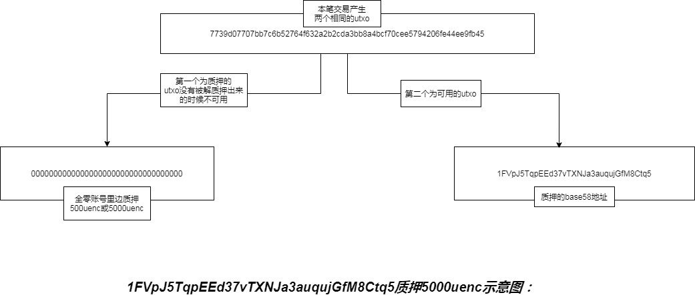
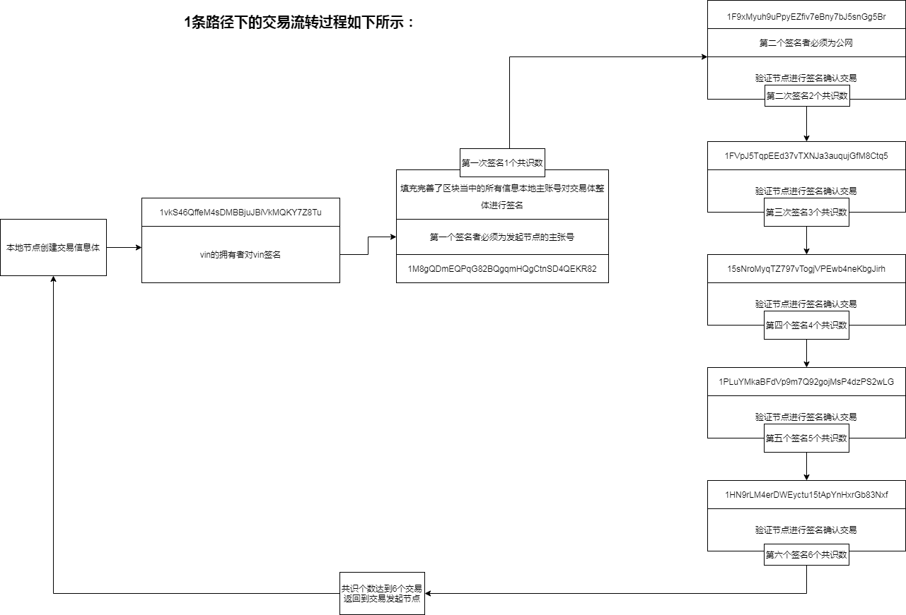
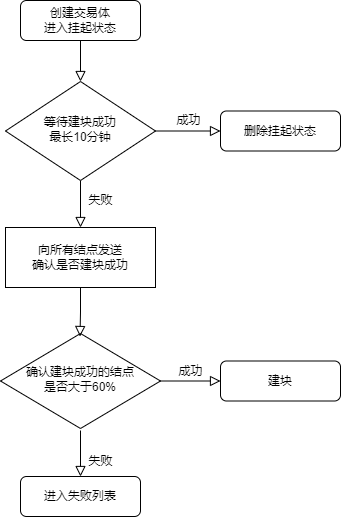

## UENC交易过程说明 ## 

UENC交易过程是利用UTXO（未使用的交易输出）机制进行交易，在UENC技术中，UTXO为64个十六进制的全网唯一的字符串，在一笔交易中，会使用若干个UTXO，并产生若干交易哈希序列。当该交易完成后，使用过的UTXO将不能再次使用，而新产生的交易哈希可以作为相关账户的UTXO为下一笔交易所用。

在交易流转是采用椭圆曲线数字签名算法（ECDSA）对交易进行签名打包，保证签名合法性和随机性，使用私钥对交易和交易中的UTXO进行签名。

## 交易类型和作用 ##

交易是指一个账户（公私密钥对）内的资产流向另外一个账户的过程。在交易中需要对发起账户核实账户的有效性，根据共识机制在网络中寻找n(6-15)个共识数签名节点对该交易进行验证和确认后，提供相应的手续费和打包费（打包费某些情况下可以为0）后，发到全网得到全网至少60%节点确认后才可上链，即确认该笔交易有效。

UENC交易分为普通交易、质押交易和解质押交易。

### 普通交易：
1. 普通交易

普通交易分为1对1交易(一个账号给另外一个账号转账)、1对多交易(1个账号给多个账号转账)和多对1交易(多个账号同时给一个账号转账)。

每笔交易的过程当中一个账号最多可以消耗100个utxo，这种机制可以降低当交易中有大量UTXO时在节点验证过程缓慢的问题，减少在交易过程当中冗余的计算。

2.质押交易：

质押交易是账号向一个虚拟质押账户（Base58地址为全为0的账户）发起交易，交易之后产生两个相同的UTXO，一个UTXO为质押资产的utxo(账号冻结的UTXO)，一个是可用的UTXO(对应账号可用的UTXO)。

质押之后需要30天之后才可以进行本笔交易的解质押。

质押分为普通节点类型质押(500UENC)和公网类型质押(5000UENC)。



3.解质押交易：

解质押交易时，需要提供之前质押的某笔质押UTXO，以及额外支付的手续费、打包费进行解质押操作，解质押成功后，质押UTXO的资产将转入到解质押账号中。

##	交易流程	##

1.交易发起地址中的Base58地址必须合法，发起方和接收方不能为同一个账号地址，发起方不能含有接收方某地址或接收方不能含有发起方地址。

2.为了防止同一个UTXO被多次使用出现冲突（双花问题），在同一个节点上发起交易成功后，本笔交易会进入挂起列表。当再用之前的UTXO发起第二笔交易的时候会被阻止交易，除非该交易上链或10分钟后从挂起列表中清除。

3.发起方的第一个账户只能作为第一个签名节点(手机端代发为代发节点主账号第一个签名)，发起方其余账户和接收方全部账户均不可以参与签名、已签名节点不可再进行签名，签名节点个数（共识数）范围为6-15。

4.检查交易（质押、解质押）金额是否正确，接收金额是否正确、vin（UTXO）的拥有者对vin进行签名。

5.50高度以下，优先选择质押（包括公网和验证节点）节点签名，当质押节点不足共识数时，可选择任一节点签名。

6.50高度以上，必须使用质押（包括公网和验证节点）节点签名，当质押节点不足共识数时，无法发起交易。

7.为了防止分叉（区块链中有两个或多个使用相同UTXO的同一账户发出的交易并存的情况），第二次签名的验证节点必须为公网节点，

在交易转发的过程当中首先要经过公网，在UENC的路由网络中，公网最先得知是否有相同的UTXO使用。所以将公网为第二次的签名者。

因为比自身节点低的节点无法确定相同的UTXO是否多次使用，为了确保主链稳定，比自身节点低的节点不允许参与签名。

8.第二次签名的验证节点首先要验证第一次的签名的签名信息是否正确，然后主账号进行签名，签名之后添加签名信息并以6倍路径随机散列选择节点(见选择节点)。

当本次交易流转到第3个验证节点的时候，验证节点首先要验证第一次和第二次签名信息是否正确，然后主账号进行签名并添加签名信息继续流转。

流转到下一个验证节点的时候验证节点都要验证前几次所有的签名信息是否正确。

9.验证节点签名是对交易体整体进行签名，当块结构当中的所有信息都填充完善之后每一个验证节点的主账号对交易整体进行签名。

10.一个区块当中包含3笔交易即本次交易的主交易、签名交易、额外奖励交易。主交易包括普通交易、质押交易和解质押交易。

签名交易就是本笔交易当中的签名者得到的签名费交易(发起节点不获取签名费)，如果某账号签名次数过多则被放入到异常账号列表当中，该账号不能进行下次的签名(详见异常账号)。

额外奖励为每个签名账号获取的额外奖励(交易发起者和交易的第二个签名者不获取额外奖励)(详见奖励)

11.当签名个数达到共识个数的时候，交易会流转到交易的发起节点，发起节点在本地先创建块，然后广播到别的节点让别的节点先建块，自身发起节点是通过同步获取到块写入到数据库。(详见同步)



#####交易过程相关函数  
```
handle_transaction //发起转账交易
CreateTxTransaction //创建交易信息体
SignTransaction //每一个拥有vin的账号对交易体签名
VerifyTransactionSign //校验签名信息是否正确
GetSignString //验证节点主账号对交易体整体签名
FindSignNode //查找签名节点
AddSignNodeMsg //添加节点签名信息
handle_pledge    //发起质押交易
CreatePledgeTransaction //创建质押交易的信息体
handle_redeem_pledge  //发起解质押交易
CreateRedeemTransaction //创建解质押交易的信息体
DoHandleTx     //交易流转处理函数
```

##### 交易协议格式
```
// 签名节点信息
message SignNodeMsg
{
	string id					= 1;				 // 签名节点id
	bytes signMsg				= 2;                 // 签名节点签名信息
	bytes signPubKey            = 3;                 // 签名者公钥
	string gasFee               = 4;                 // 签名所需燃油费
}
```
```
// PC端交易信息体
message TxMsg
{
	string       version        = 1;                        // 版本					
	bytes		 id 			= 2;						// id
	bytes 		 tx				= 3;						// 交易信息
	string       txEncodeHash   = 4;                        // 交易信息体base64之后sha256的hash值
	repeated SignNodeMsg signNodeMsg = 5;                   // 签名账户燃油费矿机在线时间签名节点签名信息
    uint64 		 top            = 6;                        // 发起交易节点高度值
	string       prevBlkHash    = 7;                        // 父块hash
	int32 		 tryCountDown	= 8;						// 尝试次数
}
```
```
// 广播建块
message BuildBlockBroadcastMsg
{
	string       version        = 1;                        // 版本					
	bytes 		blockRaw		= 2;						// 块信息
}
```
```
// 挂起
message TxPendingBroadcastMsg
{
    string version = 1; // 版本
    bytes txRaw = 2; // 交易信息
	uint64 prevBlkHeight = 3; // 前置的高度
}
```
```
// 双花
message TxDoubleSpendMsg
{
    string version = 1; // 版本
    repeated CTransaction txs = 2;
}
```
## 节点选择 ##
用户构建交易体后，需要其它用户进行验证和签名，进行交易流转，这就涉及到节点选择的问题。在节点选择中要保证公平性和随机性，让每个用户有平等的机会进行签名和获得签名奖励。

节点选择时，第一个节点选择公网，在路由网络中，公网最先建立区块，因此公网的区块信息相比其他节点更全面，能够依此判断其他往来交易中是否有冲突（双花问题）。公网先建块，能够快速判断出是否建块成功，当交易有冲突时，签名不成功则该交易发起失败。

节点选择时，会优先选择已经质押的节点。当链高度为50以下，且账号为初始账号或者是质押类型交易时，这时在没有质押节点情况下，才会选择未质押类型。

质押分为普通类型质押和公网类型质押。公网类型质押是需要金额5000。普通类型质押是需要金额500。

### 节点过滤 ###

在节点选择时，首先要获取所有节点，然后进行过滤筛选。过滤筛选，是把不符合条件的节点去除掉。

节点过滤筛选的六种情况：

1. 自身节点会被过滤。
2. 交易双方节点会被过滤。
3. 奖励值异常账号节点会被过滤。
4. 节点高度低于发起者高度的节点会被过滤。
5. 节点签名费高于发起交易时定义的签名费会被过滤。
6. 已签名的节点会被过滤。

### 公网节点选择 ###

在交易流转时，第一个被选择的节点是公网节点。公网选择时，首先取出所有公网节点，根据公网质押类型并且质押金额等于或大于5000的标准，筛选出质押和未质押的节点数据。

当链高度为50以下，并且账号为初始账号或者是质押类型交易时，优先选择质押节点，当质押节点不足时，可选择未质押节点。

当链高度为50以上时，只能选择质押节点，如果没有质押节点，结点选择失败。

选择节点时，进行散列随机选择，以保证公平性，保证每个可用节点都会有被选择的机会。

### 普通节点选择 ###

普通节点选择时，包括所有节点，根据普通质押类型并且质押金额等于大于500的标准，筛选出质押和未质押的节点数据。

当链高度为50以下，并且账号为初始账号或者是质押类型交易时，优先选择质押节点，当质押节不足时，选择未质押节点。

当链高度为50以上时，只能选择质押节点，如果没有质押节点，结点选择失败。

选择节点时，进行散列随机选择，以保证公平性，保证每个可用节点都会有被选择的机会。

### 交易上链 ###

	1.当交易发起成功之后，全网节点当中有超过60%的节点都拥有本笔交易则承认本笔交易上链。
	
	2.未上链的区块通过同步过程也可以交易上链，并写入到数据库中。
	
## 交易确认 ##


由于网络通讯的稳定性等原因，交易在某些特殊情况下会失败，为确定发出的交易是否成功上链，在这里使用拜占庭容错算法。

我们可以将共识算法定义为一种机制，共识算法的核心是在正常的节点之间形成网络状态的共识。也就是说，即使某些节点之间沟通失败或者存在恶意行为，拜占庭容错系统也能够继续运行。本质上来说，拜占庭容错算法就是少数服从多数。

用户发起交易后，进入挂起状态，10分钟后如果还在挂起状态，就进入交易确认状态，使用拜占庭算法，向全网中的n（100）个节点发送消息确认该交易体是否建块。

发起节点会检查收到的节点确认个数。如果确认个数大于60%，说明全网建块成功，会在本地建块。如果没有大于60%，说明建块失败，进入失败列表，该交易发起失败。




