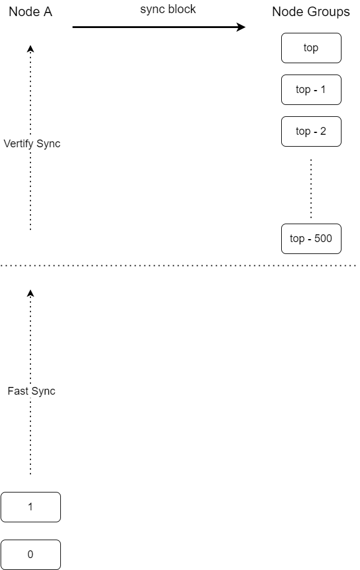

# 前置条件   

  任何用户都可同步主网中的全部数据区块，在同步区块之前，你需要拥有如下准备：
  
  * 一个连接在主网上的可靠节点

## 区块同步流程

  区块同步分为快速同步过程与校验同步过程
  
  * 当本地区块高度小于链上600高度的时候，使用快速同步，同步至链上最高减去500的高度位置。
  * 当本地区块高度大于链上600高度的时候，使用校验同步，同步至链上最高高度位置。
  
  

## 步骤

### 快速同步主要经过如下步骤：

1. 请求节点随机向100个节点发送FastSyncGetHashReq请求,以获取对方节点的区间hash与节点最高高度（FastSyncGetHashAck）。
2. 请求节点等待3分钟, 当返回数据的节点数量小于50%的时候判断为失败，等待100秒后重新发送拜占庭请求。
3. 请求节点匹配返回的hash，当数量占比达到返回数据的节点数量75%时候记录返回的节点id。
4. 向一个匹配节点发送FastSyncGetBlockReq，以获取对方节点的区块数据（FastSyncGetBlockAck）。
5. 请求节点等待3分钟, 当节点返回区块数据后，将返回的区块数据按照高度与时间进行排序，验证区块的hash，并验证与拜占庭返回的hash是否匹配。
6. 当验证成功之后，将排序后的区块数据逐个插入数据库。
7. 当没有返回数据或数据验证失败，则向下一个匹配节点继续请求，直到数据返回并验证成功或者所有节点都请求完成。
8. 等待100秒后重新发送下一轮拜占庭请求。

#### 快速同步相关函数

```cpp
  SyncBlock::GetFastSyncSumHashNode //发送拜占庭并处理返回的hash
  SyncBlock::GetFastSyncBlockData   //发送请求区块数据并添加

  SendFastSyncGetHashReq            //发送拜占庭
  SendFastSyncGetHashAck            //发送拜占庭响应
  SendFastSyncGetBlockReq           //发送同步区块
  SendFastSyncGetBlockAck           //发送区块数据

  HandleFastSyncGetHashReq          //处理拜占庭请求并返回
  HandleFastSyncGetHashAck          //将返回的拜占庭数据汇总
  HandleFastSyncGetBlockReq         //处理同步区块请求并响应
  HandleFastSyncGetBlockAck         //将返回的区块数据传给处理线程

  ca_algorithm::SaveBlock           //保存区块
```
  
#### 快速同步协议格式
```
message FastSyncGetHashReq
{
    string                 self_node_id       = 1; //请求节点id
    string                 msg_id             = 2; //本次请求消息id
    uint64                 start_height       = 3; //开始高度
    uint64                 end_height         = 4; //结束高度
}

message FastSyncGetHashAck
{
    string                 self_node_id       = 1; //响应节点id
    string                 msg_id             = 2; //请求的消息id
    uint64                 node_block_height  = 3; //本节点最高高度
    string                 hash               = 4; //区间hash
}

message FastSyncGetBlockReq
{
    string                 self_node_id       = 1; //请求节点id
    string                 msg_id             = 2; //本次请求消息id
    uint64                 start_height       = 3; //开始高度
    uint64                 end_height         = 4; //结束高度
}

message FastSyncGetBlockAck
{
    string                 msg_id             = 1; //请求的消息id
    repeated bytes         blocks             = 2; //区块数据
}
```

#### 校验同步主要经过如下步骤：

1. 请求节点随机向5个节点发送SyncGetSumHashReq请求,以获取对方节点的区间分段hash与节点最高高度（SyncGetSumHashAck）。
2. 请求节点等待1.5分钟, 当返回数据的节点数量小于50%的时候判断为失败，等待100秒后重新发送拜占庭请求。
3. 请求节点匹配返回的分段hash，，当数量占比达到75%的时候记录返回的节点id。
4. 请求节点校验本地的分段hash与返回的是否一致，当不一致的时候记录区间与节点id。
5. 请求节点向记录的节点id发送SyncGetHeightHashReq,以获取对方节点区间内的所有区块hash（SyncGetHeightHashAck）。
6. 请求节点等待1.5分钟, 当返回数据的节点数量小于50%的时候判断为失败，等待100秒后重新发送拜占庭请求。
7. 请求节点匹配返回的区块hash，当区块hash占比达到80%并且本地不存在的时候，记录区块hash以及节点id，当小于20%，并且本地存在该区块的时候，记录回滚的区块hash。
8. 请求节点获取本地高度区间所有区块hash，判断是否在可信列表，当不在可信列表中并且区块所在高度小于链上最高高度-10的时候，记录回滚的区块hash。
9. 请求节点向记录的节点id发送SyncGetBlockReq请求,以获取对方节点的区块数据（SyncGetBlockAck）。
10.请求节点等待1.5分钟当节点返回区块数据后，验证区块的hash，并验证是否在请求列表中，如果存在要回滚的区块hash，则先回滚，然后校验并添加区块数据。

#### 校验快速同步相关函数
```
  SyncBlock::GetSyncSumHashNode   //发送拜占庭并处理返回的hash
  SyncBlock::GetSyncBlockHashNode //发送分段hash并处理返回的区块hash
  SyncBlock::GetSyncBlockData     //发送请求区块数据并添加

  SendSyncGetSumHashReq           //发送拜占庭
  SendSyncGetSumHashAck           //发送拜占庭响应
  SendSyncGetHeightHashReq        //发送区间内的区块hash
  SendSyncGetHeightHashAck        //发送区间内的区块hash响应
  SendSyncGetBlockReq             //发送同步区块
  SendSyncGetBlockAck             //发送区块数据

  HandleSyncGetSumHashReq         //处理拜占庭请求并返回
  HandleSyncGetSumHashAck         //将返回的拜占庭数据汇总
  HandleSyncGetHeightHashReq      //处理发送区间内的区块hash并返回
  HandleSyncGetHeightHashAck      //将返回的区间内的区块hash并返回汇总
  HandleSyncGetBlockReq           //处理同步区块请求并响应
  HandleSyncGetBlockAck           //将返回的区块数据传给处理线程

  ca_algorithm::VerifyBlock       //校验区块
  ca_algorithm::SaveBlock         //保存区块
  ca_algorithm::RollBackToHeight  //回滚到指定高度 注意：调用的时候注意高度不要与最高高度相差太多，内存占用太大，进程容易被杀
  ca_algorithm::RollBackByHash    //回滚指定的区块hash 注意：调用的时候注意高度不要与最高高度相差太多，内存占用太大，进程容易被杀
```

#### 校验同步协议格式
```
message SyncGetSumHashReq
{
    string                 self_node_id       = 1; //请求节点id
    string                 msg_id             = 2; //本次请求消息id
    uint64                 start_height       = 3; //开始高度
    uint64                 end_height         = 4; //结束高度
}

message SyncSumHash
{
    uint64                 start_height       = 1; //分段开始高度
    uint64                 end_height         = 2; //分段结束高度
    string                 hash               = 3; //区间总hash
}

message SyncGetSumHashAck
{
    string                  self_node_id       = 1; //响应节点id
    string                  msg_id             = 2; //请求的消息id
    uint64                  node_block_height  = 3; //响应节点最高高度
    repeated SyncSumHash    sync_sum_hashes    = 4; //分段hash
}

message SyncGetHeightHashReq
{
    string                  self_node_id       = 1; //请求节点id
    string                  msg_id             = 2; //本次请求消息id
    uint64                  start_height       = 3; //开始高度
    uint64                  end_height         = 4; //结束高度
}

message SyncGetHeightHashAck
{
    string                  self_node_id       = 1; //响应节点id
    string                  msg_id             = 2; //请求的消息id
    repeated string         block_hashes       = 3; //区块数据
}

message SyncGetBlockReq
{
    string                  self_node_id       = 1; //请求节点id
    string                  msg_id             = 2; //本次请求消息id
    repeated string         block_hashes       = 3; //请求同步的区块hash
}

message SyncGetBlockAck
{
    string                  msg_id             = 1; //请求的消息id
    repeated bytes          blocks             = 2; //请求同步的区块数据
}

```