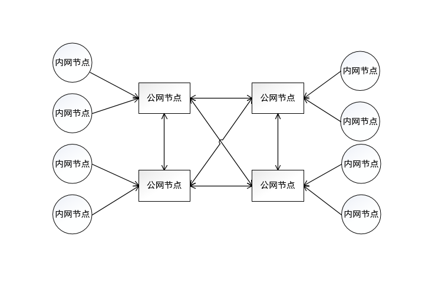
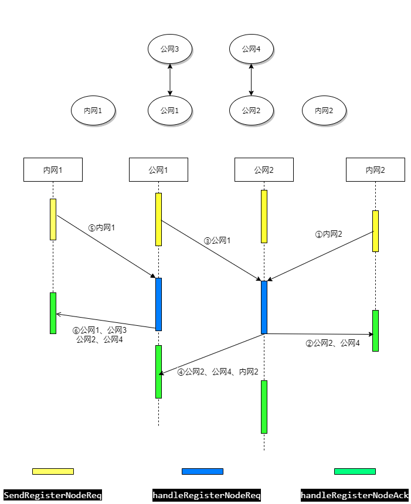
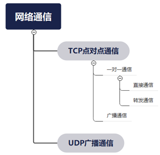

# UENC网络结构说明 #

UENC底层网络采用路由式的网络拓扑结构，而不是全连接的网络拓扑结构。
相对全连接的网络拓扑结构，路由式网络减少了查询消息传播的数量，具有更好的扩展性。随着节点数量的增加，网络不容易出现因为过多的查询而发生阻塞的情况。   
在路由式的网络拓扑结构中存在两种节点类型，分别是公网节点和内网（局域网）节点。公网节点是在外网有独立公网IP的节点，内网节点是在内网环境的节点。各个节点地位相同，主要区别在于公网节点上存储了更多的节点信息，承担更多的网络流量。在同一内网中的节点可以直接进行信息交互，在不同内网中的节点之间通过公网节点进行交互     

## 网络组建流程 ##

节点程序运行后会向其他节点进行注册，其中：  

- 公网节点之间（外外连接）   
   注册成功后进行连接并记录交换的节点信息。交换的节点信息为处理注册请求的节点已连接的其他的公网节点信息和已知的内网节点信息
- 内网节点之间（内内连接）  
   注册成功后会直接进行连接并记录对方节点信息。
- 公网节点与内网节点之间（内外连接）  
   注册成功后内网节点会与公网节点建立连接。公网节点会记录内网节点的信息，同时内网节点会记录公网节点发送的节点信息。公网节点发送的节点信息为公网已连接的其他公网的节点信息  
  
若注册失败，则反复发送注册请求，直到注册成功。  


## 网络通信流程 ##
节点间的网络通信方式分为两种：TCP点对点通信和UDP广播通信。  

### TCP点对点通信 ##
使用TCP通信时，消息首先被存入SocketBuffer中，然后经由Dispatcher进行分发，最后由各个handle函数处理。    

1. 一对一通信   
    若目标节点记录在节点列表中且两个节点之间已连接，则可进行直接通信，否则需要进行转发
2. 广播通信（TCP）  
    广播通信由一对一通信模拟而来，向全网发送消息

### UDP广播通信 ###
使用UDP通信时，消息直接由Socket中读出并进行处理。UDP广播向整个内网发送消息，仅用于内网节点之间的注册连接。内网与公网之间，公网与公网之间使用TCP进行注册。
## TCP网络通信实现 ##
### 节点列表 ###
节点列表内为当前节点所记录的节点信息，实现为单例的PeerNode对象。主要用于查看节点信息、判断节点间的通信方式是直接发送还是转发并（公网）行使路由功能，节点信息结构如下： 
```cpp 
message NodeInfo  
{  
  bytes pub = 1;               //公钥  
  bytes sign = 2;              //签名  
  string base58addr = 3;       //base58地址  
  string public_base58addr = 4;//公网节点base58地址  
  uint32 listen_ip = 5;        //监听ip  
  uint32 listen_port = 6;      //监听端口  
  uint32 public_ip = 7;        //公网ip  
  uint32 public_port = 8;      //公网端口  
  bool   is_public_node = 9;   //是否为公网节点  
  uint32 height = 10;          //高度  
  uint64 sign_fee = 11;        //签名费用  
  uint64 package_fee = 12;     //打包费用  
  string version = 13;         //版本  
}  
```
公网节点会保存所有已连接的公网节点及这些公网节点的内网节点的信息，而内网节点只保存了它的公网节点所连接的公网节点信息以及同一内网的内网节点信息
### 通信实现接口 ###
通信实现接口沟通网络应用层协议与TCP Socket，主要由两个接口组成：send_message和broadcast_message，分别对应于一对一通信和广播通信。消息经由两接口发送至SocketBuffer中，然后从SocketBuffer中取出，通过Socket发送给其他节点
## 网络功能模块 ##
### 节点注册 ###
- TCP注册   
   - 步骤
   1. 注册发送节点向被注册节点发送注册请求，若两个节点之间未连接则会先进行Socket连接，若连接失败则重新发起注册
   2. 被注册节点处理注册请求返回特定的节点信息。若注册发送节点为公网节点，则返回信息包括被注册节点已连接的公网节点信息和已知内网节点信息；若注册发送节点为内网节点，则只返回被注册节点已连接的公网节点信息。
   3. 注册发送节点处理被注册节点发回的注册响应并记录相应的节点信息。若注册发送节点为公网节点，还会与响应中的公网节点进行连接
   4. 为平衡区块链中各个公网节点负载，内网节点每间隔一段时间会随机向其他公网节点重新注册
   - 函数   
   net_com::SendRegisterNodeReq //发送节点注册请求   
   net_com::connect_init //初始Socket连接  
   handleRegisterNodeReq //处理节点注册请求  
   handleRegisterNodeAck //处理节点注册响应  
   PeerNode::conect_nodelist //与K桶中记录的节点进行连接  
   - 协议
     ```cpp
     message RegisterNodeReq    
     {     
       NodeInfo mynode = 1;           //请求节点信息  
       bool     is_get_nodelist = 2;  //始终为true，目前未使用   
     }   
     message RegisterNodeAck   
     {  
       repeated NodeInfo nodes = 1;   //响应节点返回的节点信息  
     } 
     ```
- UDP注册
  - 步骤
  1. 内网节点定期发送节点注册广播
  2. 被注册节点收到广播后记录请求节点的信息并与之进行Socket连接，若连接成功则发送注册请求。若连接失败则放弃
  3. 请求节点收到被注册节点的注册请求后将会记录被注册节点信息
  - 函数  
  net_com::SendBroadcastNodeReq //发送节点注册广播  
  net_com::RecvfromBroadcastMsg //处理节点注册广播  
  net_com::SendConnectNodeReq //发送节点注册请求  
  - 协议   
    ```cpp                               
    message BroadcastNodeReq  
    {  
      NodeInfo mynode = 1;           //请求节点信息  
    }  
    message ConnectNodeReq  
    {  
      NodeInfo mynode = 1;           //发送节点的节点信息  
    }  
    ```
### 同步节点信息 ###
当节点为公网节点时，会定期向其他公网节点发送同步节点信息请求
 - 步骤   
  1. 发送请求的公网节点把记录的所有节点信息发送给其他公网节点
  2. 接受请求的公网节点会记录请求公网节点发送的所有节点信息，并把自身记录的所有节点信息发送给请求节点
  3. 发送请求的公网节点处理接收节点的响应，记录接收节点发送的节点信息并与接受节点发送的其他公网节点进行连接
 - 函数  
	net_com::SendSyncNodeReq //发送同步节点请求  
	handleSyncNodeReq        //处理同步节点请求  
	handleSyncNodeAck        //处理同步节点响应  
 - 协议
   ```cpp  
   message SyncNodeReq  
   {  
     repeated string ids = 1;      //发送节点的base58地址    
     repeated NodeInfo nodes = 2;  //发送节点K桶内全部节点的base58地址  
   }  
   message SyncNodeAck  
   {  
     repeated NodeInfo nodes = 1;   //接受节点的base58地址  
     repeated string ids = 2;       //接受节点的base58地址   
   }  
   ```
### 心跳机制 ###
节点掉线后在规定时间内若未重新连接则心跳数变为0，删除该节点  
 - 步骤    
  1. 公网节点将所有已知节点心跳数减1并发送ping请求
  2. 当接受节点成功收到ping请求，重置发送节点心跳数并发送pong请求
  3. 当发送节点成功收到pong请求，重置接收节点心跳数并更新接收节点信息
 - 函数  
   net_com::DealHeart  //处理心跳  
   net_com::SendPingReq         //发送ping请求  
   net_com::SendPongReq         //发送pong请求  
   handlePingReq       //处理ping请求  
   handlePongReq       //处理pong请求  
 - 协议 
   ```cpp 
   message PingReq  
   {  
     string id        = 1;   //心跳发送（ping请求发送）节点base58地址    
   }  
   message PongReq  
   {  
     string id        = 1;   //心跳接受（pong请求发送）节点base58地址  
     uint32 chain_height = 2;//块高度  
   }  
   ```
### 块高度更改通知 ###
 - 步骤
  1. 当节点是内网节点时将自身的节点高度发送给自身所连接的公网节点，当节点是公网节点时将自身的节点高度发送给连接的其他公网节点
  2. 接收节点处理块高度更改请求，更新对应节点的块高度
  - 函数
   net_com::SendNodeHeightChanged      //发送更改块高度请求  
   handleNodeHeightChangedReq //处理更改块高度响应  
  - 协议  
    ```cpp
    message NodeHeightChangedReq  
    {  
      string id = 1;    //请求节点的base58地址  
      uint32 height = 2;//请求节点的高度  
    }  
    ```
## 网络测试功能 ##
1. 点对点通信测试  
net_com::SendPrintMsgReq //向指定节点发送特定的消息  
handlePrintMsgReq  //打印接收到的消息  
2. 广播（TCP）测试  
net_com::test_broadcast_message() //向全网发送"Hello World!"消息  
3. 回声测试  
   回声测试基于广播（TCP）测试，唯节点间传递的消息不同  
test_echo //发送回声  
handleEchoReq //接受节点回发自己的base58地址  
handleEchoAck //发送节点打印接受节点发送的base58地址  
* 网络测试协议:    
  ```cpp
  message PrintMsgReq  
  {  
    string data         = 1; //打印的消息  
    int32  type         = 2; //打印类型，0：打印至屏幕，1：打印至文件  
  }  
  message EchoReq  
  {  
    string id = 1; //请求节点的base58地址  
  }  
  message EchoAck  
  {  
    string id = 1; //接受节点的base58地址  
  }  
  ```
## 其他 ##


1. 转发
   
- 相关函数  
  net_com::is_need_send_trans_message //判断节点是否需要转发  
  net_com::SendTransMsgReq //发送转发请求  
  handleTransMsgReq //处理转发请求  
- 协议
  ```cpp
  message TransMsgReq  
  {  
    NodeInfo dest = 1;   //目标节点信息  
    bytes data  = 2;     //需要转发的数据  
    uint32 priority = 3; //优先级  
  }  
  ```
2. 废弃函数  
void SendNotifyConnectReq(const Node& dest);  
int handleNotifyConnectReq(const std::shared_ptr<NotifyConnectReq> &transMsgReq, const MsgData &from);  
int handleBroadcastNodeReq(const std::shared_ptr<BroadcastNodeReq> &broadcastNodeReq, const MsgData &from);  
