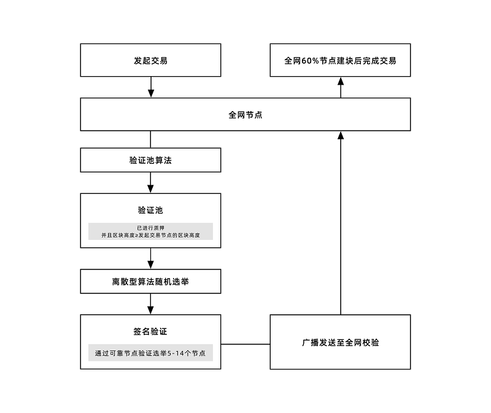

UENC自主发明了新的DPOW共识算法，即定向工作量证明（DIRECTIONAL PROOF OF WORK）。

作为完整系统的一部分，DPOW共识算法运行在单独的层次中，通过标准接口与网络层进行交互。在技术实现中，共识层设计了完整的框架接口，可以对共识层进行扩展和升级。这保持了UENC的技术先进性和可持续发展的特性。

### DPOW定向工作证明

UENC在共识层采用了DPOW模式，由C语言写成，执行效率较高。与传统POW相比更高效，不会产生算力竞争。每个节点在网络中都有自己唯一的节点ID，每个节点在主网中通过离散随机数进行选取验证。

DPOW以离散随机数算法从验证池中随机选举的验证节点进行多线性广播的数据校验，通过最终满足的签名校验，确定区块的合法性。

DPOW避免了传统POW中自由竞争记账权所带来的算力集中化与“赢者通吃”问题，一定程度上实现了公平性与竞争性的平衡。UENC网络中，会随着验证节点及公网节点的不断增加实现更高的承载量。由于节点的低能耗工作和未来不断增加的验证节点可用性的满足，交易成本会得到控制，但前提是实践中真实节点数量要成足够规模。DPOW通过CPU进行计算执行，相较于GPU、ASIC等成本大幅降低。

