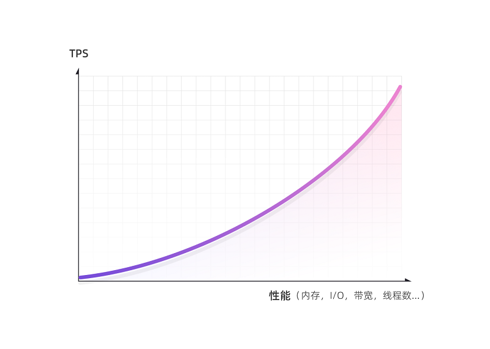

UENC网络节点我们通过实验室环境组建了规模有限的网络，采用了戴尔R740-8核心8G p4500的服务器配置标准组建了千兆网络环境，通过测试环境我们看到了比较可观的数据，在同一高度的并发区块可以达到数万个，并且时效性是完全可用的，在连续增长高度的过程中我们发现少量节点best-tree的区块哈希是有所变化的，导致了少量节点在建块过程中处于落后状态，但这并没有影响到整体主链的生长和数据可用性，通过块哈希拜占庭容错算法的同步机制少量节点能够快速进行补块操作并达到可用状态，数据显示此网络可以维持在每秒1500-3000+交易数，在整个测试过程中CPU一直处于稳定状态，我们看到I/O的性能及网络是测试过程中性能消耗较大的地方，根据节点硬件性能的提高此TPS也会同时提高，目前UENC的计算以CPU为主，并未启用GPU的芯片模块，从硬件角度分析未来有很大的可拓展性，随着各类硬件技术及网络环境的不断提升与发展，理论上可无限提升。 交易最短时间仅10s-15s时间就可出块，30s内群集的大多数节点完成确认。

### TPS

每个节点运行时都维护一个已处理的交易计数。 UENC支持侧链技术，因此在同一高度上会有多个合法区块并存的情况，统计时需要将侧链的区块和交易一并进行统计。目前版本中每个区块中仅包含1个主交易，1个手续费交易和1个奖励交易， 通过测试数据的表现，硬件环境越好TPS数值将会越大，随着网络中硬件性能的不断提升TPS也将同时不断拓展，这里的硬件条件包含上下行带宽、I/O读写速率、cpu内核和内存容量等，TPS会呈指数型增长。 

 
### I/O速率
UENC网络包含了复杂的多样的算法以确保数据的准确性和安全性，虽然数据都是以简洁轻便的字节流形式保存，但在现有网络下进行测试同步200区块的同时I/O读写频次是较高的，所以加入的节点需预备好I/O读写能力较强的磁盘。

### 确认时间

当交易节点发起交易后，首先发起节点建立该交易区块，将区块广播至全网，全网所有节点进行验证无误后，在全网节点完成建块。网络状况良好30s内全网60%以上节点将会完成建立该区块。