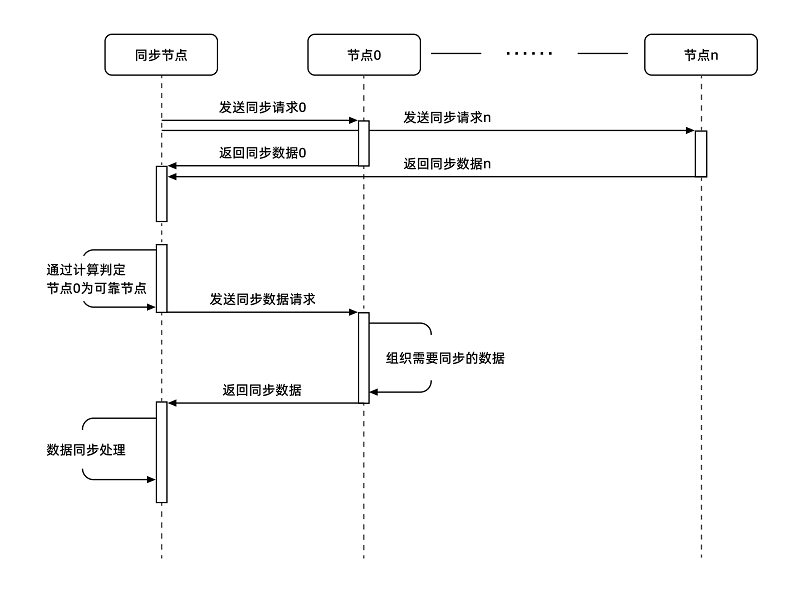

快速、可靠的同步是UENC实现超高吞吐量的基础。 同步包含大量交易的区块，每个区块有的不止含有一笔交易信息。完成那么高效率和高质量的同步需要过硬的技术支持，如：可靠节点的查找、分叉的管理、UTXO校验。

### 查找可靠节点

1. 同步节点向多个随机节点发送数据请求，当被同步的节点接收到请求后，以同步节点的高度为起始，向前计算前一个高度的分组hash，将计算分组hash发送回同步节点。
2. 同步节点接收到分组hash之后，根据分组hash在备选节点中寻找可靠节点，可靠节点的选择依据为：若60%及以上的节点的数据一致，则这些节点为可靠备选节点，通过这种方式就可以确定可靠节点。
3. 确定完可靠节点之后，同步节点向该可靠节点发送同步请求消息。 
4. 可靠节点接收到同步节点的数据同步请求之后开始处理请求,通过对比同步节点发送过来的请求信息，找出可能潜在的分叉点（若有分叉），并从分叉高度开始，组织块数据发送给同步节点。 
5. 同步节点收到数据之后开始处理，若有分叉点，则记录分叉点，并发送漏块请求，然后将收到的块加入块验证池中，待处理完成冲突检查后进行加块。

 
 
 ### 同步规则
 UENC的同步规则分为3种，根据不同的情况进行不同的同步规则。一、如果新矿机从0高度开始同步，则会对全网节点进行默克尔树计算获得一个hash值，根据这个hash值确定一个可靠节点，从此可靠节点上直接拉取1000块进行同步。第二次1000块再进行节点默克尔数计算拉取数据。
 直到距离全网高度相差500个块的时候，会进行一种数据比对方法算法计算，规则如下：对随机选择一个节点和全网数据进行数据比对，有60%以上的节点数据相同，hash一致的时候则对此节点的数据进行拉取到同步节点。

### 区块存储

UENC的存储方式是利用非关系型的数据库RocksDB存储的，数据进行交叉式并行存储。

RocksDB是使用C++编写的key-value非关系型存储引擎，其键值允许使用二进制流，有效提升数据访问速度。基于编码优化技术的，能提高数据存储空间的效率，有效的利用有限的空间尽可能存储更多的数据。 

交叉式并行存储技术（CPS），并行交叉存储器是由多个独立的、容量相同的存储模块构成的多体模块存储器。它解决的主要问题是提高主存储器的数据传输率。

UENC存储融合了并行式和交叉式的存储系统，物理上分离各地地址，相互数据不受影响，逻辑上形成虚拟主链，这样既提高数据存储空间的效率，又有效的利用有限的空间尽可能存储更多的数据。

在数据库当中可以获取到块的高度、区块哈希、块头数据、UTXO、所有交易和单笔交易等信息、通过这些信息可以把整个区块在逻辑层面上串联起来， 同时保证高效的增删改查操作。

 
部分数据库字段：

。`blkhs2blkht_` - kBlockHash2BlockHeightKey 

。`blkht2blkhs_` - kBlockHeight2BlockHashKey 

。`blkhs2blkraw_` - kBlockHash2BlcokRawKey 

。`blktop_` - kBlockTopKey 

。`syncblktop_` - kSyncBlockTopKey 

。`bestchainhash_` - kBestChainHashKey 

。`blkhs2blkhdraw_` - kBlockHash2BlockHeadRawKey 

。`addr2utxo_` - kAddress2UtxoKey 

。`txhs2txraw_` - kTransactionHash2TransactionRawKey 

。`txhs2blkhs_` - kTransactionHash2BlockHashKey 
