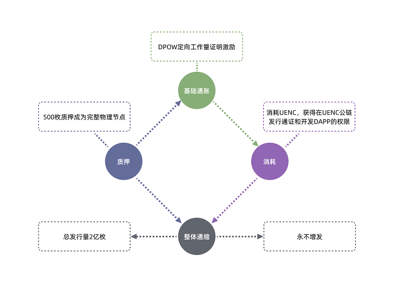

UENC主要功能包括：消耗或抵押UENC，获得在UENC公链发行通证和开发DAPP的权限；获得生态应用的使用权；在购买商品和服务中享受费用折扣；质押500UENC以成为签名节点。持有UENC可参与生态治理及获得投票权；参与UENC生态收益分配。

 ### 经济原理
 
依照经济学原理,当经济活动增加时,为满足经济激励需要,市场当中的流通货币应当增加。

根据费雪方程式`MV=PQ`（M：货币量，V：货币流速，P：商品价格，Q：商品数量）,当生态中经济活动增多,商品数量增加时,如果货币量不变，则会导致物价下跌（这里假设V不变）。物价下跌会导致人民消费意愿减弱，经济陷入通货紧缩。此方程式应用在区块链生态中时，PQ可视为生态的GDP。

在UENC生态中，随着生态参与者不断加入，生态的GDP（PQ）不断增大，如果M保持不变，会使得生态通证UENC对法币的价格不断升高。此时，生态用户选择持有UENC等待升值，而不去进行交易活动，这种情况严重阻碍了生态的健康发展。

因此，UENC通证应具有升值属性。UENC作为底层公链 ，其上将不断发行链改企业通证和开发DAPP，UENC的主要场景将作为生态通证的燃料，链上发行的通证将作为各自应用生态内的流通媒介。

其次，在UENC生态内，UENC通证兼顾一部分流通属性。由于流程场景不复杂，在生态应用UENC中通证可作为流通使用 ，但商品标价将依UENC市价进行调整，保证其价格锚定固定的法币。

未来，当UENC生态内流通支付场景大量增加时，考虑设立锚定法币的稳定通证。

 ### UENC通证

UENC通证是UENC社区生态激励经济的核心，为UENC社区生态的参与者提供参与动力。只有UENC升值，早期参与者才可以获得回报。UENC只有具备升值逻辑才能吸引跟多的参与者参与到生态当中来，从而使得UENC 社区生态网络效应增强，实现指数式的价值增长。

所以，UENC通证设计的核心要求是不断赋予其价值。赋予价值的方式是：不断鼓励用户长期持有。一方面刺激需求，一方面降低流动性，这样会使得在总量恒定的情况下，市场上UENC极度稀缺，从而提升其价值。同时采用相关机制，不断销毁UENC，进一步促进UENC升值。其通证经济模型如下：

 

 ### 升值&流通
 
UENC通证是UENC社区生态激励经济的核心，为UENC社区生态的参与者提供参与动力。UENC作为一种奖励分发给生态早期参与者，只有UENC升值，早期参与者才可以获得回报。UENC只有具备升值逻辑才能吸引更多的参与者参与到生态当中来，从而使得UENC 社区生态网络效应增强，实现指数式的价值增长。

所以，UENC通证设计的核心要求是不断赋予其价值。赋予价值的方式是：不断鼓励用户长期持有。一方面刺激需求，一方面降低流动量，这样会使得在总量恒定的情况下，市场上UENC极度稀缺，从而提升其价值。UENC在交易所的价格是用户对UENC价值预期的心里博弈，价格将围绕价值波动。同时，采用相关机制，不断销毁UENC，进一步促进UENC升值。

### 生态应用

在UENC生态体系中，生态角色主要为开发者和提供基建的用户节点生态。B端开发者通过使用优质高效的基础设施以及运用智能合约技术，创新开发更多行业智能应用，从而形成完整的闭环生态圈。在基建层面，B端和C端均可参与基建。参与基建的用户节点可获取相应的通胀收益，并将提供更好的流动性，同时他们会与开发者生态形成互相反哺的生态关系，完善整个公链上下游生态体系。

UENC作为底层公链，其通证属于技术层通证。在UENC通证层面，UENC作为主通证，锚定生态价值，主要承担升值的功能。随着UENC生态建设的不断推进，其发行的通证和开发的DAPP用户数量会不断增长，其中包括Defi、NFT、分布式搜索引擎、预言机，元宇宙等多维度赛道生态的快速繁荣。这些生态会不断赋予UENC价值，使得UENC价值快速上升，最终，所有生态角色将共享去中心化基建和生态带来的巨大红利。
