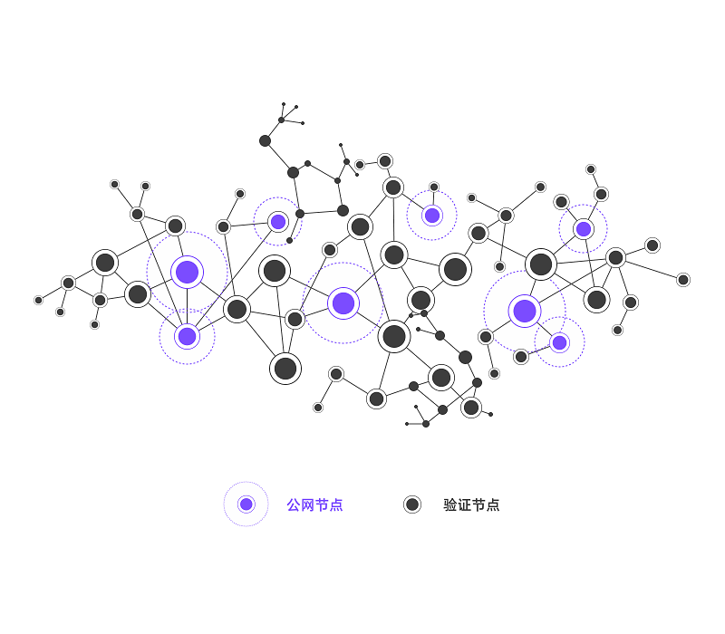

UENC没有采用Kademlia重叠网络传输协议，而是采用混合式的网络结构。

### 网络结构

UENC将网络节点分为：**公网节点**和**验证节点**

公网节点：负责桥接验证节点提高网络传输的时效性，公网节点与验证节点建立一种特定的轮巡与心跳机制，当心跳信号较弱时，验证节点会与其公网节点迅速断开，并向其他公网节点进行合法的连接请求，随着公网节点的加入，验证节点会根据特定算法进行合理分配，保证整体网络的数据传输时效性。 

验证节点：验证节点进入网络后，预先通过一定时间的适应期，适应期时长会根据网络规模而定。在这个过程中验证节点与公网节点请求握手，所有公网节点有准确的网络地址，验证其合法性后会将区块高度、验证节点所在网络位置等信息保留至节点列表并等待下一次的轮巡刷新。

每个公网节点会连接网络中的部分验证节点，每个验证节点会随机与公网节点进行可信通讯，并会不定时进行通讯更新，通过心跳监测的机制确保网络通讯的可用性。
这种网络结构可以有效融合在不断变动IP地址的环境中，并且在不定时的情况下实现轮巡替换，就好像魔方一样随时都会改变网络中节点的队列，
UENC以此机制保证其网络层的去中心化特性。

通过节点列表为每一个验证节点标志唯一性ID，保证验证节点在网络中的真实性，通过对节点列表数据的验证，将满足条件的验证节点集中至验证池中，利用离散型随机函数进行区块验证节点的随机选择，保证节点选择时的平滑性及公平性，一定程度上避免连续性函数由于网速等原因产生的不公平问题，这样做的核心目的是保证验证节点及出块的随机性和安全性，进而确认出一个作恶节点的容忍区间，凡参与验证区块合法性的节点即可拿到相应奖励。

每笔交易至少需要随机性6个-14个验证节点验证确认即可出块。这些节点既包含公网节点也包含验证节点。区别于其他公有链项目，UENC的公网节点和验证节点都可参与出块与验证。
本质上验证节点也可以实现验证和出块两种功能，但由于验证节点网络环境的局限性，出块并不成为其主要工作，除非在特定的使用环境中，相比公网节点其被使用的范围将会有所缩小。

在节点数量上，公网节点和验证节点全部由用户参与自发形成，暂时没有固定的上下限。但我们预计这个数量级是有瓶颈的，
由于UENC特殊的质押机制我们所预测的上述数量级被发展的概率是极低的，网络中节点参与的过程是流动性较强的，因为UENC不会做依赖于强制性长时间的质押要求，所有节点在加入网络后渡过30天的强制质押期后可随时退出，
每个公网节点对接的验证节点数量是有限的，数量过大会造成公网节点带宽压力，将导致小范围的网络通讯不畅。所以根据其特殊机制会设计出网络中单节点的计算能力进行承接的功能，如果压力过大造成公网节点性能瓶颈，此范围内的网络节点将会暂时处于不可用状态。
同时验证节点将会离开此公网节点分散至其他公网节点，目前根据网络数据显示8核8G，20M商业带宽的公网节点在目前网络的TPS可用状态下的连接上限为6000+的验证节点。
恒定上述硬件及带宽的条件，随着网络TPS的上升或验证节点连接数继续增加，都会让公网节点产生逐步的上升压力，当然单节点存活6000+的验证节点在现有网络中是不可能发生的，
我们预计公网节点在299个时，每个公网单节点下的验证节点数量同时为299个，全网验证节点数量将会达到接近于10万的数量级，这已经是一个非常庞大的数量级，这个数量级的发展概率是很低的，这会引发流动性的大量紧缩。
所以UENC网络层的发展可用性是长期稳定的。

### 节点列表
在其他的P2P网络中，每个节点都保存了其他节点的信息。当请求其中一个节点时，需要循环遍历所有节点直到找到请求的节点。 当网络中节点数量不断扩张时，不可能在每个节点上都存储所有其他节点的信息。 位数的增加，层数也不断增加，而越高层存储的信息也就越多。这样对后续数据的快速读取将造成很大的困难，将会降低网络数据的及时性。

而UENC网络是特殊的混合式网络，公网节点在完成子树拆分后，要记录每个子树里面的 K 个节点（验证节点）。当网络数进行增加的时候，公网节点主动统计并合理分配节点数量。这时如果公网数量不变的情况下，该数值会逐步增加，增加至公网节点性能瓶颈。这种现象我们认为是不合理的，在激励模型的推动下UENC网络中公网节点与验证节点是平行发展的过程，网络层也会处于一个相对稳定、通畅状态。

当公网节点收到一个请求消息时，发送者B的节点信息就被用来更新对应的节点列表，具体步骤如下：

   1. 记录发送节点的IP，区块高度等信息，并统计当前公网节点连接数。
   2. 若发送者B已经存在于其他节点的节点列表中，则更新节点列表信息。
   3. 若B节点不在节点列表中，则添加B节点信息到该公网节点列表中。
   4. 向其他公网节点广播此节点信息。

当然在整个过程中，网络会不定时对所有公网节点的列表进行刷新重组。每个公网节点下的验证节点将遵守轮巡机制，减少部分网络被作恶的可能。
