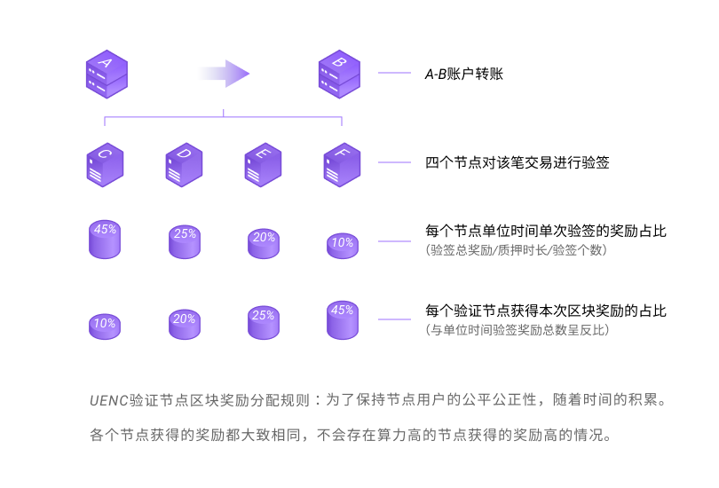

UENC实行去中心化的无竞争激励机制，每一个人都可参与UENC网络基础设施发展建设， UENC创新性地运用DPOW的共识算法，大幅降低了用户参与网络建设的成本，闲置算力即可参与。

### 质押
在UENC主网中，质押是节点通过锁定定量的UENC加入到uenc网络的行为。网络根据节点质押的uenc数量来作为节点的可信凭证之一，质押是为了防止一部分人操作UENC主网，对网络进行控制和作恶，质押UENC增加了作恶的成本，使全网避免被某些人控制的可能。 质押不是完全避免网络被攻击唯一安全性手段，这就仍需要安全可靠的算法和验证机制。

UENC的激励奖励并不是根据算力集中化与“赢者通吃”的规则，而是根据质押后单位时间的收益公平参与区块奖励。

在交易规则模块谈到转账手续费分给**公网节点**和**验证节点**，并且公网节点参与交易的第一个签名。为了确保公网节点的可靠和安全性，需要在公网节点进行质押操作，为了提高作恶的成本，这质押的数量为5000UENC。而验证节点只需要500UENC进行质押。

### 激励原理

在UENC的去中心化网络中，用户之间发起转账交易时，根据用户需求随机选择多个节点进行相关交易数据的验证后完成。节点进行交易验证时获得UENC奖励的过程即为运行激励。

在主网中用户可以有两个选择：**公网节点**和**验证节点**。公网节点与验证节点的区块奖励机制是完全一致的，公网可获得更多的交易gas费，这与验证节点是不同，公网节点的质押额度与验证节点有所不同，在主网2.0客户端的后期发布中公网节点将采用与验证节点10倍比例的质押额度，当然公网节点可以根据自身的运维成本与使用者进行gas议价，当假定公网节点数据状态完全一致并保持可用状态的情况下网络中所有交易的gas费由公网节点进行随机均分，如果由于机器性能或网络带宽等原因导致不可用状态发生时，将无法参与任何奖励的分配，验证节点只参与与自己相关交易的gas分配。

UENC运行激励的本质是节点为主网用户提供各种通证交易验证服务时获得UENC奖励的过程。每一个节点设备在主网中进行验证时都是一个随机数选取的过程，在这个过程中会随机抽取可信节点进行交易验算及签名。因此在主网启动后节点是平等的，所有节点只需要做好gas议价满足绝大部分用户的议价要求提高自身节点的中签率。

gas区间是节点与用户手续费的议价区间，如果偏离大部分节点的议价共识，那么你的节点被选中的几率就会降低。这意味着节点的手续费gas是节点争取用户服务的一个参数，议价共识会根据用户选择的交易广播范围从节点的最高出价者和最低出价者进行出价观点的平衡，当确定预计手续费后，在这个gas区间范围内的节点出价相对较低的节点比出价相对较高的节点进行验证签名的概率更高。

### 激励奖励
每笔转账交易完成后，UENC网络会对参与验签的随机节点进行奖励。该奖励由参与交易验签的节点共同分配。

UENC的交易奖励机制与目前主流公链的机制有所区别，会根据链上的通证流动性进行区块奖励。简单说初期链上交易体量不大的情况下，区块的奖励会更多，此举也是为了激励早期进入的节点能够更稳定的参与网络建设。随着链上交易的流动性增加，区块奖励会逐步紧缩。

当总奖励数量达到4000万枚（8000万枚的一半）后，整体交易奖励进行区间性减半，也就是区块奖励的算法减半。当总奖励数量再消耗2000万枚（4000万枚的一半）时，该奖励继续减半，以此递减。

#### 奖励规则
UENC签名奖励规则是根据单位时间内的节点收益分配，单位时间内的签名奖励越高，获得的签名奖励越低。这是为了保持参与节点长期的公平性行为，随着时间的推进。稳定的验证池节点获得的奖励数是趋近与相同的，在同时满足主网最佳数据状态的验证节点中不会出现当前算力高的节点获得奖励高的情形。

举例：账户A转账给账户B，如果根据链上流动性测算，该笔交易的交易奖励为10枚，其中有4个确认节点C、D、E、F对该笔交易进行签名认证， C、D、E、F节点单位时间内签名总奖励为45,25,20,10。则在C、D、E、F单位签名奖励占比为45%、25%、20%、10%，而本次获得的签名奖励占比恰恰相反，C节点获得1UENC，D节点获得2UENC，E节点获得2.5UENC，F节点获得4.5UENC奖励，单位时间内奖励总数越高，签名获得的奖励相对较少。
