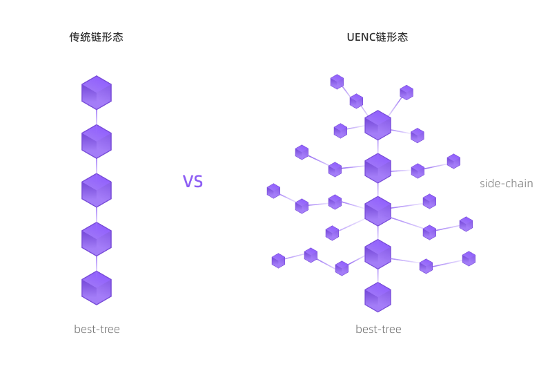

UENC采用了一种特殊的链形态以此来满足主链TPS的无限可拓展性，单链形态是无法与UENC的共识机制产生更好的融合，无法保证主链的性能，所以采用了新的链形态，这种形态与树形态很相似。

### 单链形态

大部分区块链的链结构以单链形态存在，单链是在确定状态后持续向前延伸，并且会极大限制UENC的TPS性能，即便区块的容量能够满足要求，双花会让链上发生多个区块中大量交易被全部放弃并且纠错的可能。
### UENC链形态

UENC是以树形结构的链形态存在，主链和侧链共存的状态下持续向上生长，在主链高度中确认best-tree为生长基础后，在10s内的其他交易都会在侧链出块，侧链上可以无限延伸区块长度，当然这取决于在生长期过程中的交易数量，这极大的提升了主链可拓展TPS的空间，UENC的出块机制不同于其他区块链网络，出块后只对高度的生长存在时间共识，并非定时打包区块的机制，这与UENC存在的共识算法可以更好的融合并实现UENC主链无限可拓展TPS的基础。

原来选择最早交易的块作为主链的Best-chain，但是在生产环境中节点设备或者网络情况会影响最早区块的选择，当出现延迟的交易比之前已判定的Best-chain区块更早的时候，所有的交易前置hash都需要更改进行复杂的纠错机制，这极大消耗节点的资源。我们采用固化Best-chain的形式，在交易未发生之前就预判到下个Best-chain的前置hash。那么再出现并发交易延迟的情况，都不影响主链的延展。所有的交易都进行有序规划，这样就不存在交易回滚和纠错的情况。极大节约了节点的资源能耗。

 

UENC中侧链区块是合法的，树形结构以及分片处理交易的机制让它可以高效率/高并发处理各类交易事务，并实现一对一，一对多，多对一，多对多的交易方式，极大提高了处理效率，随着基础网络中节点硬件性能的不断提升TPS可以无限进行拓展。
