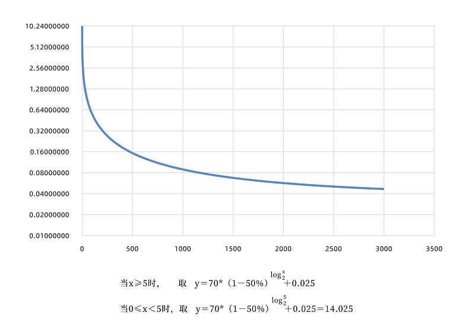

### 验证池

UENC的每一个区块签名验证都是根据验证池内离散型随机算法选举出的6-14个验证节点进行签名。进入验证池需满足质押条件， 并且验证节点的数据状态需保持与主网最新数据状态一致。 发起交易的时间戳内通过离散型随机算法选举分片节点作为验证节点，假如主网TPS的需求持续增加，验证节点硬件性能或带宽导致无法保持与主网最新数据状态一致，将无法进入验证池，直到满足后可进入验证池，我们希望验证池节点能够随着主网TPS的需求增长预估合理现状及可拓展性的预留。

### 去除异常账户

UENC使用椭圆曲线数字签名算法（ECDSA），即使用椭圆曲线密码（ECC）对数字签名算法 （DSA）的模拟，UENC的交易过程中，签名节点是通过散列随机算法进行选择，保证验证池节点均有机会进行验证。为防止恶意使某验证节点多次参与验证反复参与奖励UENC利用四分位算法检查异常节点的验证，保证随机的公平性。一旦检查出异常节点，该异常节点质押资产将无法解押，此节点将被冻结后无法使用。

 
 四分位算法的机制是根据奖励算法进行，区块奖励算法中x为区块数，y为奖励。区块数每增加c倍，奖励增加a%。m为斜率，b为截距。
 
 
 
说明：1..当x≧5,时，区块数每增加一倍，区块奖励减少50%。区块奖励无限趋近于0.025。 

2.当x<5,时，为避免节点区块奖励波动过大，均取上述函数中X=5时的奖励。

对于异常账户采用统计学上的四分位数法排除前500块签名过高的账户，将所有账户奖励排序后计算

 
则在当前交易中排除高于Q3奖励的账户签名。
