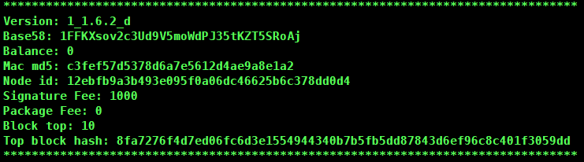
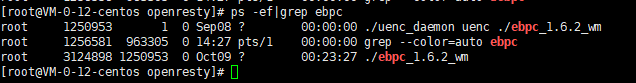

此文档简单介绍公网节点和子网节点如何搭建，如需详细的搭建流程需完整阅读UENC节点文档。

## UENC子网节点搭建

### 1.	下载解压程序

Github[网页链接](https://github.com/uenctech/uenc-demo/tree/master/uenc)上下载主网程序（uenc_xxx_primarynet.zip）。

```
    #wget https://github.com/uenctech/uenc-demo/raw/master/uenc/uenc_1.6.3_primarynet.zip
    #unzip uenc_1.6.3_primarynet.zip
    #chmod +x uenc_1.6.3_primarynet
```
下载后修改下载的安装文件的执行权限并解压缩。
 
需要先运行程序生成一些程序文件，在运行前确保以下两点：

1、将程序放到一个目录下面，需要确保该目录具有读、写和执行权限及其以上。

2、运行“获取程序”步骤后得到的二进制文件，等待数秒（例如10秒）后，按0退出当前程序。

```
    #./uenc_1.6.3_primarynet
```

退出后，`#ls`查看结构目录。生成的目录结构如下：

 | 文件或目录 |     描述     | 
 | :--------: | :--------------: | 
 |   cert   | 存放生成的公私密钥对，后缀为".public.key"的文件是公钥文件，后缀为".private.key"为私钥文件 | 
 |   data.db   | 数据库文件 | 
 |   devpwd.json   | 本机访问密码哈希值，当移动端连接时使用该密码进行连接 | 
 |   config.json   | 配置文件 | 
 |   logs   | 日志文件 | 

程序运行之后，子网节点不需要进行任何配置文件修改。程序启动的时候，黄色字样**bs58Addr:1AXxxxxxxxx**的为改节点的钱包地址，需要复制保存用于转账。


### 2.	设置gas费
要想要程序参与节点建设和获得激励，需要进行以下设置：

#### 方法一：通过命令行操作

```
    #./uenc_1.6.3_primarynet -s  2000
```

此方法要知道目前主网大概的gas费用值大概范围，设置过高或者过低，均会导致节点边缘化，无法参与签名打包。

#### 方法二：通过菜单操作

```
    #./uenc_1.6.3_primarynet –m
```

出现菜单列表
```
    1.Transaction  
    2.Pledge  
    3.Redeem pledge  
    4.Change password  
    5.Set config  
    6.Set fee
    7.Export private key  
    8.Print pending transaction in cache  
    0.exit  
    Please input your choice:
 ```
输入6进入费用设置选项，出现以下选择：

```
    1.Set signature fee     2.Set package fee     0.Exit
```

选择2进入signature fee设置命令，此菜单方法程序会告诉你目前全网的gas费平均值给你参考。
提示当前gas费：

```
    Current signature fee: 1000
    < Hint: any positive integer from 1000 to 100000 >
```

输入gas费：

```
    Set signature fee: 100000
```

若成功，则有提示信息：

```
    Signature fee is successful to set: 100000.
```

### 3.	质押UENC
设置好签名费用之后，需要对节点进行质押。需要累计质押500UENC。

1.	账户转入足够的UENC，因为质押需要消耗手续费用，所以建议最低转501UENC。

2.	查看余额，通过`#./uenc_1.6.3_primarynet –m`出现下列信息。**Balance**:显示的数量为UENC余额。当然也可以查看上述的**Signature Fee**是否设置成功。

  
  
进行质押操作：上述出现的菜单列表。输入数字2进入质押流程。

```
    Please enter the amount to pledge：
    500
```
输入金额后回车系统提示你输入gas费
```
    Please enter GasFee: 
    0.014
```
输入后回车系统提示你输入密码,，12345678是默认密码。若需要更改密码则根据菜单4.Change password进行修改密码。
```
     Please enter password:
     158660
```
输入密码后回车质押完毕。 确认质押成功与否可以查看自己余额显示，还可以根据菜单`7.Export private key` 导出的私钥再导入到Fastoken查看质押列表是否有质押交易。

### 4.	稳定运行
质押完成之后，程序需要稳定运行。运行需要用到辅助程序：守护者进程，下载地址：

```
   #wget https://github.com/uenctech/uenc-demo/raw/master/uenc/uenc_daemon
```

将守护进程程序复制到uenc程序同级目录下，使用如下方法用守护进程运行程序：

```
    #./ebpc_daemon uenc  ./uenc_1.6.3_primarynet
```
查看进程是否启动：`#ps –ef|grep uenc` 出现如下2个程序，说明程序已经运行。

  
  
至此，一个完整的子网节点搭建完成。如需进行其他操作，可以根据菜单列表进行选择操作。如满30天之后进行解质押操作：3.Redeem pledge 进行交易：1.Transaction 查看缓存交易：8.Print pending transaction in cache。如需其他操作可以查看[技术文档](https://www.uenc.io/devDocsEn/UENC%20Nodes/Using%20Nodes) 

## UENC公网节点搭建

公网是连接子节点的中转节点，通过公网节点实现内外直连、外外直连、服务中转等
公网节点的IP地址必须是外网可以访问到的。公网搭建大多数操作和子网节点相同，不同的是需要对配置文件更改和设置打包费。

### 1.下载解压程序

```
    #wget https://github.com/uenctech/uenc-demo/raw/master/uenc/uenc_1.6.3_primarynet.zip
    #unzip uenc_1.6.3_primarynet.zip
    #chmod +x uenc_1.6.3_primarynet
```
### 2.初始化程序
解压完成之后需要先运行程序生成一些程序文件，在运行前确保以下两点：

1、将程序放到一个目录下面，需要确保该目录具有读、写和执行权限及其以上。

2、运行“获取程序”步骤后得到的二进制文件，等待数秒（例如10秒）后，按0退出当前程序。

```
    #./uenc_1.6.3_primarynet
```

退出后，`#ls`查看结构目录。

程序运行之后，子网节点不需要进行任何配置文件修改。程序启动的时候，黄色字样**bs58Addr:1AXxxxxxxxx**的为改节点的钱包地址，需要复制保存用于转账。

### 3.修改配置文件

在运行程序之前，您需要通过修改一些文件来配置程序运行所需要的环境。修改配置文件**config.json**。

```
    vim config.json
```

按照如下方式进行修改：

1.	需要将is_public_node的值由false修改为true。

2.	将server中的IP字段的值设置为自身节点所连接的其他公网节点IP地址。

3.	将var字段下的local_ip字段设置为自身节点的外网IP地址。

例如，自身节点外网IP地址为xxx.xxx.xxx.xxx, 所连接公网地址为yyy.yyy.yyy.yyy, 则按如下配置（以测试网公网节点配置为例）

```
  "is_public_node": true,
   "server": [
       {
           "IP": "yyy.yyy.yyy.yyy",
           "PORT": 11188
       },
   ],
   "var": {
   "k_bucket": "a0dbbd80eb84b9e51f3a0d69727384c651f9bdb5",
   "k_refresh_time": 100,
   "local_ip": "xxx.xxx.xxx.xxx",
   "local_port": 11188,
   "work_thread_num": 4
   },
```

编辑完成，进行退出。重新执行`#./uenc_1.6.3_primarynet` 命令，执行生效。

### 4.打包费设置
子网节点只需要设置签名费，而公网节点还需要设置打包费用。

设置gas费和打包费

#### 方法一：通过命令行操作

```
    #./uenc_1.6.3_primarynet -s  2000
    #./ uenc_1.6.3_primarynet -p  150
```

或者直接

```
    #./uenc_1.6.3_primarynet -m -s 2000 -p 150
```

此方法要知道目前主网大概的gas费用值大概范围，设置过高或者过低，均会导致节点边缘化，无法参与签名打包。

#### 方法二：通过菜单操作
```
    #./uenc_1.6.3_primarynet –m
```

出现菜单列表:

```
    1.Transaction  
    2.Pledge  
    3.Redeem pledge  
    4.Change password  
    5.Set config  
    6.Set fee
    7.Export private key  
    8.Print pending transaction in cache  
    0.exit  
    Please input your choice:
```

输入6进入费用设置选项，出现以下选择：

```
    1.Set signature fee     2.Set package fee     0.Exit
```

选择1进入**signature fee**设置命令，此菜单方法程序会告诉你目前全网的gas费平均值给你参考。
提示当前gas费：
```
    Current signature fee: 1000
    < Hint: any positive integer from 1000 to 100000 >
```
输入gas费：
```
    Set signature fee: 100000
```
若成功，则有提示信息：
```
    Signature fee is successful to set: 100000.
```

设置完成之后，输入0退出。选择2进行打包费用设置：2.Set package fee

提示当前打包费：

```
    Current package fee: 0
    < Hint: any positive integer from 0 to 100000000 >
```

输入打包费：

```
    Set package fee: 12
```

若成功，则有提示信息：

```
    Package fee is successful to set: 12.
```

### 5.质押UENC

设置好签名费用之后，需要对节点进行质押。质押需要累积500UENC。

1.	账户转入足够的UENC，因为质押需要消耗手续费用，所以建议最低转501UENC。

2.	查看余额，通过`#./uenc_1.6.3_primarynet –m`出现下列信息。**Balance**:显示的数量为UENC余额。当然也可以查看上述的**Signature Fee**和**Package Fee**是否设置成功。
  
   
   
进行质押操作：上述出现的菜单列表。输入数字2进入质押流程。

```
    Please enter the amount to pledge：
    500
```

输入金额后回车系统提示你输入gas费

```
    Please enter GasFee: 
    0.014
```

输入后回车系统提示你输入密码,，12345678是默认密码。若需要更改密码则根据菜单**4.Change password**进行修改密码。

```
     Please enter password:
     158660
```

输入密码后回车质押完毕。 确认质押成功与否可以查看自己余额显示，还可以根据菜单**7.Export private key**导出的私钥再导入到Fastoken查看质押列表是否有质押交易。

### 6.稳定运行
质押完成之后，程序需要稳定运行。运行需要用到辅助程序：守护者进程，下载地址：

```
    #wget https://github.com/uenctech/uenc-demo/raw/master/uenc/uenc_daemon
```

将守护进程程序复制到uenc程序同级目录下，使用如下方法用守护进程运行程序：

```
    #./ebpc_daemon uenc  ./uenc_1.6.3_primarynet
```

查看进程是否启动：`#ps –ef|grep uenc` 出现如下2个程序，说明程序已经运行。

 

至此，一个完整的公网节点搭建完成。

