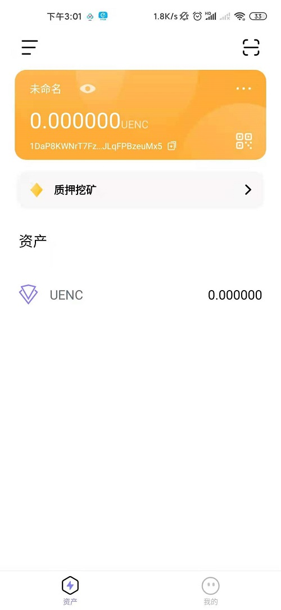

### 1.需要先下载app
   * 打开[官网](https://www.uenc.io/#/index) 点击进入wallet的Fastoken downloads模块，看到主页有个钱包介绍和二维码，扫二维码Fostoken安装app。 

   
   
    app安装成功后   
    
   
   
### 2.创建数字身份  
 * 安装成功后打开app进入欢迎页面。  
   
 * 点击欢迎页面的Agree按钮进入创建数字身份页面，在此页面手机会询问"Fastoken"需要使用存储权限是否允许，点击下面的始终允许按钮。
  点击右上方的 `中/En` 切换按钮进行中英文切换
   
      
    
  * 开始创建数字身份，按要求输入身份名（不少于8位）和密码及重复密码点击创建按钮进入备份助记词页面。 
  *  点击上一步的创建后进入提示你备份助记词的页面。
  
    
  
  * 仔细阅读页面内容后点击下一步，弹出助记词页面让你备份。
  
  * 备份助记词后点击下一步此时要你按刚才的助记词的顺序点击出现的助记词。
   
    
      
   操作完后点击完成按钮回到首页。 

### 3.备份助记词和私钥
 点击我的模块，选择钱包管理。出现主网和用户节点的选择，选择自己要备份的账户。
 
   
    
 进入账户设置页面，选择助记词或私钥进行备份页面。
 
   
  
  助记词备份页面在创建数字身份模块已介绍，显示的字母进行手抄记录，
  备份私钥页面，点击复制按钮，保存复制下来的私钥。或者生成的二维码进行保存。
  
   
   
### 4.连接节点  
 * 助记词备份成功后，回到首页当前显示是主账号。 
 
  
    
  * 此时还未连接节点，点击左上角`三`个横线节点切换到节点账号，节点账号是黄色显示

    
   
   点击节点下面的 `+添加`  进入节点搜索列表，搜索时长根据所在局域网下的用户节点数量。  

     
  
 * 在节点列表中选择一台节点进行连接（备注：手机端必须连接wi-fi，且手机端wi-fi与连接的节点在同一局域网内）
    选择一台节点，点击连接节点，弹出输入密码框，节点默认密码是12345678，输入密码。

     
 
 * 点击完成按钮如果连接成功会弹出“链接成功的提示”。点击确定
 
### 5.设置燃料费  
* 节点连接成功后点击立即设置进入设置燃料费界面，可以设置修改当前节点燃料费。  

     
 
* 阅读上面内容后输入燃料费点击保存，返回节点列表界面，此时账户显示颜色是黄色。
  
    

### 6.账号发起转账  
* 回到首页切换到主账号  
 
     

   点击资产下的`UENC图标`，进入列表页面。 

      
  
 点击`转账`按钮，有`批量转账`和`普通转账`两种选择，选择自己需要的转账方式进入转账页面。
 
    
  
 输入转账地址、交易金额、拖动签名费的小圆圈设置签名费，点击共识数的-或+设置共识数。点击选择交易节点右下方的箭头进入节点设置页面。 

     
 
 点击要选择的节点返回到转账界面，点击转账按钮进入`确认转账`界面点击确认。
 
     
   
 转账系统提示交易发起成功.
   
     
    
  节点账号的转账和主账户转账一样，转账之前记得切换成节点账户，唯一不同的是不需要选择交易节点。
   
 ### 7.节点质押和解质押 
* 进入首页点击节点切换到节点账号。  

     
 
* 点击节点账号的`质押运行`按钮进入质押列表。 

     
  
* 如果有进行质押操作，按钮会显示`解质押`。没有质押操作会显示`质押`按钮。

* 质押之前保证账户有足够的金额，一次质押的金额是500UENC

* 质押完成之后要30天后才能进行解质押。

   
 
### 8.查看交易情况  

* 在首页点击UENC图标进入交易列表页面。 
在此页面可以看到账号余额、质押解质押记录（节点账户）、还可以查看你的交易是失败还是成功或在交易中。

### 9.主账号退出   
 * 点击资产页面，账户上的三个点`...`,进入本账号管理页面。最下面有红色按钮退出，进行账号的退出。 

 * 退出前请先备份好助记词或者私钥，以方便恢复，备份后点击退出当前账号按钮会弹出密码框，输入密码后点击确认后退出主
 账号返回到其他账号页面或者创建数字身份页面。
  
### 10.恢复账号  
* 两种方式：1助记词恢复；2私钥恢复。  
 在钱包管理页面，点击右上角的`＋`号。进入添加页面。 选择助记词或私钥恢复身份。 
 
    
   
  选择助记词恢复，会出现对应的单次框，输入之前手写下来的单词，点击`导入钱包`，完成账户恢复
  
   
  
 选择私钥恢复，会出现私钥和密码的输入，这里的密码是自己设置的新密码。点击`恢复身份`进行恢复。
   
    