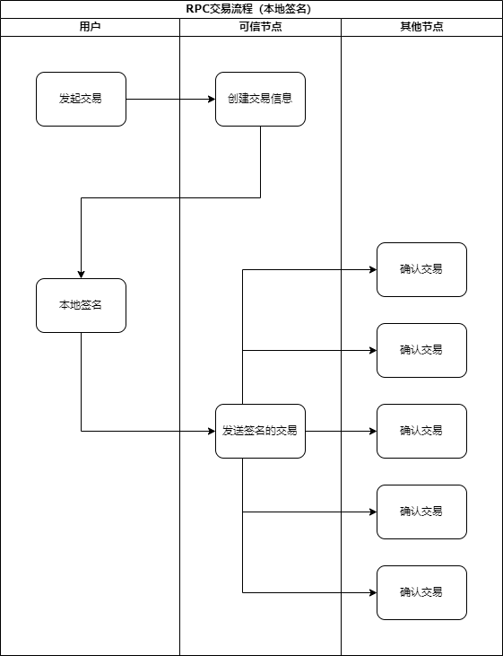
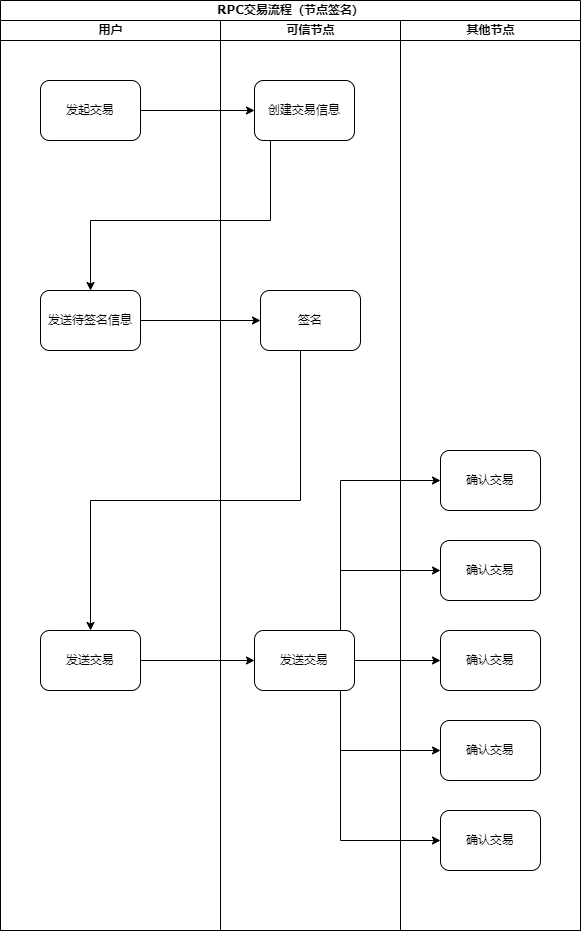

### RPC 交易流程

#### 前置条件   

  任何用户都可使用一些列RPC相关接口在UENC网络上发起交易交易，在使用这些RPC接口前，你需要拥有如下准备：
  
  * 一个连接在主网上的可靠节点，需要同步到全网最高高度。
  * 一个拥有资产的账户（密钥对），区分其中的公钥和私钥。

#### 步骤

##### 通过RPC发起交易主要经过如下三个步骤：
  
  1. 创建交易信息
    
  通过向可靠节点发送RPC请求，来创建交易信息。用户收到交易信息后，可对交易信息进行二次确认（可选）。
  	
  2. 用私钥对交易信息进行签名
  
  有两种方式可进行签名
  
  * 调用本地签名动态库（so库）对交易信息进行签名。

  * 如果可靠节点为自己所控制节点并可信，向可靠节点发送RPC请求，用私钥对交易信息进行签名。
  
  推荐调用本地签名动态库进行签名。
  
  3. 发送签名后交易信息
  
  将签名后的交易信息发送到可靠节点，可靠节点将信息转发到主网全部节点进行确认。
  
  当发送交易完成后，如果交易得到全网60%的节点的确认和认可后，可视为该交易成功上链，用户可使用相关RPC接口进行确认查询。
  
  当该交易已经上链后才可使用该账户进行下一笔交易，否则将无法继续用该账户发起交易。
  
##### 流程图

   1. 节点签名
   
   
   
   2. 本地签名
   
   
  
#### 接口调用说明

  1. 创建交易（create_tx_message）
  
  请求格式：
  ```json
  {
    "jsonrpc": "2.0",
    "id": "1",
    "method": "create_tx_message",
    "params": {
        "from_addr": ["1BuFpDmH2bJhqxQoyv8cC8YL3mU2TnUDES"],
        "to_addr": [{"addr": "1FoQKZdUNeBXV2nTba6e354m5JrQ4rHYgA", "value": "2.2"}],
        "fee": "0.1"
    }
}
  ```
  
  |  参数   | 说明  |
  |  ----  | ----  |
  | from_addr  | 交易发起地址集，目前仅支持单一地址且有足够资产进行交易 |
  | to_addr  | 交易接收地址集，可为多个，其中addr为某个交易地址，value为该地址的交易金额 |
  | fee  | 该交易所使用的单笔签名费 |
  
  
 fee所标识为该交易的单笔签名费，RPC交易默认采用6个共识数节点认证，因此该交易的总费用为:
  
  ```
  总签名费用 = （共识数 - 1）* 单笔签名费
  ```
  
  在交易中，如果可靠节点设置了打包费，则额外需要付打包费用，即总费用公式如下：
  ```
  总费用 = （共识数 - 1）* 单笔签名费 + 打包费 + 交易金额
  ```
  
  假设该可靠节点打包费用为0.3，则上述例子中的总费用如下：
  ```
  (6 - 1) * 0.1 + 0.3 + 2.2 = 3
  ```
  
  注，某节点打包费用可用 get_basic_info 接口查询`package_fee`字段。
  
  调用成功时返回
  ```json
  {
    "id": "1",
    "jsonrpc": "2.0",
    "result": {
        "tx_data": "EM2nvbfKuOwCIiIxQnVGcERtSDJiSmhxeFFveXY4Y0M4WUwzbVUyVG5VREVTMig4ZjU1M2U5ODA4MzM4MjZhMDIxYWQ5MTU4MDA5N2E5OGVkY2EzM2M3QkQKQgpAMDEwZDJmYTBkNzkwNDEzNDlmM2QwZWFmY2FjMzg5ZTQ4NTM1MzgyYzE1M2VmYzNiYWZlZjFjMTcyNjU5ZjU2YUopCI6rzAoSIjFGb1FLWmRVTmVCWFYyblRiYTZlMzU0bTVKclE0ckhZZ0FKKgjY4M+cAxIiMUJ1RnBEbUgyYkpocXhRb3l2OGNDOFlMM21VMlRuVURFU1JDeyJHYXNGZWUiOjU1NTU1NSwiTmVlZFZlcmlmeVByZUhhc2hDb3VudCI6MywiVHJhbnNhY3Rpb25UeXBlIjoidHgifQ==",
        "tx_encode_hash": "3c9a103d8542750dd048eecf2151b052ed26051f201246089bfc01e508ed7000"
    }
}  
  ```
  
  |  参数   | 说明  |
  |  ----  | ----  |
  | tx_data  | 交易体的base64编码 |
  | tx_encode_hash  | 交易体的待签名hash |
  
  
  调用错误时返回相应错误代码，如下：
  
  TODO 待补充
  
  2.1 节点签名
  
  当有可靠节点时，可用generate_sign接口对create_tx_message接口的`tx_encode_hash`字段进行签名。
  
  请求格式：
  ```json
  {
  "jsonrpc": "2.0",
  "id": "1",
  "method": "generate_sign",
  	"params": {
		"data": "3c9a103d8542750dd048eecf2151b052ed26051f201246089bfc01e508ed7000",
		"private_key": "xAEF+gTQZ6PmtH3hlmygJpAVxBpKHBa3Zw8iMxRjlbQ="
	 }
  }
  ```
  
  |  参数   | 说明  |
  |  ----  | ----  |
  | data  | 待签名信息, create_tx_message方法调用后返回的tx_encode_hash |
  | private_key  | base64编码后的私钥  |
  
  
  调用成功时返回
  
  ```json
  {
    "id": "1",
    "jsonrpc": "2.0",
    "result": {
        "message": "Ggy2ouJDIZw9/ShvZUwXyVgsAXSFLsxvRCh42elAf+Klit6DJH/jUY6Z3Km/W7VhPKinrsHcaEcwYqIUIwopWQ=="
    }
}  
  ```
  
  |  参数   | 说明  |
  |  ----  | ----  |
  | message  | base64编码后的已签名信息 |
  
  调用失败时的返回相应错误代码，如下：
  
  TODO 待补充
  
  
  2.2 本地签名
  
  若无可用节点，可使用动态库进行本地签名，动态库可从如下[地址](https://github.com/uenctech/uenc-demo/tree/master/libs_linux)下载。
  
  接口
  
  ```cpp
  int GenSign_(const char* pri, int pri_len,
             const char* msg, int msg_len,
             char *signature_msg, int &out_len);
  ```
  
  |  参数   | 说明  |
  |  ----  | ----  |
  | pri  | 私钥(字节流形式，下同) |
  | pri_len  | 私钥的长度 |
  | msg  | 待签名信息 |
  | msg_len  | 待签名信息的长度 |
  | signature_msg  | 传出参数，传出base64编码之后的签名信息，调用方负责开辟内存，确保大于 90 字节 |
  | out_len  | 传入传出参数，传入时代表开辟的内存大小，传出时返回签名信息的实际长度 |
  
  调用签名后，保留signature_msg信息备用。
  
  调用失败时的返回相应错误代码，如下：
  
  TODO
  
  3. 发送交易  (send_tx)

  请求  

  ```
  {
  	"jsonrpc": "2.0",
  	"id": "1",
  	"method": "send_tx",
  	"params": {
		  "tx_data": "ELvdqOvRuOwCIiIxQnVGcERtSDJiSmhxeFFveXY4Y0M4WUwzbVUyVG5VREVTMig4ZjU1M2U5ODA4MzM4MjZhMDIxYWQ5MTU4MDA5N2E5OGVkY2EzM2M3QkQKQgpAMjRkMjUxMzMxZGFkYjEyMGMyYmYxMDlhZDI2ODllOWNkMDcwYTAyZWJkZWQxNDA1ZTM5MGFlMmVhMDI0YjEzMEopCI6rzAoSIjFGb1FLWmRVTmVCWFYyblRiYTZlMzU0bTVKclE0ckhZZ0FKKgiwua+GAxIiMUJ1RnBEbUgyYkpocXhRb3l2OGNDOFlMM21VMlRuVURFU1JDeyJHYXNGZWUiOjU1NTU1NSwiTmVlZFZlcmlmeVByZUhhc2hDb3VudCI6MywiVHJhbnNhY3Rpb25UeXBlIjoidHgifQ==",
		  "tx_signature": "N1ii0dikr0NJRvi7GXkjXOayD+mVcMfXF+49iOmOneYqYj2HHYzNm3Txj/otW/K7Dh3uBJ2Gb4nlTJW2AY3Dog==",
		  "public_key": "ICBszM0aHCpWmDdEC3GMBL6DFN7XdWzijF33uvmWKMa1WbvWBk33+G9E4pSztJWlwDkvEt4dW4oGY8/sY2FJBtPG",
		  "tx_encode_hash": "b3b8f15852efddbdfe8aa759a2f026488350b6f56a4cae7494ea3cbba0f8a5c5"
  	}
  }
  ```  
  
  |  参数   | 说明  |
  |  ----  | ----  |
  | tx_data  | 交易体(base64编码), 为创建交易体方法(create_tx_message)调用后返回的tx_data |
  | tx_signature  | 交易体hash(tx_encode_hash)进行签名得到的签名信息, 为调用动态库GenSign_()方法进行签名 |
  | public_key  | 公钥(base64编码)  |
  | tx_encode_hash  | 交易体hash(待签名信息), 创建交易体方法(create_tx_message)调用后返回的tx_encode_hash |
  
  成功返回值:
```
  {
    "id": "1",
    "jsonrpc": "2.0",
    "result": {
      "tx_hash": "e241d6af1b8f8ff58508f14177005b4263d26e32a2e0d0f6b8e98d966cbaa864",
      "height" : 100
       }
   }  
   ```
   
  |  参数   | 说明  |
  |  ----  | ----  |
  | tx_hash  | 交易hash |
  | height  | 发起交易时全网高度 |
  
  后续可通过此hash查询完整交易信息。
  
  调用失败时的返回相应错误代码，如下：
  
  TODO
  
  4. 确认交易是否成功（confirm_transaction）
  
  当发送交易（send_tx）成功后，可用该接口查询交易是否达到60%的节点上链，请求如下：
  
  ```json
  {
  "jsonrpc": "2.0",
  "id": "1",
  "method": "confirm_transaction",
  	"params": {
		"tx_hash": "d7ef410796ffa9ef60982c3470f5d816c28a4ea2d3c5299228ef2f5997bf8221",
    "height" : 100
	}
}
  ```
  
  |  参数   | 说明  |
  |  ----  | ----  |
  | tx_hash  | 本次交易的交易哈希，为send_tx接口调用返回的tx_hash字段信息 |
  | height  | 发起交易时节点的高度，为send_tx接口调用返回的height字段信息 |
  
  请求成功时返回如下信息：
  
  ```json
  {
    "id": "1",
    "jsonrpc": "2.0",
    "result": {
        "count_failed": 0,
        "count_success": 6,
        "count_success_rate": 1.0,
        "count_total": 6,
        "nodeid": [
            "06a2ff71d77d84a079ee858f33e86fbd59aaca47",
            "43cdd5c798c3cd81442725590700da7548c82c37",
            "e20569ec8d8fdf321453411e623888acbb9e62b5",
            "31d19d07088d1b18413e4f256fbdc277a0b239d7",
            "49362e3b9473aa7556481d3ccc7da7337c438781",
            "4fa76c195136d91e7679579bbe92809b1cecd9c4"
        ],
        "success": 1,
        "total": 6
    }
}
  ```
  
  |  参数   | 说明  |
  |  ----  | ----  |
  | count_failed  | 查询未建立区块的节点统计数 |
  | count_success  | 查询建立区块的节点统计数 |
  | count_success_rate  | 成功建块节点比率 |
  | count_total  | 已查询总节点数 |
  | nodeid  | 已查询总节点列表 |
  | success  | 操作是否成功 |
  | total  | 同count_total参数 |
  
  该请求发送后，接收节点会随机选取100个节点，向这100个节点上发起交易查询请求并统计，在count_total参数中返回节点总数，在count_success参数中是查询到的已建立该区块（交易）的节点，在count_failed中是未查询到建立该交易的节点，count_success_rate中是成功建块的比率。
  
  当count_success_rate比率大于0.6，即60%的节点已确认并建立交易时，视为该交易成功上链。
  
  该接口可多次进行查询。
  
  调用失败时的返回相应错误代码，如下：
  
  TODO
  
  5. 查询正在挂起的交易（get_pending_transaction）
  
  当交易通过某个节点发起而该节点还未建立该区块（交易）时，该交易处于挂起状态，用户无法使用相同的账户通过该节点继续交易，直到10分钟超时后或该交易已在该节点建立区块后，方可继续交易。
  
  可用该接口查询上笔交易是否处于挂起状态。
  
  ```json
  {
    "jsonrpc": "2.0",
    "id": "1",
    "method": "get_pending_transaction",
    	"params": {
  		"address": "1MpeeKXwH1ArnMJ85D161yfH1us471J86X"
	  }
  }
  ```
  
  |  参数   | 说明  |
  |  ----  | ----  |
  | address  | 交易发起方地址 |
  
  调用成功后接口返回如下信息：
  
  ```json
  {
    "id": "1",
    "jsonrpc": "2.0",
    "result": {
        "total": 1,
        "transaction": [
            {
                "amount": "501",
				        "broadstamp": 1620378873518030,
                "from": [
                    "1MpeeKXwH1ArnMJ85D161yfH1us471J86X"
                ],
                "gap": "0.050000",
                "hash": "4303e57195616797f77d7db888ef15d677740d8f10a9a8e29370d35c3cc853fb",
                "timestamp": 1620378873279899,
                "to": [
                    "1HjrxHbBuuyNQDwKMh4JtqfuGiDCLodEwC"
                ],
                "toAmount": [
                    "501.000000"
                ],
                "vin": [
                    "7d9a0cb698db789b5f294343209b94ca69119f02593cb5607069623810f6ed69",
                    "92c45d62b86d37c04f5f873eedfdcb1719eeca9a43e16b206e98101d20baeb0c",
                    "d2c9da85e7b67188c507f40a95cba88c491afca56b863cce6af512638c7b1b1c"
                ]
            }
        ]
    }
  }
  ```
  
  |  参数   | 说明  |
  |  ----  | ----  |
  | total  | 处于挂起的交易的个数 |
  | transaction  | 交易内容,包括交易的哈希，发起方，接收方，金额，时间戳等信息 |
  
  根据send_tx接口调用返回后的tx_hash字段，若在transaction中找到对应的交易hash，则该交易在该节点上未建立区块（交易）。


  调用失败时的返回相应错误代码，如下：
  
  TODO